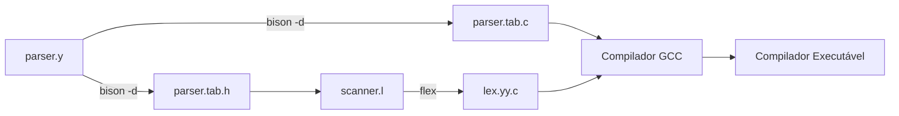

<div style="display: flex; justify-content: space-between; align-items: center; padding: 10px 16px; background: var(--light, #f8fafc); border: 1px solid var(--lightgray, #e2e8f0); border-radius: 10px; margin: 1.5rem 0;">
  <div>⬅️ <b><a href="/pt-br/resource/engenharia-de-computação/6-periodo/compiladores/anotacoes/aula-07-avaliacao-teorico-pratica-p1-lexica-e-sintatica">Aula Anterior</a></b></div>
  <div>🏠 <b><a href="/pt-br/resource/engenharia-de-computação/6-periodo/compiladores">Hub da Disciplina</a></b></div>
  <div>➡️ <b><a href="/pt-br/resource/engenharia-de-computação/6-periodo/compiladores/anotacoes/aula-09-estruturas-e-gerenciamento-da-tabela-de-simbolos">Próxima Aula</a></b></div>
</div>

> [!info] 📅 Informações da Aula
> - **Disciplina:** Compiladores (CSECBJI.48)
> - **Professor:** Fabrício Barros
> - **Data Realizada:** 23/10/2026
> - **Tópico Principal:** Análise Sintática Ascendente Avançada: LR(1), LALR(1) e Bison/Yacc
> - **Status:** Concluída e Revisada

> [!note] 📂 Material Complementar & Slides
> - 📄 **Slides Oficiais:** [[slide-08-compiladores|Acessar Apresentação em PDF]]
> - 🎥 **Short Lecture / Gravação:** [[video-08-compiladores|Assistir Síntese da Aula (Vídeo)]]

---

### 📑 Resumo das Seções
- [📌 1. Anotações do Quadro: Análise Sintática Ascendente Avançada: LR(1), LALR(1) e Bison/Yacc](#-anotações-do-quadro-análise-sintática-ascendente-avançada-lr1,-lalr1-e-bison/yacc)
- [🧮 2. Formulação & Exemplo Prático Resolvido](#-formulação--exemplo-prático-resolvido)
- [📊 3. Esquema Visual & Fluxograma (Mermaid)](#-esquema-visual--fluxograma-mermaid)
- [🧠 4. Resumo Pessoal & Macetes do Professor](#-resumo-pessoal--macetes-do-professor)
- [📝 5. Dúvidas & Exercícios Recomendados para Casa](#-dúvidas--exercícios-recomendados-para-casa)

---

## 📌 Anotações do Quadro: Análise Sintática Ascendente Avançada: LR(1), LALR(1) e Bison/Yacc

### 8.1 Limitações do SLR(1) e Necessidade de Itens LR(1) Canônicos
O SLR(1) utiliza o $\text{FOLLOW}(A)$ global para decidir reduções, o que pode gerar conflitos em gramáticas não-ambíguas.

Um **item LR(1)** incorpora explicitamente o símbolo de *lookahead* contextual esperado:
$$[A \to \alpha \cdot \beta, \; a]$$
onde $a \in \Sigma \cup \{\$\}$ é o conjunto de terminais que podem legitimamente seguir esta redução específica.

### 8.2 O Analisador LALR(1) (*LookAhead LR*)
O **LALR(1)** resolve a explosão de estados do LR(1) canônico:
- **Princípio:** Funde estados LR(1) que possuem exatamente o **mesmo núcleo** (mesmos itens LR(0)), unindo seus conjuntos de *lookahead*.
- **Vantagem:** Mantém a quantidade compacta de estados do autômato LR(0) original.
- **Propriedade:** A fusão de estados no LALR(1) **nunca produz conflitos Shift/Reduce**, podendo ocasionalmente gerar novos conflitos Reduce/Reduce em gramáticas ambíguas.

---

## 🧮 Formulação & Exemplo Prático Resolvido

### ✏️ Especificação Bison (`parser.y`) com Declaração de Precedência

```bison
%{
#include <stdio.h>
#include <stdlib.h>
extern int yylex();
void yyerror(const char *s);
%}

%union {
    int ival;
    double fval;
    char *sval;
}

%token <ival> TOKEN_INT
%token <fval> TOKEN_FLOAT
%token <sval> TOKEN_ID

%left '+' '-'
%left '*' '/'
%right UMINUS

%type <fval> exp

%%
exp:
    exp '+' exp          { $$ = $1 + $3; }
    | exp '-' exp        { $$ = $1 - $3; }
    | exp '*' exp        { $$ = $1 * $3; }
    | exp '/' exp        { $$ = $1 / $3; }
    | '-' exp %prec UMINUS { $$ = -$2; }
    | TOKEN_INT          { $$ = (double)$1; }
    | TOKEN_FLOAT        { $$ = $1; }
    ;
%%
void yyerror(const char *s) { fprintf(stderr, "Erro: %s\n", s); }
```

---

## 📊 Esquema Visual & Fluxograma (Mermaid)



---

## 🧠 Resumo Pessoal & Macetes do Professor

| Conceito-Chave | *Takeaway* do Professor | Dicas de Prova / Atenção |
| :--- | :--- | :--- |
| **Diretivas de Precedência do Bison** | `%left`, `%right` e `%nonassoc` eliminam conflitos shift/reduce sem precisar desdobrar regras gramaticais. | A ordem de declaração define a precedência (linhas inferiores têm maior prioridade). |
| **A Opção `%prec`** | Permite atribuir precedência contextual a um operador sobrecarregado (ex: o operador `-` unário tendo maior precedência que a subtração binária). | Aplicação prática direta |

---

## 📝 Dúvidas & Exercícios Recomendados para Casa

1. Explique por que a fusão de estados no LALR(1) não pode introduzir conflitos Shift/Reduce.
2. Escreva a especificação Bison completa para comandos de atribuição e laços `while`.

---

<div style="display: flex; justify-content: space-between; align-items: center; padding: 10px 16px; background: var(--light, #f8fafc); border: 1px solid var(--lightgray, #e2e8f0); border-radius: 10px; margin: 1.5rem 0;">
  <div>⬅️ <b><a href="/pt-br/resource/engenharia-de-computação/6-periodo/compiladores/anotacoes/aula-07-avaliacao-teorico-pratica-p1-lexica-e-sintatica">Aula Anterior</a></b></div>
  <div>🏠 <b><a href="/pt-br/resource/engenharia-de-computação/6-periodo/compiladores">Hub da Disciplina</a></b></div>
  <div>➡️ <b><a href="/pt-br/resource/engenharia-de-computação/6-periodo/compiladores/anotacoes/aula-09-estruturas-e-gerenciamento-da-tabela-de-simbolos">Próxima Aula</a></b></div>
</div>
