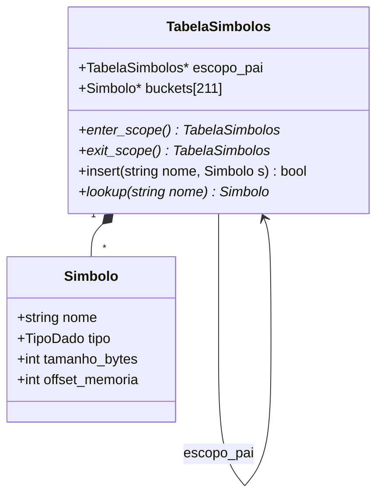

<div style="display: flex; justify-content: space-between; align-items: center; padding: 10px 16px; background: var(--light, #f8fafc); border: 1px solid var(--lightgray, #e2e8f0); border-radius: 10px; margin: 1.5rem 0;">
  <div>⬅️ <b><a href="/pt-br/resource/engenharia-de-computação/6-periodo/compiladores/anotacoes/aula-08-analise-sintatica-ascendente-avancada-lr-1-lalr-1-e-bison-yacc">Aula Anterior</a></b></div>
  <div>🏠 <b><a href="/pt-br/resource/engenharia-de-computação/6-periodo/compiladores">Hub da Disciplina</a></b></div>
  <div>➡️ <b><a href="/pt-br/resource/engenharia-de-computação/6-periodo/compiladores/anotacoes/aula-10-analise-semantica-esquemas-de-traducao-dirigidos-por-sintaxe-sdt">Próxima Aula</a></b></div>
</div>

> [!info] 📅 Informações da Aula
> - **Disciplina:** Compiladores (CSECBJI.48)
> - **Professor:** Fabrício Barros
> - **Data Realizada:** 30/10/2026
> - **Tópico Principal:** Estruturas e Gerenciamento da Tabela de Símbolos
> - **Status:** Concluída e Revisada

> [!note] 📂 Material Complementar & Slides
> - 📄 **Slides Oficiais:** [[slide-09-compiladores|Acessar Apresentação em PDF]]
> - 🎥 **Short Lecture / Gravação:** [[video-09-compiladores|Assistir Síntese da Aula (Vídeo)]]

---

### 📑 Resumo das Seções
- [📌 1. Anotações do Quadro: Estruturas e Gerenciamento da Tabela de Símbolos](#-anotações-do-quadro-estruturas-e-gerenciamento-da-tabela-de-símbolos)
- [🧮 2. Formulação & Exemplo Prático Resolvido](#-formulação--exemplo-prático-resolvido)
- [📊 3. Esquema Visual & Fluxograma (Mermaid)](#-esquema-visual--fluxograma-mermaid)
- [🧠 4. Resumo Pessoal & Macetes do Professor](#-resumo-pessoal--macetes-do-professor)
- [📝 5. Dúvidas & Exercícios Recomendados para Casa](#-dúvidas--exercícios-recomendados-para-casa)

---

## 📌 Anotações do Quadro: Estruturas e Gerenciamento da Tabela de Símbolos

### 9.1 Função da Tabela de Símbolos no Compilador
A **Tabela de Símbolos** associa nomes de identificadores aos seus respectivos metadados semânticos:
- Nome textual do identificador (lexema).
- Tipo primitivo ou estruturado (`int`, `float`, ponteiro, `struct`, array, função).
- Categoria de armazenamento (variável local, parâmetro formal, variável global).
- Tamanho em bytes e deslocamento relativo de memória (*offset* no stack frame).
- Assinatura de funções: tipo de retorno e tipos dos parâmetros formais.

### 9.2 Gerenciamento de Escopos Aninhados (*Scope Stack*)
Utiliza-se uma **Pilha de Tabelas Hash Encadeadas**:
- `enter_scope()`: Cria uma nova tabela filha apontando para a atual e empilha-a.
- `exit_scope()`: Desempilha o escopo atual, retornando ao escopo pai.
- `insert(nome, simbolo)`: Insere no escopo ativo (erro se já existir no mesmo nível).
- `lookup(nome)`: Busca no escopo ativo; se não achar, sobe pelos ponteiros pais até o global.

---

## 🧮 Formulação & Exemplo Prático Resolvido

### ✏️ Implementação em C da Estrutura de Tabela Encadeada

```c
typedef struct Simbolo {
    char *nome;
    TipoDado tipo;
    int offset;
    struct Simbolo *proximo_bucket;
} Simbolo;

typedef struct TabelaSimbolos {
    Simbolo *buckets[211];
    struct TabelaSimbolos *escopo_pai;
} TabelaSimbolos;

Simbolo* lookup(TabelaSimbolos *tabela, const char *nome) {
    TabelaSimbolos *escopo = tabela;
    while (escopo != NULL) {
        unsigned int h = hash(nome) % 211;
        Simbolo *s = escopo->buckets[h];
        while (s != NULL) {
            if (strcmp(s->nome, nome) == 0) return s;
            s = s->proximo_bucket;
        }
        escopo = escopo->escopo_pai;
    }
    return NULL;
}
```

---

## 📊 Esquema Visual & Fluxograma (Mermaid)



---

## 🧠 Resumo Pessoal & Macetes do Professor

| Conceito-Chave | *Takeaway* do Professor | Dicas de Prova / Atenção |
| :--- | :--- | :--- |
| **Sombreamento de Variáveis (*Shadowing*)** | Uma variável em bloco interno pode ter o mesmo nome de uma no bloco externo. O `lookup` retorna a declaração mais interna. | Verifique se a linguagem permite shadowing antes de emitir warnings. |
| **Tamanho de Hash Primo** | Utilize sempre um número primo (ex: 211, 503) para o tamanho do array de buckets da tabela hash para garantir dispersão uniforme. | Aplicação prática direta |

---

## 📝 Dúvidas & Exercícios Recomendados para Casa

1. Desenhe o estado da pilha de tabelas de símbolos para um programa em C com 3 níveis de aninhamento de laços `for`.
2. Implemente a função `insert` com verificação de erro para declaração de variáveis duplicadas no mesmo escopo.

---

<div style="display: flex; justify-content: space-between; align-items: center; padding: 10px 16px; background: var(--light, #f8fafc); border: 1px solid var(--lightgray, #e2e8f0); border-radius: 10px; margin: 1.5rem 0;">
  <div>⬅️ <b><a href="/pt-br/resource/engenharia-de-computação/6-periodo/compiladores/anotacoes/aula-08-analise-sintatica-ascendente-avancada-lr-1-lalr-1-e-bison-yacc">Aula Anterior</a></b></div>
  <div>🏠 <b><a href="/pt-br/resource/engenharia-de-computação/6-periodo/compiladores">Hub da Disciplina</a></b></div>
  <div>➡️ <b><a href="/pt-br/resource/engenharia-de-computação/6-periodo/compiladores/anotacoes/aula-10-analise-semantica-esquemas-de-traducao-dirigidos-por-sintaxe-sdt">Próxima Aula</a></b></div>
</div>
