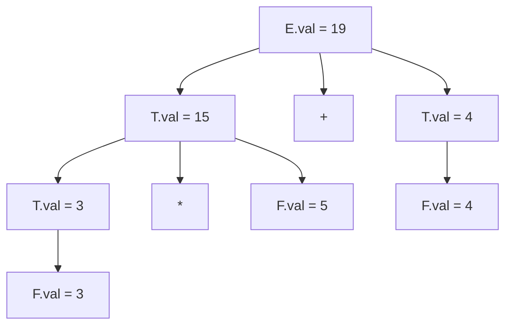

  
⬅️ <b><a href="/pt-br/resource/engenharia-de-computação/6-periodo/compiladores/anotacoes/aula-09-estruturas-e-gerenciamento-da-tabela-de-simbolos">Aula Anterior</a></b>

  
🏠 <b><a href="/pt-br/resource/engenharia-de-computação/6-periodo/compiladores">Hub da Disciplina</a></b>

  
➡️ <b><a href="/pt-br/resource/engenharia-de-computação/6-periodo/compiladores/anotacoes/aula-11-sistemas-de-tipos-inferencia-e-verificacao-semantica">Próxima Aula</a></b>

> [!info] 📅 Informações da Aula
> - **Disciplina:** Compiladores (CSECBJI.48)
> - **Professor:** Fabrício Barros
> - **Data Realizada:** 06/11/2026
> - **Tópico Principal:** Análise Semântica: Esquemas de Tradução Dirigidos por Sintaxe (SDT)
> - **Status:** Concluída e Revisada

> [!note] 📂 Material Complementar & Slides
> - 📄 **Slides Oficiais:** [[slide-10-compiladores|Acessar Apresentação em PDF]]
> - 🎥 **Short Lecture / Gravação:** [[video-10-compiladores|Assistir Síntese da Aula (Vídeo)]]

---

### 📑 Resumo das Seções
- [📌 1. Anotações do Quadro: Análise Semântica: Esquemas de Tradução Dirigidos por Sintaxe (SDT)](#-anotações-do-quadro-análise-semântica-esquemas-de-tradução-dirigidos-por-sintaxe-sdt)
- [🧮 2. Formulação & Exemplo Prático Resolvido](#-formulação--exemplo-prático-resolvido)
- [📊 3. Esquema Visual & Fluxograma (Mermaid)](#-esquema-visual--fluxograma-mermaid)
- [🧠 4. Resumo Pessoal & Macetes do Professor](#-resumo-pessoal--macetes-do-professor)
- [📝 5. Dúvidas & Exercícios Recomendados para Casa](#-dúvidas--exercícios-recomendados-para-casa)

---

## 📌 Anotações do Quadro: Análise Semântica: Esquemas de Tradução Dirigidos por Sintaxe (SDT)

### 10.1 Definições Dirigidas por Sintaxe (SDD)
Uma **Definição Dirigida por Sintaxe (SDD)** associa regras semânticas a cada produção gramatical. Cada símbolo possui atributos:
- **Atributos Sintetizados:** O valor no nó pai $N$ é calculado estritamente a partir dos valores dos nós filhos de $N$.
- **Atributos Herdados:** O valor no nó $N$ é calculado a partir dos atributos dos nós irmãos de $N$ ou do seu nó pai.

### 10.2 Classes de Gramáticas com Atributos
1. **Gramáticas $S$-Atribuídas:** Utilizam **exclusivamente atributos sintetizados**. Podem ser avaliadas de forma puramente *bottom-up* durante o parsing LR em um único passe.
2. **Gramáticas $L$-Atribuídas:** Permitem atributos herdados, com a restrição de que cada atributo herdado de um nó filho depende apenas dos atributos do pai ou dos irmãos à sua esquerda.

---

## 🧮 Formulação & Exemplo Prático Resolvido

### ✏️ Exemplo: SDD para Calculadora de Expressões ($S$-Atribuída)

| Produção Gramatical | Regra Semântica Associada |
| :--- | :--- |
| $L \to E \; \mathbf{n}$ | $\text{print}(E.val)$ |
| $E \to E_1 + T$ | $E.val = E_1.val + T.val$ |
| $E \to T$ | $E.val = T.val$ |
| $T \to T_1 * F$ | $T.val = T_1.val * F.val$ |
| $T \to F$ | $T.val = F.val$ |
| $F \to ( E )$ | $F.val = E.val$ |
| $F \to \mathbf{digit}$ | $F.val = \mathbf{digit}.lexval$ |

**Grafo de Dependência para `3 * 5 + 4`:**
- Folha $F_1.val = 3$, Folha $F_2.val = 5 \implies T_1.val = 15$
- Folha $F_3.val = 4 \implies T_2.val = 4$
- Raiz $E.val = 15 + 4 = 19$

---

## 📊 Esquema Visual & Fluxograma (Mermaid)

---

## 🧠 Resumo Pessoal & Macetes do Professor

| Conceito-Chave | *Takeaway* do Professor | Dicas de Prova / Atenção |
| :--- | :--- | :--- |
| **Ciclos no Grafo de Dependência** | Se o grafo de dependência contiver ciclos, a SDD não pode ser avaliada! Garanta que seja $S$-atribuída ou $L$-atribuída. | A ordenação topológica do grafo fornece a sequência exata de avaliação. |
| **Ações Embutidas no Bison** | Ações como `{ $$ = $1 + $3; }` em especificações Bison implementam diretamente SDDs $S$-atribuídas. | Aplicação prática direta |

---

## 📝 Dúvidas & Exercícios Recomendados para Casa

1. Escreva a SDD para converter números binários para base decimal (ex: `1101` $	o 13$).
2. Diferencie formalmente um atributo sintetizado de um herdado.

---

  
⬅️ <b><a href="/pt-br/resource/engenharia-de-computação/6-periodo/compiladores/anotacoes/aula-09-estruturas-e-gerenciamento-da-tabela-de-simbolos">Aula Anterior</a></b>

  
🏠 <b><a href="/pt-br/resource/engenharia-de-computação/6-periodo/compiladores">Hub da Disciplina</a></b>

  
➡️ <b><a href="/pt-br/resource/engenharia-de-computação/6-periodo/compiladores/anotacoes/aula-11-sistemas-de-tipos-inferencia-e-verificacao-semantica">Próxima Aula</a></b>

