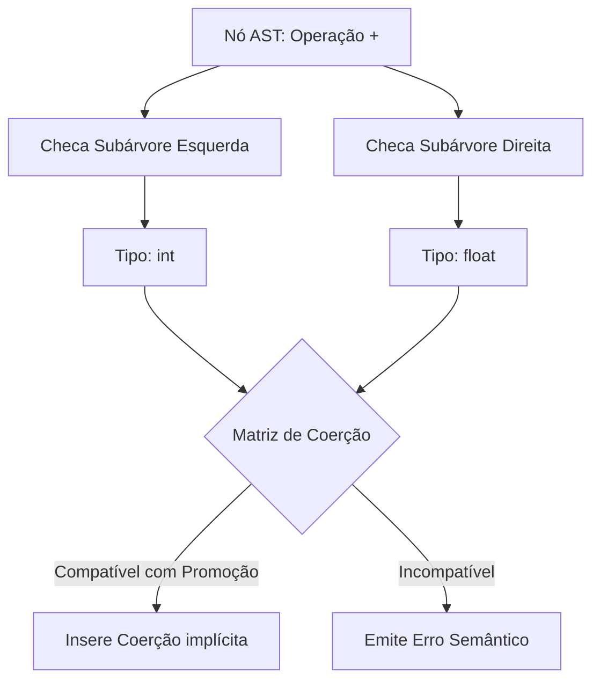

<div style="display: flex; justify-content: space-between; align-items: center; padding: 10px 16px; background: var(--light, #f8fafc); border: 1px solid var(--lightgray, #e2e8f0); border-radius: 10px; margin: 1.5rem 0;">
  <div>⬅️ <b><a href="/pt-br/resource/engenharia-de-computação/6-periodo/compiladores/anotacoes/aula-10-analise-semantica-esquemas-de-traducao-dirigidos-por-sintaxe-sdt">Aula Anterior</a></b></div>
  <div>🏠 <b><a href="/pt-br/resource/engenharia-de-computação/6-periodo/compiladores">Hub da Disciplina</a></b></div>
  <div>➡️ <b><a href="/pt-br/resource/engenharia-de-computação/6-periodo/compiladores/anotacoes/aula-12-geracao-de-codigo-intermediario-arvores-sintaticas-e-tac">Próxima Aula</a></b></div>
</div>

> [!info] 📅 Informações da Aula
> - **Disciplina:** Compiladores (CSECBJI.48)
> - **Professor:** Fabrício Barros
> - **Data Realizada:** 13/11/2026
> - **Tópico Principal:** Sistemas de Tipos, Inferência e Verificação Semântica
> - **Status:** Concluída e Revisada

> [!note] 📂 Material Complementar & Slides
> - 📄 **Slides Oficiais:** [[slide-11-compiladores|Acessar Apresentação em PDF]]
> - 🎥 **Short Lecture / Gravação:** [[video-11-compiladores|Assistir Síntese da Aula (Vídeo)]]

---

### 📑 Resumo das Seções
- [📌 1. Anotações do Quadro: Sistemas de Tipos, Inferência e Verificação Semântica](#-anotações-do-quadro-sistemas-de-tipos,-inferência-e-verificação-semântica)
- [🧮 2. Formulação & Exemplo Prático Resolvido](#-formulação--exemplo-prático-resolvido)
- [📊 3. Esquema Visual & Fluxograma (Mermaid)](#-esquema-visual--fluxograma-mermaid)
- [🧠 4. Resumo Pessoal & Macetes do Professor](#-resumo-pessoal--macetes-do-professor)
- [📝 5. Dúvidas & Exercícios Recomendados para Casa](#-dúvidas--exercícios-recomendados-para-casa)

---

## 📌 Anotações do Quadro: Sistemas de Tipos, Inferência e Verificação Semântica

### 11.1 Fundamentos de Sistemas de Tipos
Um **Sistema de Tipos** é um conjunto formal de regras lógicas que atribuem expressões de tipo a variáveis, expressões e funções, garantindo *Type Safety*.

Classificação:
- **Tipagem Estática:** Verificação completa em tempo de compilação (C, Java, Rust).
- **Tipagem Dinâmica:** Verificação em tempo de execução (Python, JavaScript).
- **Tipagem Forte:** Rejeita operações incompatíveis sem conversão explícita.

### 11.2 Regras de Inferência e Coerção
Regra de inferência formal:
$$\frac{\Gamma \vdash e_1 : \mathbf{float} \quad \Gamma \vdash e_2 : \mathbf{int}}{\Gamma \vdash e_1 + \text{inttofloat}(e_2) : \mathbf{float}}$$

---

## 🧮 Formulação & Exemplo Prático Resolvido

### ✏️ Algoritmo de Verificação de Tipos na AST

```python
def check_type(node, env):
    if node.kind == "INT_LITERAL":
        return Type.INT
    elif node.kind == "FLOAT_LITERAL":
        return Type.FLOAT
    elif node.kind == "VAR":
        sym = env.lookup(node.name)
        if not sym:
            raise SemanticError(f"Variável '{node.name}' não declarada!")
        return sym.type
    elif node.kind == "BINARY_OP":
        t_left = check_type(node.left, env)
        t_right = check_type(node.right, env)
        if t_left == t_right:
            return t_left
        elif t_left == Type.FLOAT and t_right == Type.INT:
            node.right = ASTNode("COERCE_TO_FLOAT", child=node.right)
            return Type.FLOAT
        else:
            raise SemanticError(f"Incompatibilidade: {t_left} e {t_right}")
```

---

## 📊 Esquema Visual & Fluxograma (Mermaid)



---

## 🧠 Resumo Pessoal & Macetes do Professor

| Conceito-Chave | *Takeaway* do Professor | Dicas de Prova / Atenção |
| :--- | :--- | :--- |
| **L-Values vs R-Values** | Um *L-Value* denota posição de memória atribuível; um *R-Value* denota valor transitório. | A atribuição `a + 5 = 10` falha na análise semântica porque o lado esquerdo não é um L-Value! |
| **Aridade e Assinatura** | Verifique quantidade e tipos correspondentes de parâmetros em chamadas de função. | Aplicação prática direta |

---

## 📝 Dúvidas & Exercícios Recomendados para Casa

1. Escreva a regra de inferência de tipos para `if (cond) stmt1 else stmt2`.
2. Construa a matriz de coerção de tipos entre `char`, `int`, `float` e `double`.

---

<div style="display: flex; justify-content: space-between; align-items: center; padding: 10px 16px; background: var(--light, #f8fafc); border: 1px solid var(--lightgray, #e2e8f0); border-radius: 10px; margin: 1.5rem 0;">
  <div>⬅️ <b><a href="/pt-br/resource/engenharia-de-computação/6-periodo/compiladores/anotacoes/aula-10-analise-semantica-esquemas-de-traducao-dirigidos-por-sintaxe-sdt">Aula Anterior</a></b></div>
  <div>🏠 <b><a href="/pt-br/resource/engenharia-de-computação/6-periodo/compiladores">Hub da Disciplina</a></b></div>
  <div>➡️ <b><a href="/pt-br/resource/engenharia-de-computação/6-periodo/compiladores/anotacoes/aula-12-geracao-de-codigo-intermediario-arvores-sintaticas-e-tac">Próxima Aula</a></b></div>
</div>
