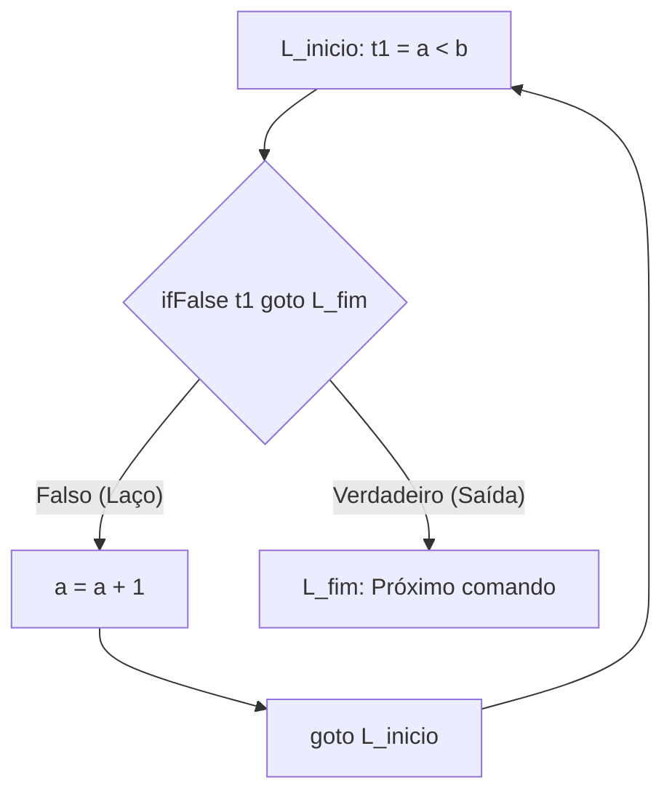

<div style="display: flex; justify-content: space-between; align-items: center; padding: 10px 16px; background: var(--light, #f8fafc); border: 1px solid var(--lightgray, #e2e8f0); border-radius: 10px; margin: 1.5rem 0;">
  <div>⬅️ <b><a href="/pt-br/resource/engenharia-de-computação/6-periodo/compiladores/anotacoes/aula-11-sistemas-de-tipos-inferencia-e-verificacao-semantica">Aula Anterior</a></b></div>
  <div>🏠 <b><a href="/pt-br/resource/engenharia-de-computação/6-periodo/compiladores">Hub da Disciplina</a></b></div>
  <div>➡️ <b><a href="/pt-br/resource/engenharia-de-computação/6-periodo/compiladores/anotacoes/aula-13-otimizacao-de-codigo-independente-de-maquina">Próxima Aula</a></b></div>
</div>

> [!info] 📅 Informações da Aula
> - **Disciplina:** Compiladores (CSECBJI.48)
> - **Professor:** Fabrício Barros
> - **Data Realizada:** 20/11/2026
> - **Tópico Principal:** Geração de Código Intermediário: Árvores Sintáticas e TAC
> - **Status:** Concluída e Revisada

> [!note] 📂 Material Complementar & Slides
> - 📄 **Slides Oficiais:** [[slide-12-compiladores|Acessar Apresentação em PDF]]
> - 🎥 **Short Lecture / Gravação:** [[video-12-compiladores|Assistir Síntese da Aula (Vídeo)]]

---

### 📑 Resumo das Seções
- [📌 1. Anotações do Quadro: Geração de Código Intermediário: Árvores Sintáticas e TAC](#-anotações-do-quadro-geração-de-código-intermediário-árvores-sintáticas-e-tac)
- [🧮 2. Formulação & Exemplo Prático Resolvido](#-formulação--exemplo-prático-resolvido)
- [📊 3. Esquema Visual & Fluxograma (Mermaid)](#-esquema-visual--fluxograma-mermaid)
- [🧠 4. Resumo Pessoal & Macetes do Professor](#-resumo-pessoal--macetes-do-professor)
- [📝 5. Dúvidas & Exercícios Recomendados para Casa](#-dúvidas--exercícios-recomendados-para-casa)

---

## 📌 Anotações do Quadro: Geração de Código Intermediário: Árvores Sintáticas e TAC

### 12.1 Por que Representações Intermediárias (IR)?
A **Representação Intermediária (IR)** fornece uma forma linearizada e independente de plataforma, desacoplando o front-end do back-end.

### 12.2 Three-Address Code (TAC)
No modelo de **Código de Três Endereços (TAC)**, cada instrução possui no máximo **um operador** e **três endereços**:
$$x = y \;\mathbf{op}\; z$$

Formas de Instruções TAC:
1. `x = y + z` (Atribuição binária)
2. `x = -y` (Atribuição unária)
3. `goto L` (Salto incondicional)
4. `if x < y goto L` (Salto condicional)
5. `param x`, `call f, n` (Chamada de função)
6. `x = y[i]` (Acesso indexado)

---

## 🧮 Formulação & Exemplo Prático Resolvido

### ✏️ Tradução de `while (a < b) { a = a + 1; }` para TAC

**Código TAC Gerado com Rótulos:**
```text
L_inicio:
    t1 = a < b
    ifFalse t1 goto L_fim
    t2 = a + 1
    a = t2
    goto L_inicio
L_fim:
```

---

## 📊 Esquema Visual & Fluxograma (Mermaid)



---

## 🧠 Resumo Pessoal & Macetes do Professor

| Conceito-Chave | *Takeaway* do Professor | Dicas de Prova / Atenção |
| :--- | :--- | :--- |
| **Avaliação em Curto-Circuito** | Expressões booleanas em controle de fluxo geram saltos diretos sem calcular valores 0 ou 1. | Reduz significativamente a quantidade de instruções executadas. |
| **Quádruplas vs Triplas** | Quádruplas usam temporários explícitos `(op, arg1, arg2, res)`; Triplas usam posições da tabela `(op, arg1, arg2)`. | Quádruplas facilitam a reordenação em otimizações. |

---

## 📝 Dúvidas & Exercícios Recomendados para Casa

1. Traduza `if (x > y || z == 0) a = b * c; else a = 0;` para TAC com curto-circuito.
2. Escreva a representação em Quádruplas para `A[i][j] = B[i][j] + 5`.

---

<div style="display: flex; justify-content: space-between; align-items: center; padding: 10px 16px; background: var(--light, #f8fafc); border: 1px solid var(--lightgray, #e2e8f0); border-radius: 10px; margin: 1.5rem 0;">
  <div>⬅️ <b><a href="/pt-br/resource/engenharia-de-computação/6-periodo/compiladores/anotacoes/aula-11-sistemas-de-tipos-inferencia-e-verificacao-semantica">Aula Anterior</a></b></div>
  <div>🏠 <b><a href="/pt-br/resource/engenharia-de-computação/6-periodo/compiladores">Hub da Disciplina</a></b></div>
  <div>➡️ <b><a href="/pt-br/resource/engenharia-de-computação/6-periodo/compiladores/anotacoes/aula-13-otimizacao-de-codigo-independente-de-maquina">Próxima Aula</a></b></div>
</div>
