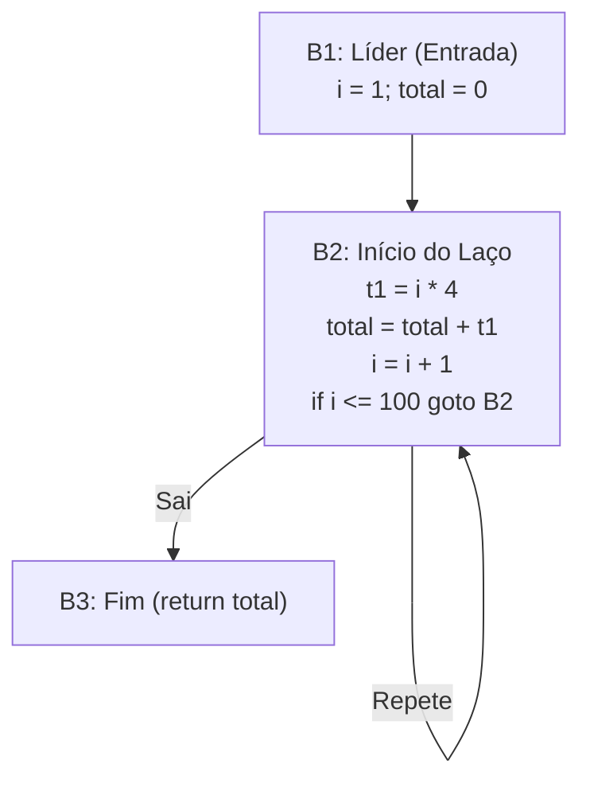

<div style="display: flex; justify-content: space-between; align-items: center; padding: 10px 16px; background: var(--light, #f8fafc); border: 1px solid var(--lightgray, #e2e8f0); border-radius: 10px; margin: 1.5rem 0;">
  <div>⬅️ <b><a href="/pt-br/resource/engenharia-de-computação/6-periodo/compiladores/anotacoes/aula-12-geracao-de-codigo-intermediario-arvores-sintaticas-e-tac">Aula Anterior</a></b></div>
  <div>🏠 <b><a href="/pt-br/resource/engenharia-de-computação/6-periodo/compiladores">Hub da Disciplina</a></b></div>
  <div>➡️ <b><a href="/pt-br/resource/engenharia-de-computação/6-periodo/compiladores/anotacoes/aula-14-ambientes-de-tempo-de-execucao-alocacao-de-pilha-e-coleta-de-lixo">Próxima Aula</a></b></div>
</div>

> [!info] 📅 Informações da Aula
> - **Disciplina:** Compiladores (CSECBJI.48)
> - **Professor:** Fabrício Barros
> - **Data Realizada:** 27/11/2026
> - **Tópico Principal:** Otimização de Código Independente de Máquina
> - **Status:** Concluída e Revisada

> [!note] 📂 Material Complementar & Slides
> - 📄 **Slides Oficiais:** [[slide-13-compiladores|Acessar Apresentação em PDF]]
> - 🎥 **Short Lecture / Gravação:** [[video-13-compiladores|Assistir Síntese da Aula (Vídeo)]]

---

### 📑 Resumo das Seções
- [📌 1. Anotações do Quadro: Otimização de Código Independente de Máquina](#-anotações-do-quadro-otimização-de-código-independente-de-máquina)
- [🧮 2. Formulação & Exemplo Prático Resolvido](#-formulação--exemplo-prático-resolvido)
- [📊 3. Esquema Visual & Fluxograma (Mermaid)](#-esquema-visual--fluxograma-mermaid)
- [🧠 4. Resumo Pessoal & Macetes do Professor](#-resumo-pessoal--macetes-do-professor)
- [📝 5. Dúvidas & Exercícios Recomendados para Casa](#-dúvidas--exercícios-recomendados-para-casa)

---

## 📌 Anotações do Quadro: Otimização de Código Independente de Máquina

### 13.1 Particionamento em Blocos Básicos (*Basic Blocks*)
Um **Bloco Básico** é uma sequência máxima de instruções TAC consecutivas na qual o fluxo entra apenas na primeira e sai apenas na última instrução.

**Líderes de Bloco:**
- Primeira instrução do programa.
- Alvo de qualquer salto (`goto L`).
- Instrução imediatamente após qualquer salto.

### 13.2 Técnicas de Otimização Clássicas
- **Dobra de Constantes (*Constant Folding*):** Avaliação de literais em compilação (`2 * 3.14` $\to 6.28$).
- **Propagação de Constantes:** Substituição de variáveis de valor conhecido constante.
- **Eliminação de Subexpressões Comuns (CSE):** Reutilização de cálculos idênticos.
- **Eliminação de Código Morto (*Dead Code Elimination*):** Remoção de código inalcançável ou sem efeito.

---

## 🧮 Formulação & Exemplo Prático Resolvido

### ✏️ Exemplo de Otimização sobre Bloco Básico

**Código TAC Original:**
```text
t1 = 4 * i
t2 = a[t1]
t3 = 4 * i
t4 = b[t3]
t5 = t2 + t4
t6 = 4 * i
c[t6] = t5
```

**Código Otimizado (Eliminação de Subexpressões Comuns):**
```text
t1 = 4 * i
t2 = a[t1]
t4 = b[t1]
t5 = t2 + t4
c[t1] = t5
```

---

## 📊 Esquema Visual & Fluxograma (Mermaid)



---

## 🧠 Resumo Pessoal & Macetes do Professor

| Conceito-Chave | *Takeaway* do Professor | Dicas de Prova / Atenção |
| :--- | :--- | :--- |
| **Preservação da Semântica** | Uma otimização NUNCA pode alterar o resultado observável do programa nem suprimir efeitos colaterais. | Cuidado com overflow ao dobrar constantes. |
| **Invariantes de Laço** | Expressões calculadas no laço cujo valor não muda a cada iteração devem ser movidas para antes do laço. | Aplicação prática direta |

---

## 📝 Dúvidas & Exercícios Recomendados para Casa

1. Particione um código TAC fornecido em Blocos Básicos e desenhe o CFG.
2. Aplique Constant Folding e Dead Code Elimination no bloco proposto.

---

<div style="display: flex; justify-content: space-between; align-items: center; padding: 10px 16px; background: var(--light, #f8fafc); border: 1px solid var(--lightgray, #e2e8f0); border-radius: 10px; margin: 1.5rem 0;">
  <div>⬅️ <b><a href="/pt-br/resource/engenharia-de-computação/6-periodo/compiladores/anotacoes/aula-12-geracao-de-codigo-intermediario-arvores-sintaticas-e-tac">Aula Anterior</a></b></div>
  <div>🏠 <b><a href="/pt-br/resource/engenharia-de-computação/6-periodo/compiladores">Hub da Disciplina</a></b></div>
  <div>➡️ <b><a href="/pt-br/resource/engenharia-de-computação/6-periodo/compiladores/anotacoes/aula-14-ambientes-de-tempo-de-execucao-alocacao-de-pilha-e-coleta-de-lixo">Próxima Aula</a></b></div>
</div>
