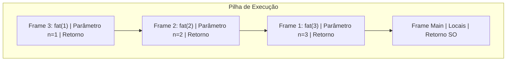

<div style="display: flex; justify-content: space-between; align-items: center; padding: 10px 16px; background: var(--light, #f8fafc); border: 1px solid var(--lightgray, #e2e8f0); border-radius: 10px; margin: 1.5rem 0;">
  <div>⬅️ <b><a href="/pt-br/resource/engenharia-de-computação/6-periodo/compiladores/anotacoes/aula-13-otimizacao-de-codigo-independente-de-maquina">Aula Anterior</a></b></div>
  <div>🏠 <b><a href="/pt-br/resource/engenharia-de-computação/6-periodo/compiladores">Hub da Disciplina</a></b></div>
  <div>➡️ <b><a href="/pt-br/resource/engenharia-de-computação/6-periodo/compiladores/anotacoes/aula-15-avaliacao-pratica-p2-e-apresentacao-do-compilador-desenvolvido">Próxima Aula</a></b></div>
</div>

> [!info] 📅 Informações da Aula
> - **Disciplina:** Compiladores (CSECBJI.48)
> - **Professor:** Fabrício Barros
> - **Data Realizada:** 04/12/2026
> - **Tópico Principal:** Ambientes de Tempo de Execução, Alocação de Pilha e Coleta de Lixo
> - **Status:** Concluída e Revisada

> [!note] 📂 Material Complementar & Slides
> - 📄 **Slides Oficiais:** [[slide-14-compiladores|Acessar Apresentação em PDF]]
> - 🎥 **Short Lecture / Gravação:** [[video-14-compiladores|Assistir Síntese da Aula (Vídeo)]]

---

### 📑 Resumo das Seções
- [📌 1. Anotações do Quadro: Ambientes de Tempo de Execução, Alocação de Pilha e Coleta de Lixo](#-anotações-do-quadro-ambientes-de-tempo-de-execução,-alocação-de-pilha-e-coleta-de-lixo)
- [🧮 2. Formulação & Exemplo Prático Resolvido](#-formulação--exemplo-prático-resolvido)
- [📊 3. Esquema Visual & Fluxograma (Mermaid)](#-esquema-visual--fluxograma-mermaid)
- [🧠 4. Resumo Pessoal & Macetes do Professor](#-resumo-pessoal--macetes-do-professor)
- [📝 5. Dúvidas & Exercícios Recomendados para Casa](#-dúvidas--exercícios-recomendados-para-casa)

---

## 📌 Anotações do Quadro: Ambientes de Tempo de Execução, Alocação de Pilha e Coleta de Lixo

### 14.1 Organização do Espaço de Endereçamento Virtual
Layout de memória de um processo compilado:
```text
Endereço Alto (0xFFFFFFFFFFFFFFFF)
┌────────────────────────────────────────┐
│ Pilha de Execução (Stack)              │  ▼ Cresce para baixo
├────────────────────────────────────────┤
│                  ▲                     │
│ Heap (Alocação Dinâmica: malloc/new)   │  ▲ Cresce para cima
├────────────────────────────────────────┤
│ Segmento BSS / Data                    │
├────────────────────────────────────────┤
│ Segmento Text (Código Máquina)         │  Somente Leitura
└────────────────────────────────────────┘
Endereço Baixo (0x0000000000000000)
```

### 14.2 Registros de Ativação (*Stack Frame*)
- **Stack Pointer ($SP$):** Aponta para o topo dinâmico da pilha.
- **Frame Pointer ($FP$ / $RBP$):** Aponta para a base fixa do frame atual para acesso a variáveis locais e parâmetros.

### 14.3 Coleta de Lixo (*Garbage Collection*)
- **Mark-and-Sweep:** 1. Marca objetos acessíveis a partir das raízes; 2. Varre o Heap liberando objetos não marcados.
- **Coletor Geracional:** Separa objetos por idade (Geração Jovem vs Velha).

---

## 🧮 Formulação & Exemplo Prático Resolvido

### ✏️ Rastreamento de Chamada Recursiva na Pilha: `fat(3)`

1. `main` chama `fat(3)` $\to$ Empilha Frame 1 ($n=3$).
2. `fat(3)` chama `fat(2)` $\to$ Empilha Frame 2 ($n=2$).
3. `fat(2)` chama `fat(1)` $\to$ Empilha Frame 3 ($n=1$, caso base).
4. Retorno: Frame 3 retorna `1`, Frame 2 calcula $2 \times 1 = 2$, Frame 1 calcula $3 \times 2 = 6$.

---

## 📊 Esquema Visual & Fluxograma (Mermaid)



---

## 🧠 Resumo Pessoal & Macetes do Professor

| Conceito-Chave | *Takeaway* do Professor | Dicas de Prova / Atenção |
| :--- | :--- | :--- |
| **Prólogo e Epílogo** | Prólogo salva $RBP$ e aloca espaço local; Epílogo restaura $RSP$, desempilha $RBP$ e executa `ret`. | Erros no epílogo causam Falha de Segmentação (*Segfault*). |
| **Stack Overflow** | Recursão infinita estoura o limite do segmento de pilha. | Aplicação prática direta |

---

## 📝 Dúvidas & Exercícios Recomendados para Casa

1. Desenhe o layout do Stack Frame em x86_64 para `int soma(int a, int b, int c)` com variáveis locais `int x, y`.
2. Compare Mark-and-Sweep com Stop-and-Copy em termos de fragmentação.

---

<div style="display: flex; justify-content: space-between; align-items: center; padding: 10px 16px; background: var(--light, #f8fafc); border: 1px solid var(--lightgray, #e2e8f0); border-radius: 10px; margin: 1.5rem 0;">
  <div>⬅️ <b><a href="/pt-br/resource/engenharia-de-computação/6-periodo/compiladores/anotacoes/aula-13-otimizacao-de-codigo-independente-de-maquina">Aula Anterior</a></b></div>
  <div>🏠 <b><a href="/pt-br/resource/engenharia-de-computação/6-periodo/compiladores">Hub da Disciplina</a></b></div>
  <div>➡️ <b><a href="/pt-br/resource/engenharia-de-computação/6-periodo/compiladores/anotacoes/aula-15-avaliacao-pratica-p2-e-apresentacao-do-compilador-desenvolvido">Próxima Aula</a></b></div>
</div>
