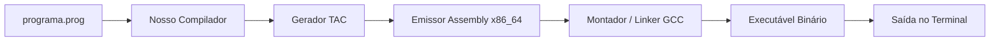

<div style="display: flex; justify-content: space-between; align-items: center; padding: 10px 16px; background: var(--light, #f8fafc); border: 1px solid var(--lightgray, #e2e8f0); border-radius: 10px; margin: 1.5rem 0;">
  <div>⬅️ <b><a href="/pt-br/resource/engenharia-de-computação/6-periodo/compiladores/anotacoes/aula-14-ambientes-de-tempo-de-execucao-alocacao-de-pilha-e-coleta-de-lixo">Aula Anterior</a></b></div>
  <div>🏠 <b><a href="/pt-br/resource/engenharia-de-computação/6-periodo/compiladores">Hub da Disciplina</a></b></div>
  <div>➡️ <b><a href="/pt-br/resource/engenharia-de-computação/6-periodo/compiladores/anotacoes/aula-16-prova-final-de-compiladores-e-encerramento">Próxima Aula</a></b></div>
</div>

> [!info] 📅 Informações da Aula
> - **Disciplina:** Compiladores (CSECBJI.48)
> - **Professor:** Fabrício Barros
> - **Data Realizada:** 11/12/2026
> - **Tópico Principal:** Avaliação Prática P2 e Apresentação do Compilador Desenvolvido
> - **Status:** Concluída e Revisada

> [!note] 📂 Material Complementar & Slides
> - 📄 **Slides Oficiais:** [[slide-15-compiladores|Acessar Apresentação em PDF]]
> - 🎥 **Short Lecture / Gravação:** [[video-15-compiladores|Assistir Síntese da Aula (Vídeo)]]

---

### 📑 Resumo das Seções
- [📌 1. Anotações do Quadro: Avaliação Prática P2 e Apresentação do Compilador Desenvolvido](#-anotações-do-quadro-avaliação-prática-p2-e-apresentação-do-compilador-desenvolvido)
- [🧮 2. Formulação & Exemplo Prático Resolvido](#-formulação--exemplo-prático-resolvido)
- [📊 3. Esquema Visual & Fluxograma (Mermaid)](#-esquema-visual--fluxograma-mermaid)
- [🧠 4. Resumo Pessoal & Macetes do Professor](#-resumo-pessoal--macetes-do-professor)
- [📝 5. Dúvidas & Exercícios Recomendados para Casa](#-dúvidas--exercícios-recomendados-para-casa)

---

## 📌 Anotações do Quadro: Avaliação Prática P2 e Apresentação do Compilador Desenvolvido

### 15.1 Critérios de Avaliação e Testes de Conformidade
A avaliação prática P2 consiste na entrega e defesa do compilador completo implementado:
1. Análise léxica e sintática livre de conflitos.
2. Tabela de símbolos com suporte a escopos aninhados.
3. Checagem de tipos estática e tratamento de coerção.
4. Geração de código intermediário TAC ou assembly executável.
5. Bateria de testes de regressão automatizados.

---

## 🧮 Formulação & Exemplo Prático Resolvido

### ✏️ Script de Validação de Testes do Compilador

```bash
#!/bin/bash
TOTAL=0; PASSOU=0
for test_file in tests/validos/*.prog; do
    TOTAL=$((TOTAL + 1))
    ./meu_compilador "$test_file" -o out.s
    gcc out.s -o prog_exec
    ./prog_exec > out.txt
    if diff -q out.txt "${test_file%.prog}.expected"; then
        echo "[PASSOU] $test_file"
        PASSOU=$((PASSOU + 1))
    fi
done
echo "Total: $PASSOU / $TOTAL testes bem-sucedidos."
```

---

## 📊 Esquema Visual & Fluxograma (Mermaid)



---

## 🧠 Resumo Pessoal & Macetes do Professor

| Conceito-Chave | *Takeaway* do Professor | Dicas de Prova / Atenção |
| :--- | :--- | :--- |
| **Checklist de Defesa P2** | Tenha em mãos os arquivos `.l`, `.y` e a suite de testes automatizada. | Esteja preparado para explicar como a Tabela de Símbolos opera. |
| **Tratamento de Erros** | O compilador não pode abortar com crash/segfault perante entradas sintaticamente inválidas. | Aplicação prática direta |

---

## 📝 Dúvidas & Exercícios Recomendados para Casa

1. Execute a suite de testes no compilador desenvolvido.
2. Implemente um teste para verificar a avaliação em curto-circuito.

---

<div style="display: flex; justify-content: space-between; align-items: center; padding: 10px 16px; background: var(--light, #f8fafc); border: 1px solid var(--lightgray, #e2e8f0); border-radius: 10px; margin: 1.5rem 0;">
  <div>⬅️ <b><a href="/pt-br/resource/engenharia-de-computação/6-periodo/compiladores/anotacoes/aula-14-ambientes-de-tempo-de-execucao-alocacao-de-pilha-e-coleta-de-lixo">Aula Anterior</a></b></div>
  <div>🏠 <b><a href="/pt-br/resource/engenharia-de-computação/6-periodo/compiladores">Hub da Disciplina</a></b></div>
  <div>➡️ <b><a href="/pt-br/resource/engenharia-de-computação/6-periodo/compiladores/anotacoes/aula-16-prova-final-de-compiladores-e-encerramento">Próxima Aula</a></b></div>
</div>
