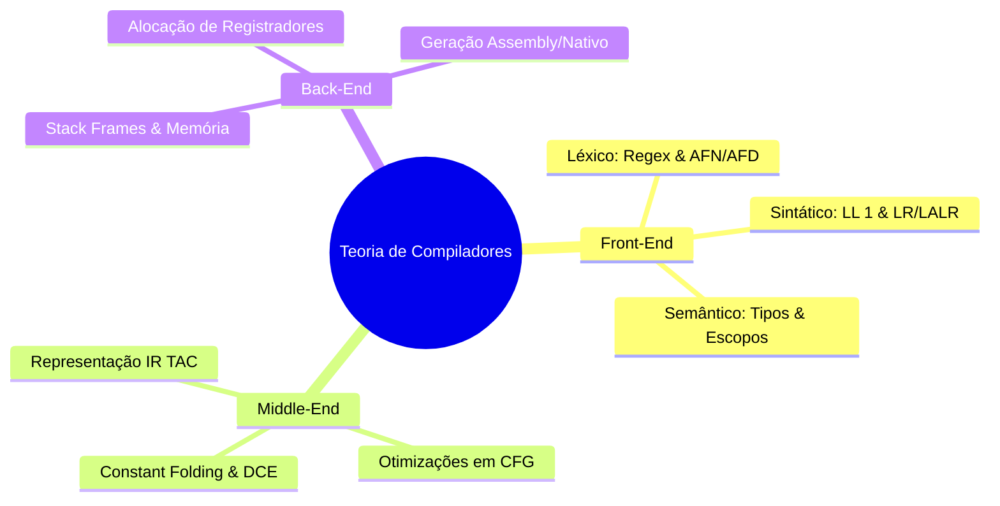

<div style="display: flex; justify-content: space-between; align-items: center; padding: 10px 16px; background: var(--light, #f8fafc); border: 1px solid var(--lightgray, #e2e8f0); border-radius: 10px; margin: 1.5rem 0;">
  <div>⬅️ <b><a href="/pt-br/resource/engenharia-de-computação/6-periodo/compiladores/anotacoes/aula-15-avaliacao-pratica-p2-e-apresentacao-do-compilador-desenvolvido">Aula Anterior</a></b></div>
  <div>🏠 <b><a href="/pt-br/resource/engenharia-de-computação/6-periodo/compiladores">Hub da Disciplina</a></b></div>
  <div>➡️ <span style="color: gray;">Última Aula</span></div>
</div>

> [!info] 📅 Informações da Aula
> - **Disciplina:** Compiladores (CSECBJI.48)
> - **Professor:** Fabrício Barros
> - **Data Realizada:** 18/12/2026
> - **Tópico Principal:** Prova Final de Compiladores e Encerramento
> - **Status:** Concluída e Revisada

> [!note] 📂 Material Complementar & Slides
> - 📄 **Slides Oficiais:** [[slide-16-compiladores|Acessar Apresentação em PDF]]
> - 🎥 **Short Lecture / Gravação:** [[video-16-compiladores|Assistir Síntese da Aula (Vídeo)]]

---

### 📑 Resumo das Seções
- [📌 1. Anotações do Quadro: Prova Final de Compiladores e Encerramento](#-anotações-do-quadro-prova-final-de-compiladores-e-encerramento)
- [🧮 2. Formulação & Exemplo Prático Resolvido](#-formulação--exemplo-prático-resolvido)
- [📊 3. Esquema Visual & Fluxograma (Mermaid)](#-esquema-visual--fluxograma-mermaid)
- [🧠 4. Resumo Pessoal & Macetes do Professor](#-resumo-pessoal--macetes-do-professor)
- [📝 5. Dúvidas & Exercícios Recomendados para Casa](#-dúvidas--exercícios-recomendados-para-casa)

---

## 📌 Anotações do Quadro: Prova Final de Compiladores e Encerramento

### 16.1 Síntese Holística da Teoria de Compiladores
A disciplina de Compiladores integra Teoria da Computação, Linguagens Formais, Estruturas de Dados Avançadas e Arquitetura de Computadores:
```text
Código Fonte ──▶ Léxico ──▶ Sintático ──▶ Semântico ──▶ TAC IR ──▶ Otimizador ──▶ Assembly/Executável
```

### 16.2 Tecnologias Modernas na Indústria
- **LLVM:** Padrão industrial moderno adotado por Clang, Rustc e Swift.
- **GraalVM & HotSpot:** Máquinas virtuais com compiladores JIT avançados.
- **Compiladores de Domínio Específico (DSL):** Shaders em GPUs e aceleradores de redes neurais (TVM, XLA).

---

## 🧮 Formulação & Exemplo Prático Resolvido

### ✏️ Mapa Geral de Competências Consolidadas

1. **Formalismo Matemático:** Expressões Regulares, Autômatos Finitos e GLCs.
2. **Engenharia de Software:** Gerenciamento de tabelas hash e árvores sintáticas.
3. **Compreensão do Hardware:** Registradores, convenções de chamada (C ABI) e layout de memória.

---

## 📊 Esquema Visual & Fluxograma (Mermaid)



---

## 🧠 Resumo Pessoal & Macetes do Professor

| Conceito-Chave | *Takeaway* do Professor | Dicas de Prova / Atenção |
| :--- | :--- | :--- |
| **Visão do Engenheiro** | Entender como o compilador opera transforma a maneira como escrevemos código de alto desempenho. | Otimizações manuais prematuras são frequentemente redundantes. |
| **Transição de Semestre** | Os conceitos de memória e registradores serão aprofundados em Sistemas Operacionais e Arquitetura. | Aplicação prática direta |

---

## 📝 Dúvidas & Exercícios Recomendados para Casa

1. Revisão final de todos os tópicos conceituais do semestre letivo 2026-2.
2. Consulte as referências clássicas recomendadas: Aho, Lam, Sethi & Ullman.

---

<div style="display: flex; justify-content: space-between; align-items: center; padding: 10px 16px; background: var(--light, #f8fafc); border: 1px solid var(--lightgray, #e2e8f0); border-radius: 10px; margin: 1.5rem 0;">
  <div>⬅️ <b><a href="/pt-br/resource/engenharia-de-computação/6-periodo/compiladores/anotacoes/aula-15-avaliacao-pratica-p2-e-apresentacao-do-compilador-desenvolvido">Aula Anterior</a></b></div>
  <div>🏠 <b><a href="/pt-br/resource/engenharia-de-computação/6-periodo/compiladores">Hub da Disciplina</a></b></div>
  <div>➡️ <span style="color: gray;">Última Aula</span></div>
</div>
