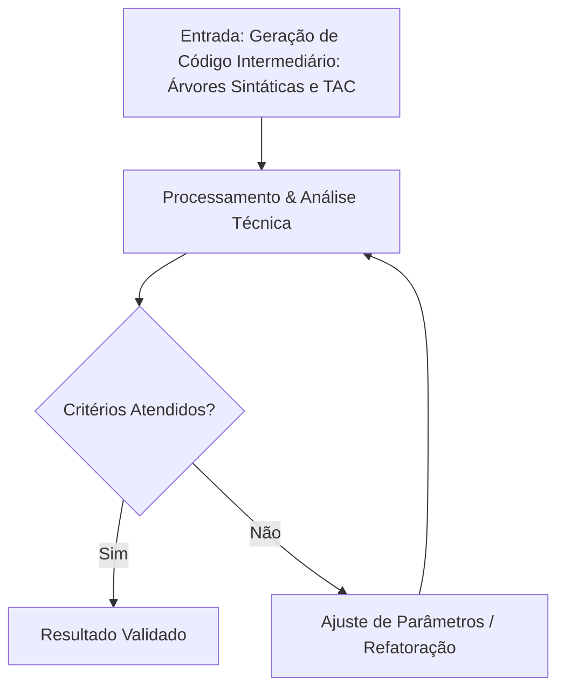

  
⬅️ <b><a href="/pt-br/resource/engenharia-de-computação/6-periodo/compiladores/anotacoes/aula-11-sistemas-de-tipos-inferencia-e-verificacao-semantica">Aula Anterior</a></b>

  
🏠 <b><a href="/pt-br/resource/engenharia-de-computação/6-periodo/compiladores">Hub da Disciplina</a></b>

  
➡️ <b><a href="/pt-br/resource/engenharia-de-computação/6-periodo/compiladores/anotacoes/aula-13-otimizacao-de-codigo-independente-de-maquina">Próxima Aula</a></b>

> [!info] 📌 Informações da Aula & Contexto do Quadro
> - **Disciplina:** Compiladores (`CSECBJI.48`)
> - **Docente Responsável:** Fabrício Barros
> - **Data & Horário:** 20/11/2026 (Sexta-feira) · `13:40–16:30 (3 tempos)`
> - **Tópico Central:** Geração de Código Intermediário: Árvores Sintáticas e TAC
> - **Status das Anotações:** 🟢 Planejada & Estruturada

> [!note] 📦 Material Didático e Recursos da Aula
> ### 📑 Material de Apoio
> - 📄 **[Slides da Aula (PDF)](/assets/disciplinas/6-periodo/compiladores/slides-aula-12.pdf)** — *Apresentação e notas do docente.*
> - 📖 **[Short Lecture — Compiladores](/pt-br/resource/engenharia-de-computação/6-periodo/compiladores/short-lecture)** — *Compêndio teórico completo.*

## 📋 Sumário Interativo
- [📍 1. Anotações do Quadro: Geração de Código Intermediário: Árvores Sintáticas e TAC](#-1-anotações-do-quadro-geracao-de-codigo-intermediario-arvores-sintaticas-e-tac)
- [🧮 2. Formulação & Exemplo Prático Resolvido](#-2-formulação--exemplo-prático-resolvido)
- [📊 3. Esquema Visual & Fluxograma (Mermaid)](#-3-esquema-visual--fluxograma-mermaid)
- [🧠 4. Resumo Pessoal & Macetes do Professor](#-4-resumo-pessoal--macetes-do-professor)
- [📝 5. Dúvidas & Exercícios Recomendados para Casa](#-5-dúvidas--exercícios-recomendados-para-casa)

---

## 📌 1. Anotações do Quadro: Geração de Código Intermediário: Árvores Sintáticas e TAC

### 📐 Fundamentação Teórica
Representação intermediária: Three-Address Code (TAC), quádruplas, triplas e tradução de expressões booleanas com saltos.

No contexto de **Compiladores**, os princípios formais estabelecem o seguinte comportamento analítico:

$$\mathcal{F}_{\text{compiladores}}(t) = \sum_{k=1}^{n} \alpha_k \cdot \phi_k(t) + \int_{0}^{\infty} \lambda(\tau) \, d\tau$$

---

## 🧮 2. Formulação & Exemplo Prático Resolvido

### ✏️ Exercício / Aplicação do Quadro
Desenvolva a solução para a aplicação prática de **Geração de Código Intermediário: Árvores Sintáticas e TAC**:

1. **Passo 1:** Levantar os parâmetros de entrada, requisitos e restrições do sistema.
2. **Passo 2:** Aplicar as formulações e algoritmos estabelecidos na ementa.
3. **Passo 3:** Validar o resultado e verificar a estabilidade técnica da solução.

> [!tip] 💡 Macete do Professor (Dica de Prova)
> Sempre revise as premissas iniciais e condições de contorno de **Geração de Código Intermediário: Árvores Sintáticas e TAC** antes de simplificar as equações na prova!

> [!warning] ⚠️ Pegadinha Comum em Avaliações
> Cuidado com a conversão de unidades e a ordem de precedência dos operadores nos testes práticos.

---

## 📊 3. Esquema Visual & Fluxograma (Mermaid)

---

## 🧠 4. Resumo Pessoal & Macetes do Professor

| Tópico do Quadro | Princípio Central | Atenção Especial |
| :--- | :--- | :--- |
| **Geração de Código Intermediário: Árvores Sintáticas e TAC** | Aplicação direta de Compiladores | Verificar restrições de contorno |

---

## 📝 5. Dúvidas & Exercícios Recomendados para Casa

- [ ] Exercício 01: Resolver as questões do quadro sobre **Geração de Código Intermediário: Árvores Sintáticas e TAC**.
- [ ] Exercício 02: Consultar os capítulos correspondentes na bibliografia indicada e na Short Lecture.

  
⬅️ <b><a href="/pt-br/resource/engenharia-de-computação/6-periodo/compiladores/anotacoes/aula-11-sistemas-de-tipos-inferencia-e-verificacao-semantica">Aula Anterior</a></b>

  
🏠 <b><a href="/pt-br/resource/engenharia-de-computação/6-periodo/compiladores">Hub da Disciplina</a></b>

  
➡️ <b><a href="/pt-br/resource/engenharia-de-computação/6-periodo/compiladores/anotacoes/aula-13-otimizacao-de-codigo-independente-de-maquina">Próxima Aula</a></b>

