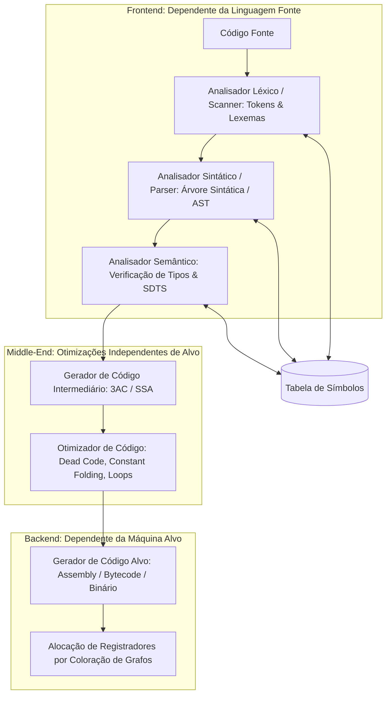
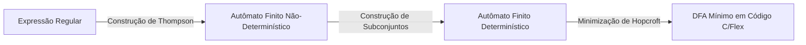
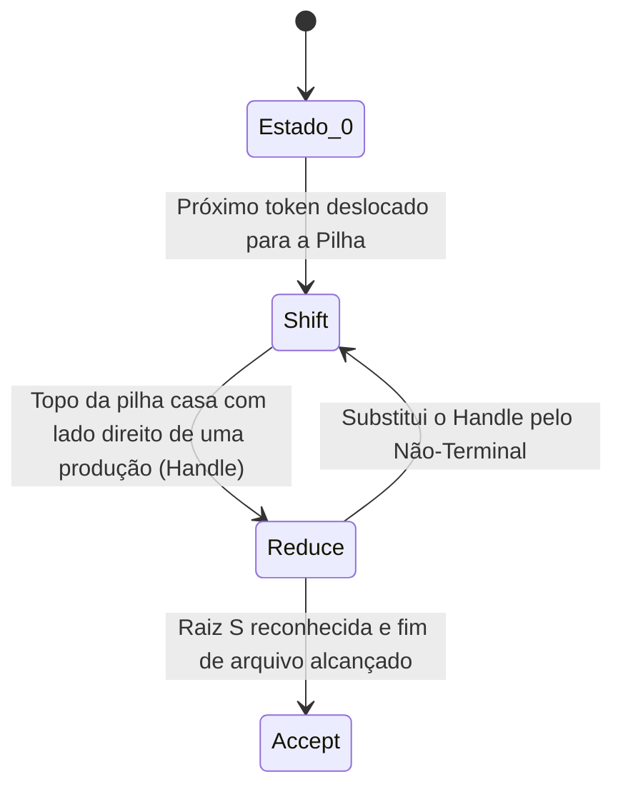

# ⚙️ Short Lecture — Compiladores

> [!abstract] 📌 Visão Geral da Disciplina
> * **Código:** `CSECBJI.48` | **Carga Horária:** 60 h/a | **Período:** 6º Período
> * **Pré-requisito:** [[02 - Áreas/Acadêmico/IFF - Engenharia de Computação/05 - Periodo/40 - Linguagens Formais e Autômatos/Ementa - Linguagens Formais e Autômatos|Linguagens Formais e Autômatos (CSECBJI.40)]]
> * **Tranca:** Nenhuma
> * **Ementa Síntese:** Fases e Arquitetura de Compilação; Análise Léxica e Autômatos (Lex/Flex); Análise Sintática Top-Down (LL) e Bottom-Up (LR, LALR, Yacc/Bison); Tabelas de Símbolos e Escopos; Análise Semântica, Esquemas de Tradução (SDTS) e Type Checking; Geração e Otimização de Código Intermediário (3AC, SSA); Ambientes de Execução em Tempo Real (Runtime Layout, Call Stack, GC).

---

## 🗺️ Mapa Conceitual da Disciplina



---

## 🏗️ Módulo 1: Arquitetura Geral de um Compilador

Um compilador é um tradutor que converte um programa escrito em uma **linguagem fonte** de alto nível em um programa semanticamente equivalente em uma **linguagem alvo** (Assembly, código de máquina binário ou Bytecode para máquina virtual).

### Compilação vs Interpretação vs JIT (Just-In-Time)
- **Compilador Tradicional (AOT - *Ahead-of-Time*):** Traduz todo o código fonte para binário nativo antes da execução (ex: C, C++, Rust). Máximo desempenho em tempo de execução.
- **Interpretador:** Lê o código fonte ou bytecode instrução por instrução e executa as ações em tempo real (ex: Python, Ruby clássico). Alta flexibilidade, menor desempenho computacional.
- **Compilador JIT (Java JVM, V8 JavaScript):** Combina interpretação inicial com compilação dinâmica em código de máquina nativo para os blocos de código mais executados (*hotspots*).

---

## 🔍 Módulo 2: Análise Léxica (*Scanning*)

### 2.1 Lexemas, Tokens e Padrões
- **Lexema:** A sequência concreta de caracteres do código fonte (ex: `while`, `total`, `105`, `<=`).
- **Token:** Um par abstrato `⟨nome_do_token, valor_do_atributo⟩` produzido pelo Lexer para o Parser (ex: `⟨ID, "total"⟩`, `⟨NUM, 105⟩`, `⟨RELOP, LE⟩`).
- **Padrão (*Pattern*):** A regra formal descrita por uma **Expressão Regular (ER)** que define a estrutura do token.

### 2.2 Da Expressão Regular ao Autômato Finito



1. **Algoritmo de Thompson:** Converte Expressões Regulares em AFN ($\epsilon$-transições) em tempo $O(|r|)$.
2. **Determinização (Subset Construction):** Converte o AFN em um AFD equivalente onde cada estado representa um subconjunto de estados do AFN.
3. **Minimização de Estados:** Agrupa estados indistinguíveis gerando a tabela de transição com o menor número possível de estados.

---

## 🌲 Módulo 3: Análise Sintática (*Parsing*)

O analisador sintático verifica se a sequência linear de tokens obedece à **Gramática Livre de Contexto (GLC)** formal:
$$G = (V, \Sigma, R, S)$$
Onde $V$ são não-terminais, $\Sigma$ são terminais (tokens), $R$ são regras de produção e $S$ é o símbolo inicial.

### 3.1 Parsing Descendente (Top-Down): Gramáticas LL(1)
Constrói a árvore de derivação a partir da raiz (símbolo inicial $S$) em direção às folhas:
- **LL(1):** *Left-to-right scan, Leftmost derivation, 1 lookahead token*.
- **Cálculo de Conjuntos:**
  - $\text{FIRST}(\alpha)$: Conjunto de terminais que podem aparecer no início de qualquer cadeia derivada de $\alpha$.
  - $\text{FOLLOW}(A)$: Conjunto de terminais que podem aparecer imediatamente à direita do não-terminal $A$ em alguma forma sentencial.
- **Condição para ser LL(1):** Para cada produção $A \rightarrow \alpha \mid \beta$, os conjuntos $\text{FIRST}(\alpha)$ e $\text{FIRST}(\beta)$ devem ser disjuntos; se $\alpha \Rightarrow^* \epsilon$, então $\text{FIRST}(\beta) \cap \text{FOLLOW}(A) = \emptyset$.
- **Eliminação de Recursão à Esquerda:** Produções do tipo $A \rightarrow A\alpha \mid \beta$ travam parsers descendentes em loop infinito e devem ser transformadas em:
  $$A \rightarrow \beta A', \quad A' \rightarrow \alpha A' \mid \epsilon$$

### 3.2 Parsing Ascendente (Bottom-Up): Família LR
Constrói a árvore a partir das folhas em direção à raiz, utilizando a técnica de **Deslocamento e Redução (*Shift-Reduce*)**:



- **LR(0):** Baseado exclusivamente no estado atual sem *lookahead*.
- **SLR(1) (*Simple LR*):** Utiliza $\text{FOLLOW}(A)$ para decidir quando fazer redução.
- **LR(1) Canônico:** Incorpora o símbolo de *lookahead* dentro de cada item do autômato (tabelas gigantescas).
- **LALR(1) (*Lookahead LR*):** Funde estados do LR(1) que possuem o mesmo núcleo de itens LR(0), mantendo tabelas compactas. É o algoritmo padrão do **Yacc / Bison**.

---

## 🏷️ Módulo 4: Tabela de Símbolos & Análise Semântica

### 4.1 Organização da Tabela de Símbolos com Escopos Aninhados
A Tabela de Símbolos armazena identificadores, tipos, modificadores, offsets de memória e número de parâmetros.
- Implementada como uma pilha de tabelas hash (*Scoped Hash Tables*): ao entrar em um novo bloco `{ ... }`, cria-se uma tabela filha apontando para a tabela pai; ao sair do bloco, a tabela filha é destruída.

### 4.2 Esquemas de Tradução Dirigidos por Sintaxe (SDTS) & Atributos
- **Atributos Sintetizados:** O valor do atributo no nó pai é computado a partir dos valores dos atributos de seus nós filhos na árvore:
  $$E \rightarrow E_1 + T \quad \{ E.\text{val} = E_1.\text{val} + T.\text{val} \}$$
- **Atributos Herdados:** O valor do atributo em um nó filho é computado a partir de nós irmãos ou do nó pai (usado para propagar tipos em declarações de variáveis: `int x, y, z;`).

### 4.3 Verificação de Tipos (*Type Checking*)
O analisador semântico valida:
1. Compatibilidade de tipos em operações aritméticas e lógicas.
2. Concordância entre número e tipos de argumentos em chamadas de funções.
3. Variáveis utilizadas sem declaração prévia.
4. Unicidade de identificadores no mesmo escopo local.

---

## ⚡ Módulo 5: Geração & Otimização de Código Intermediário (IR)

### 5.1 Código de Três Endereços (3AC - *Three-Address Code*)
Formato intermediário universal onde cada instrução possui no máximo um operador e no máximo três operandos de memória/temporários:

```text
Código Fonte Original:
x = a * b + (c - d) / e;

Código 3AC Gerado:
t1 = a * b
t2 = c - d
t3 = t2 / e
t4 = t1 + t3
x  = t4
```

### 5.2 Otimizações de Código
As otimizações transformam o código intermediário para torná-lo mais rápido e menor em consumo de memória sem alterar seu comportamento observável:

| Técnica de Otimização | Código Antes | Código Otimizado |
|---|---|---|
| **Constant Folding** | `x = 3.14159 * 2.0;` | `x = 6.28318;` |
| **Constant Propagation** | `pi = 3.14; area = pi * r * r;` | `area = 3.14 * r * r;` |
| **Dead Code Elimination** | `if (0) { log_debug(); }` | *(instrução inteiramente removida)* |
| **Common Subexpression (CSE)**| `t1 = a + b; t2 = c * (a + b);` | `t1 = a + b; t2 = c * t1;` |
| **Loop Invariant Motion** | `while (i < n) { x = y + z; i++; }` | `t1 = y + z; while (i < n) { x = t1; i++; }` |

---

## 🖥️ Módulo 6: Ambientes de Execução (*Runtime*) & Geração de Código

### 6.1 Layout de Memória do Processo
```text
  +-----------------------------------+  0xFFFFFFFF (Endereço Alto)
  | Stack (Pilha de Ativação / Frames)|  |  Cresce para baixo
  |  - Parâmetros, Retorno, Variáveis |  v
  +-----------------------------------+
  |                 |                 |
  |                 v                 |
  |                 ^                 |
  |                 |                 |
  +-----------------------------------+
  | Heap (Memória Dinâmica: malloc/new)|  ^  Cresce para cima
  +-----------------------------------+  |
  | Dados Estáticos (BSS / Globais)   |
  +-----------------------------------+
  | Código Executável (.text)         |  0x00000000 (Endereço Baixo)
  +-----------------------------------+
```

### 6.2 Alocação de Registradores por Coloração de Grafos
- Os registradores físicos da CPU são escassos e ultrarrápidos.
- Constrói-se um **Grafo de Interferência**: cada variável temporária é um nó; existe uma aresta entre dois nós se ambas as variáveis estão ativas (*live*) simultaneamente no mesmo ponto do programa.
- Se a CPU possui $K$ registradores físicos, o problema reduz-se a encontrar uma **$K$-coloração** do grafo onde nenhum nó vizinho compartilhe a mesma cor. Se não for possível colorir, faz-se o descarregamento (*spill*) da variável para a pilha de memória.

---

## 🧪 Resumo Executivo / Cheat Sheet para Provas & Projetos

1. **Frontend vs Backend:** Frontend é independente da máquina (Léxico/Sintático/Semântico); Backend é específico do hardware (IR para Assembly/Registradores).
2. **Lexer:** Usa Expressões Regulares $\rightarrow$ AFN $\rightarrow$ AFD Mínimo para produzir tokens.
3. **Parsers:**
   - **LL(1):** Descendente recursivo, sem recursão à esquerda, guiado por tabelas FIRST/FOLLOW.
   - **LR(1) / LALR(1):** Ascendente Shift-Reduce, robusto, base do Bison.
4. **SDTS:** Atributos sintetizados sobem na árvore; herdados descem ou cruzam lateralmente.
5. **3AC:** Instruções atômicas lineares que preparam o código para otimizações matemáticas e fluxo de controle.
6. **Coloração de Grafos:** Resolve o problema NP-completo de alocação ótima de registradores na CPU.

---

## 🔗 Referências e Conexões no Cofre
* [[02 - Áreas/Acadêmico/IFF - Engenharia de Computação/06 - Periodo/48 - Compiladores/Ementa - Compiladores|📄 Ementa Oficial de Compiladores]]
* [[02 - Áreas/Acadêmico/IFF - Engenharia de Computação/05 - Periodo/40 - Linguagens Formais e Autômatos/Ementa - Linguagens Formais e Autômatos|LFA (CSECBJI.40)]]
* [[02 - Áreas/Acadêmico/IFF - Engenharia de Computação/00 - Documentos/PPC_EngComp_Completo_Ementario|📜 PPC & Ementário Geral]]
* Livros Base:
  * AHO, Alfred V.; LAM, Monica S.; SETHI, Ravi; ULLMAN, Jeffrey D. *Compiladores: Princípios, Técnicas e Ferramentas* (O Livro do Dragão). 2ª Edição. Pearson, 2008.
  * COOPER, Keith D.; TORCZON, Linda. *Construindo Compiladores*. 2ª Edição. Elsevier, 2014.
