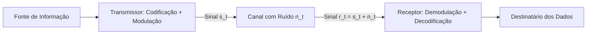

<div style="display: flex; justify-content: space-between; align-items: center; padding: 10px 16px; background: var(--light, #f8fafc); border: 1px solid var(--lightgray, #e2e8f0); border-radius: 10px; margin: 1.5rem 0;">
  <div>⬅️ <span style="color: gray;">Primeira Aula</span></div>
  <div>🏠 <b><a href="/pt-br/resource/engenharia-de-computação/6-periodo/comunicacao-de-dados">Hub da Disciplina</a></b></div>
  <div>➡️ <b><a href="/pt-br/resource/engenharia-de-computação/6-periodo/comunicacao-de-dados/anotacoes/aula-01-fundamentos-de-transmissao-de-dados-e-sinais">Próxima Aula</a></b></div>
</div>

> [!info] 📅 Informações da Aula
> - **Disciplina:** Comunicação de Dados (CSECBJI.47)
> - **Professor:** Rômulo / Paulo
> - **Data Realizada:** 25/08/2026
> - **Tópico Principal:** Apresentação da Disciplina, Ementário e Conceitos Iniciais
> - **Status:** Concluída e Revisada

> [!note] 📂 Material Complementar & Slides
> - 📄 **Slides Oficiais:** [[slide-00-comunicacao-de-dados|Acessar Apresentação em PDF]]
> - 🎥 **Short Lecture / Gravação:** [[video-00-comunicacao-de-dados|Assistir Síntese da Aula (Vídeo)]]

---

### 📑 Resumo das Seções
- [📌 1. Anotações do Quadro: Apresentação da Disciplina, Ementário e Conceitos Iniciais](#-anotações-do-quadro-apresentação-da-disciplina,-ementário-e-conceitos-iniciais)
- [🧮 2. Formulação & Exemplo Prático Resolvido](#-formulação--exemplo-prático-resolvido)
- [📊 3. Esquema Visual & Fluxograma (Mermaid)](#-esquema-visual--fluxograma-mermaid)
- [🧠 4. Resumo Pessoal & Macetes do Professor](#-resumo-pessoal--macetes-do-professor)
- [📝 5. Dúvidas & Exercícios Recomendados para Casa](#-dúvidas--exercícios-recomendados-para-casa)

---

## 📌 Anotações do Quadro: Apresentação da Disciplina, Ementário e Conceitos Iniciais

### 1.1 Modelo Geral de um Sistema de Comunicação
Um sistema de comunicação de dados tem por finalidade transferir informação entre dois pontos de forma confiável e eficiente:
```text
[ Fonte de Dados ] ──▶ [ Transmissor ] ──▶ [ Meio de Transmissão / Canal ] ──▶ [ Receptor ] ──▶ [ Destinatário ]
                                                      ▲
                                                      │ Ruído / Interferência
```

Elementos constituintes:
- **Transmissor:** Codifica, formata e modula a mensagem original em sinais eletromagnéticos adequados ao canal.
- **Canal de Comunicação:** O meio físico (cabo metálico, fibra óptica ou espaço livre/RF) que transporta o sinal.
- **Receptor:** Demodula, amplifica, equaliza e decodifica o sinal recebido para reconstruir a mensagem original.

### 1.2 Os Modelos em Camadas: OSI vs TCP/IP
A disciplina de Comunicação de Dados concentra-se com rigor matemático nas duas camadas inferiores da pilha:
- **Camada Física (Camada 1):** Transmissão de bits brutos pelo canal físico, modulação, codificação de linha, níveis de tensão, temporização de clock e conectores.
- **Camada de Enlace de Dados (Camada 2):** Enquadramento (*framing*), controle de fluxo, detecção/correção de erros e controle de acesso ao meio (MAC).

---

## 🧮 Formulação & Exemplo Prático Resolvido

### ✏️ Modos de Transmissão de Dados

| Modo | Direcionalidade | Descrição | Exemplo |
| :--- | :--- | :--- | :--- |
| **Simplex** | Unidirecional | A informação trafega em um único sentido fixo sem retorno. | Rádio FM, Teclado $\to$ PC |
| **Half-Duplex** | Bidirecional Alternado | Ambos transmitem, mas apenas um por vez (requer alternância). | Walkie-Talkie, RS-485 |
| **Full-Duplex** | Bidirecional Simultâneo | Ambos transmitem e recebem simultaneamente em canais dedicados. | Telefonia móvel, Ethernet 1Gbps |

---

## 📊 Esquema Visual & Fluxograma (Mermaid)



---

## 🧠 Resumo Pessoal & Macetes do Professor

| Conceito-Chave | *Takeaway* do Professor | Dicas de Prova / Atenção |
| :--- | :--- | :--- |
| **Foco da Disciplina** | Comunicação de Dados trata da física dos sinais, canais e enlace ponto a ponto. Redes de Computadores (7ºP) tratará do roteamento e protocolos IP/TCP na rede inteira. | Entenda os sinais e a modulação antes de estudar roteamento. |
| **Taxa de Dados vs Taxa de Sinalização** | Bps (bits por segundo) mede informação; Baud (símbolos por segundo) mede velocidade de modulação no canal. | Aplicação prática direta |

---

## 📝 Dúvidas & Exercícios Recomendados para Casa

1. Diferencie as funções da Camada Física daquelas da Camada de Enlace de Dados no modelo OSI.
2. Explique por que uma transmissão Full-Duplex oferece o dobro da taxa de transferência teórica em relação ao Half-Duplex.

---

<div style="display: flex; justify-content: space-between; align-items: center; padding: 10px 16px; background: var(--light, #f8fafc); border: 1px solid var(--lightgray, #e2e8f0); border-radius: 10px; margin: 1.5rem 0;">
  <div>⬅️ <span style="color: gray;">Primeira Aula</span></div>
  <div>🏠 <b><a href="/pt-br/resource/engenharia-de-computação/6-periodo/comunicacao-de-dados">Hub da Disciplina</a></b></div>
  <div>➡️ <b><a href="/pt-br/resource/engenharia-de-computação/6-periodo/comunicacao-de-dados/anotacoes/aula-01-fundamentos-de-transmissao-de-dados-e-sinais">Próxima Aula</a></b></div>
</div>
