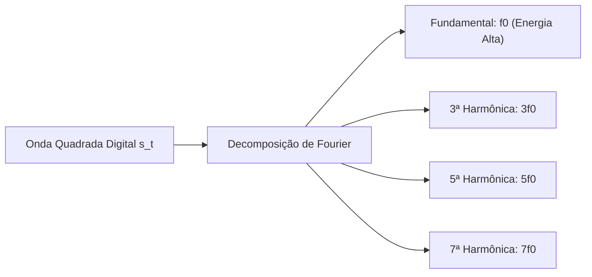

  
⬅️ <b><a href="/pt-br/resource/engenharia-de-computação/6-periodo/comunicacao-de-dados/anotacoes/aula-00-apresentacao-da-disciplina-ementario-e-conceitos-iniciais">Aula Anterior</a></b>

  
🏠 <b><a href="/pt-br/resource/engenharia-de-computação/6-periodo/comunicacao-de-dados">Hub da Disciplina</a></b>

  
➡️ <b><a href="/pt-br/resource/engenharia-de-computação/6-periodo/comunicacao-de-dados/anotacoes/aula-02-degradacoes-no-canal-atenuacao-distorcao-e-ruido">Próxima Aula</a></b>

> [!info] 📅 Informações da Aula
> - **Disciplina:** Comunicação de Dados (CSECBJI.47)
> - **Professor:** Rômulo / Paulo
> - **Data Realizada:** 01/09/2026
> - **Tópico Principal:** Fundamentos de Transmissão de Dados e Sinais
> - **Status:** Concluída e Revisada

> [!note] 📂 Material Complementar & Slides
> - 📄 **Slides Oficiais:** [[slide-01-comunicacao-de-dados|Acessar Apresentação em PDF]]
> - 🎥 **Short Lecture / Gravação:** [[video-01-comunicacao-de-dados|Assistir Síntese da Aula (Vídeo)]]

---

### 📑 Resumo das Seções
- [📌 1. Anotações do Quadro: Fundamentos de Transmissão de Dados e Sinais](#-anotações-do-quadro-fundamentos-de-transmissão-de-dados-e-sinais)
- [🧮 2. Formulação & Exemplo Prático Resolvido](#-formulação--exemplo-prático-resolvido)
- [📊 3. Esquema Visual & Fluxograma (Mermaid)](#-esquema-visual--fluxograma-mermaid)
- [🧠 4. Resumo Pessoal & Macetes do Professor](#-resumo-pessoal--macetes-do-professor)
- [📝 5. Dúvidas & Exercícios Recomendados para Casa](#-dúvidas--exercícios-recomendados-para-casa)

---

## 📌 Anotações do Quadro: Fundamentos de Transmissão de Dados e Sinais

### 1.1 Domínio do Tempo vs Domínio da Frequência
Qualquer sinal eletromagnético real pode ser analisado sob duas perspectivas complementares:
- **Domínio do Tempo ($s(t)$):** Representa a amplitude instantânea do sinal ao longo do tempo (visualizado no osciloscópio).
- **Domínio da Frequência ($S(f)$):** Decompõe o sinal em suas componentes senoidais fundamentais e harmônicas (visualizado no analisador de espectro).

### 1.2 Análise de Fourier para Sinais Periódicos
Pelo Teorema de Fourier, qualquer sinal periódico de período $T$ ($f_0 = 1/T$) pode ser expresso como uma soma infinita de senos e cossenos:
$$s(t) = \frac{a_0}{2} + \sum_{n=1}^{\infty} \left[ a_n \cos(2\pi n f_0 t) + b_n \sin(2\pi n f_0 t) \right]$$

- **Harmônicas:** Múltiplos inteiros da frequência fundamental $f_0$.
- **Espectro de Frequência:** Faixa de frequências contidas no sinal.
- **Largura de Banda Absoluta ($B$):** A largura do espectro de frequência ($f_{max} - f_{min}$).
- **Largura de Banda Efetiva:** A faixa onde está concentrada a maior parte da energia do sinal ($90\%$ a $99\%$).

---

## 🧮 Formulação & Exemplo Prático Resolvido

### ✏️ Decomposição de uma Onda Quadrada em Harmônicas de Fourier

Uma onda quadrada periódica de amplitude $V$ e período $T$ possui apenas harmônicas ímpares:
$$s(t) = \frac{4V}{\pi} \left[ \sin(2\pi f_0 t) + \frac{1}{3}\sin(6\pi f_0 t) + \frac{1}{5}\sin(10\pi f_0 t) + \dots \right]$$

**Efeito da Largura de Banda do Canal:**
- Se o canal cortar as frequências acima da 3ª harmônica, o receptor verá uma onda senoidal distorcida com cantos arredondados.
- Para reconstruir pulsos digitais com subidas rápidas e sem erro de leitura de bit, o canal deve ter largura de banda suficiente para transmitir até pelo menos a 5ª ou 7ª harmônica!

---

## 📊 Esquema Visual & Fluxograma (Mermaid)

---

## 🧠 Resumo Pessoal & Macetes do Professor

| Conceito-Chave | *Takeaway* do Professor | Dicas de Prova / Atenção |
| :--- | :--- | :--- |
| **Compromisso Taxa vs Banda** | Quanto maior a taxa de transmissão em bits por segundo desejada em pulsos digitais, maior será a frequência fundamental e maior será a largura de banda exigida do canal. | Canais de banda estreita distorcem pulsos rápidos. |
| **Espectro de Sinais Aperiódicos** | Sinais periódicos possuem espectros discretos de raias; sinais aperiódicos (como dados aleatórios reais) possuem espectros contínuos calculados pela Transformada de Fourier. | Aplicação prática direta |

---

## 📝 Dúvidas & Exercícios Recomendados para Casa

1. Calcule a largura de banda mínima de um canal para transmitir uma onda quadrada de $1	ext{ Mbps}$ preservando até a 5ª harmônica.
2. Explique por que a atenuação de altas frequências causa o arredondamento dos pulsos digitais.

---

  
⬅️ <b><a href="/pt-br/resource/engenharia-de-computação/6-periodo/comunicacao-de-dados/anotacoes/aula-00-apresentacao-da-disciplina-ementario-e-conceitos-iniciais">Aula Anterior</a></b>

  
🏠 <b><a href="/pt-br/resource/engenharia-de-computação/6-periodo/comunicacao-de-dados">Hub da Disciplina</a></b>

  
➡️ <b><a href="/pt-br/resource/engenharia-de-computação/6-periodo/comunicacao-de-dados/anotacoes/aula-02-degradacoes-no-canal-atenuacao-distorcao-e-ruido">Próxima Aula</a></b>

