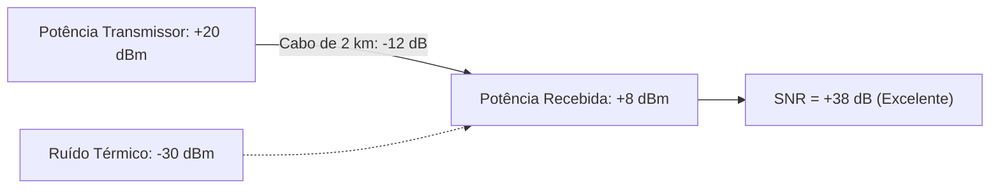

  
⬅️ <b><a href="/pt-br/resource/engenharia-de-computação/6-periodo/comunicacao-de-dados/anotacoes/aula-01-fundamentos-de-transmissao-de-dados-e-sinais">Aula Anterior</a></b>

  
🏠 <b><a href="/pt-br/resource/engenharia-de-computação/6-periodo/comunicacao-de-dados">Hub da Disciplina</a></b>

  
➡️ <b><a href="/pt-br/resource/engenharia-de-computação/6-periodo/comunicacao-de-dados/anotacoes/aula-03-capacidade-de-canal-teoremas-de-nyquist-e-shannon-hartley">Próxima Aula</a></b>

> [!info] 📅 Informações da Aula
> - **Disciplina:** Comunicação de Dados (CSECBJI.47)
> - **Professor:** Rômulo / Paulo
> - **Data Realizada:** 08/09/2026
> - **Tópico Principal:** Degradações no Canal: Atenuação, Distorção e Ruído
> - **Status:** Concluída e Revisada

> [!note] 📂 Material Complementar & Slides
> - 📄 **Slides Oficiais:** [[slide-02-comunicacao-de-dados|Acessar Apresentação em PDF]]
> - 🎥 **Short Lecture / Gravação:** [[video-02-comunicacao-de-dados|Assistir Síntese da Aula (Vídeo)]]

---

### 📑 Resumo das Seções
- [📌 1. Anotações do Quadro: Degradações no Canal: Atenuação, Distorção e Ruído](#-anotações-do-quadro-degradações-no-canal-atenuação,-distorção-e-ruído)
- [🧮 2. Formulação & Exemplo Prático Resolvido](#-formulação--exemplo-prático-resolvido)
- [📊 3. Esquema Visual & Fluxograma (Mermaid)](#-esquema-visual--fluxograma-mermaid)
- [🧠 4. Resumo Pessoal & Macetes do Professor](#-resumo-pessoal--macetes-do-professor)
- [📝 5. Dúvidas & Exercícios Recomendados para Casa](#-dúvidas--exercícios-recomendados-para-casa)

---

## 📌 Anotações do Quadro: Degradações no Canal: Atenuação, Distorção e Ruído

### 2.1 Degradações do Sinal no Canal de Transmissão
À medida que o sinal eletromagnético se propaga pelo meio físico, ele sofre três formas principais de degradação:
1. **Atenuação:** Perda de energia e redução da amplitude do sinal com a distância percorrida ($dB$).
2. **Distorção de Atraso (*Delay Distortion*):** Ocorre em meios guiados porque componentes de diferentes frequências se propagam em velocidades ligeiramente distintas, fazendo com que as harmônicas cheguem desfasadas (causa Interferência Inter-Simbólica - ISI).
3. **Ruído:** Sinais eletromagnéticos espúrios indesejados inseridos pelo canal.

### 2.2 Classificação de Ruídos
- **Ruído Térmico (Ruído Branco / Johnson-Nyquist):** Gerado pela agitação térmica dos elétrons em condutores. Distribuído uniformemente em todo o espectro:
  $$N = k \cdot T \cdot B \quad \text{(Watts)}$$
  onde $k = 1.38 \times 10^{-23}\text{ J/K}$ (Constante de Boltzmann), $T$ é a temperatura em Kelvin e $B$ é a largura de banda em Hz.
- **Ruído de Intermodulação:** Frequências espúrias geradas por não-linearidades em transmissores/amplificadores.
- **Diafonia (*Crosstalk*):** Acoplamento eletromagnético indesejado entre condutores vizinhos em um cabo multipar.
- **Ruído Impulsivo:** Picos abruptos de curta duração causados por raios, faíscas ou chaveamentos elétricos (principal causa de erros em rajada).

### 2.3 Relação Sinal-Ruído (SNR) e Decibéis
$$\text{SNR} = \frac{P_{\text{sinal}}}{P_{\text{ruído}}}$$
$$\text{SNR}_{\text{dB}} = 10 \log_{10}(\text{SNR})$$

---

## 🧮 Formulação & Exemplo Prático Resolvido

### ✏️ Cálculo de Orçamento de Enlace e Relação Sinal-Ruído

**Problema:** Um transmissor emite $100\text{ mW}$ ($+20\text{ dBm}$) em um cabo coaxial de $2\text{ km}$ com atenuação de $6\text{ dB/km}$. O ruído medido na recepção é de $0.001\text{ mW}$ ($-30\text{ dBm}$).
1. Atenuação total do cabo: $A = 2\text{ km} \times 6\text{ dB/km} = 12\text{ dB}$.
2. Potência recebida: $P_{rx} = 20\text{ dBm} - 12\text{ dB} = +8\text{ dBm}$ ($6.31\text{ mW}$).
3. Relação Sinal-Ruído em dB:
   $$\text{SNR}_{\text{dB}} = P_{rx(\text{dBm})} - P_{noise(\text{dBm})} = 8\text{ dBm} - (-30\text{ dBm}) = 38\text{ dB}$$
4. Relação linear: $\text{SNR} = 10^{3.8} \approx 6.309$. Excelente qualidade de sinal!

---

## 📊 Esquema Visual & Fluxograma (Mermaid)

---

## 🧠 Resumo Pessoal & Macetes do Professor

| Conceito-Chave | *Takeaway* do Professor | Dicas de Prova / Atenção |
| :--- | :--- | :--- |
| **Trabalhando em dBm vs dB** | Potência absoluta usa **dBm** ($1	ext{ mW} = 0	ext{ dBm}$); Ganhos e perdas usam **dB**. Para somar/subtrair perdas: $	ext{dBm} - 	ext{dB} = 	ext{dBm}$. | Regra básica que evita confusão em provas. |
| **Regra Prática do 3 dB** | +3 dB dobra a potência linear; -3 dB reduz a potência à metade. | Aplicação prática direta |

---

## 📝 Dúvidas & Exercícios Recomendados para Casa

1. Calcule a potência de ruído térmico em dBm gerada em um receptor com banda de $20	ext{ MHz}$ operando a $300	ext{ K}$.
2. Converta $2	ext{ Watts}$ para dBm e $0.05	ext{ mW}$ para dBm.

---

  
⬅️ <b><a href="/pt-br/resource/engenharia-de-computação/6-periodo/comunicacao-de-dados/anotacoes/aula-01-fundamentos-de-transmissao-de-dados-e-sinais">Aula Anterior</a></b>

  
🏠 <b><a href="/pt-br/resource/engenharia-de-computação/6-periodo/comunicacao-de-dados">Hub da Disciplina</a></b>

  
➡️ <b><a href="/pt-br/resource/engenharia-de-computação/6-periodo/comunicacao-de-dados/anotacoes/aula-03-capacidade-de-canal-teoremas-de-nyquist-e-shannon-hartley">Próxima Aula</a></b>

