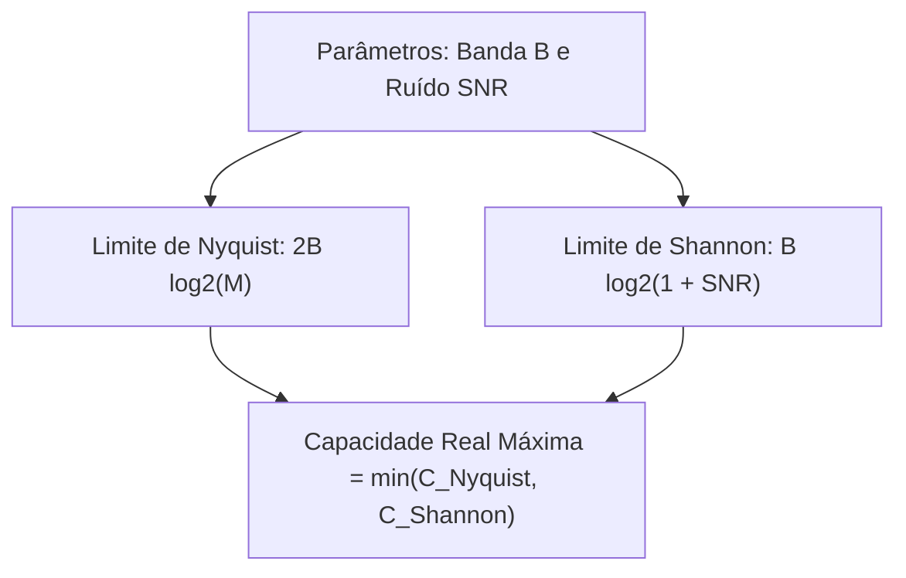

  
⬅️ <b><a href="/pt-br/resource/engenharia-de-computação/6-periodo/comunicacao-de-dados/anotacoes/aula-02-degradacoes-no-canal-atenuacao-distorcao-e-ruido">Aula Anterior</a></b>

  
🏠 <b><a href="/pt-br/resource/engenharia-de-computação/6-periodo/comunicacao-de-dados">Hub da Disciplina</a></b>

  
➡️ <b><a href="/pt-br/resource/engenharia-de-computação/6-periodo/comunicacao-de-dados/anotacoes/aula-04-meios-de-transmissao-guiados">Próxima Aula</a></b>

> [!info] 📅 Informações da Aula
> - **Disciplina:** Comunicação de Dados (CSECBJI.47)
> - **Professor:** Rômulo / Paulo
> - **Data Realizada:** 15/09/2026
> - **Tópico Principal:** Capacidade de Canal: Teoremas de Nyquist e Shannon-Hartley
> - **Status:** Concluída e Revisada

> [!note] 📂 Material Complementar & Slides
> - 📄 **Slides Oficiais:** [[slide-03-comunicacao-de-dados|Acessar Apresentação em PDF]]
> - 🎥 **Short Lecture / Gravação:** [[video-03-comunicacao-de-dados|Assistir Síntese da Aula (Vídeo)]]

---

### 📑 Resumo das Seções
- [📌 1. Anotações do Quadro: Capacidade de Canal: Teoremas de Nyquist e Shannon-Hartley](#-anotações-do-quadro-capacidade-de-canal-teoremas-de-nyquist-e-shannon-hartley)
- [🧮 2. Formulação & Exemplo Prático Resolvido](#-formulação--exemplo-prático-resolvido)
- [📊 3. Esquema Visual & Fluxograma (Mermaid)](#-esquema-visual--fluxograma-mermaid)
- [🧠 4. Resumo Pessoal & Macetes do Professor](#-resumo-pessoal--macetes-do-professor)
- [📝 5. Dúvidas & Exercícios Recomendados para Casa](#-dúvidas--exercícios-recomendados-para-casa)

---

## 📌 Anotações do Quadro: Capacidade de Canal: Teoremas de Nyquist e Shannon-Hartley

### 3.1 Teorema da Capacidade de Canal de Nyquist (Canal Sem Ruído)
Em 1928, Harry Nyquist provou que a taxa máxima de transmissão teórica em um canal ideal passa-baixas de largura de banda $B$ (sem ruído), utilizando $M$ níveis discretos de sinalização, é:
$$C_{\text{Nyquist}} = 2 \cdot B \cdot \log_2(M) \quad \text{(bps)}$$

- Se o sinal for estritamente binário ($M=2$ níveis), $C = 2B\text{ bps}$.
- Aumentando os níveis de sinalização ($M=4, 8, 16, 64$), aumentamos a taxa de dados sem aumentar a largura de banda física.

### 3.2 Teorema da Capacidade de Shannon-Hartley (Canal com Ruído)
Em 1948, Claude Shannon estendeu a teoria para canais reais com ruído branco gaussiano aditivo (AWGN), estabelecendo o limite termodinâmico absoluto de transmissão livre de erros:
$$C_{\text{Shannon}} = B \cdot \log_2(1 + \text{SNR}) \quad \text{(bps)}$$
onde $\text{SNR}$ é a relação sinal-ruído linear ($P_{\text{sinal}} / P_{\text{ruído}}$).

### 3.3 Implicações Fundamentais na Engenharia
1. Não existe técnica de codificação que consiga transmitir acima da capacidade de Shannon sem erros irreparáveis.
2. Para aumentar a capacidade $C$, pode-se aumentar a largura de banda $B$ ou a potência do transmissor ($\text{SNR}$).
3. A capacidade cresce **linearmente com $B$**, mas apenas **logaritmicamente com o $\text{SNR}$** (aumentar a banda é muito mais eficaz que aumentar a potência!).

---

## 🧮 Formulação & Exemplo Prático Resolvido

### ✏️ Dimensionamento de Enlace: Linha Telefônica Clássica

**Parâmetros:**
- Banda do canal de voz: $B = 3.100\text{ Hz}$ ($300\text{ Hz}$ a $3.400\text{ Hz}$).
- Relação Sinal-Ruído típica: $\text{SNR}_{\text{dB}} = 30\text{ dB} \implies \text{SNR} = 10^{30/10} = 1.000$.

**1. Cálculo do Limite de Shannon:**
$$C = 3100 \cdot \log_2(1 + 1000) = 3100 \cdot \log_2(1001) \approx 3100 \cdot 9.967 = 30.898\text{ bps} \approx 31\text{ kbps}$$

**2. Quantos níveis de sinalização ($M$) seriam necessários para atingir $30\text{ kbps}$ pelo critério de Nyquist?**
$$30.000 = 2 \cdot 3.100 \cdot \log_2(M) \implies \log_2(M) = \frac{30.000}{6.200} \approx 4.84 \implies M = 2^{4.84} \approx 29 \text{ níveis}$$
Adota-se $M=32$ níveis de modulação ($5\text{ bits por símbolo}$)!

---

## 📊 Esquema Visual & Fluxograma (Mermaid)

---

## 🧠 Resumo Pessoal & Macetes do Professor

| Conceito-Chave | *Takeaway* do Professor | Dicas de Prova / Atenção |
| :--- | :--- | :--- |
| **Shannon usa SNR Linear!** | Nunca insira o valor em dB diretamente na fórmula de Shannon! Converta sempre para linear antes: $	ext{SNR} = 10^{(	ext{SNR}_{	ext{dB}} / 10)}$. | Erro número 1 em provas de telecomunicações. |
| **Aumentar Níveis $M$ não é Infinito** | Nyquist diz que $C 	o \infty$ se $M 	o \infty$; mas na presença de ruído, os níveis tornam-se tão próximos que o ruído confunde os símbolos, esbarrando no limite de Shannon. | Aplicação prática direta |

---

## 📝 Dúvidas & Exercícios Recomendados para Casa

1. Um canal de satélite possui banda de $36	ext{ MHz}$ e $	ext{SNR}_{	ext{dB}} = 20	ext{ dB}$. Calcule a capacidade máxima teórica de transmissão de Shannon.
2. Quantos bits por símbolo devem ser codificados em um canal de $10	ext{ MHz}$ sem ruído para atingir $60	ext{ Mbps}$?

---

  
⬅️ <b><a href="/pt-br/resource/engenharia-de-computação/6-periodo/comunicacao-de-dados/anotacoes/aula-02-degradacoes-no-canal-atenuacao-distorcao-e-ruido">Aula Anterior</a></b>

  
🏠 <b><a href="/pt-br/resource/engenharia-de-computação/6-periodo/comunicacao-de-dados">Hub da Disciplina</a></b>

  
➡️ <b><a href="/pt-br/resource/engenharia-de-computação/6-periodo/comunicacao-de-dados/anotacoes/aula-04-meios-de-transmissao-guiados">Próxima Aula</a></b>

