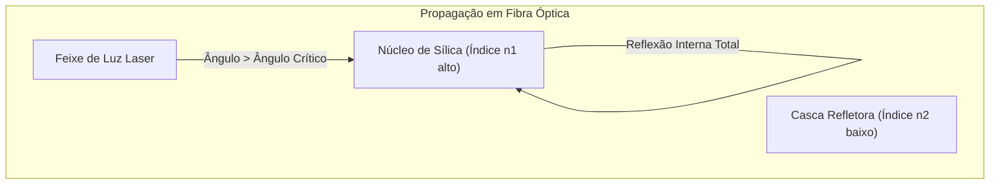

  
⬅️ <b><a href="/pt-br/resource/engenharia-de-computação/6-periodo/comunicacao-de-dados/anotacoes/aula-03-capacidade-de-canal-teoremas-de-nyquist-e-shannon-hartley">Aula Anterior</a></b>

  
🏠 <b><a href="/pt-br/resource/engenharia-de-computação/6-periodo/comunicacao-de-dados">Hub da Disciplina</a></b>

  
➡️ <b><a href="/pt-br/resource/engenharia-de-computação/6-periodo/comunicacao-de-dados/anotacoes/aula-05-meios-de-transmissao-nao-guiados-e-propagacao-de-rf">Próxima Aula</a></b>

> [!info] 📅 Informações da Aula
> - **Disciplina:** Comunicação de Dados (CSECBJI.47)
> - **Professor:** Rômulo / Paulo
> - **Data Realizada:** 22/09/2026
> - **Tópico Principal:** Meios de Transmissão Guiados
> - **Status:** Concluída e Revisada

> [!note] 📂 Material Complementar & Slides
> - 📄 **Slides Oficiais:** [[slide-04-comunicacao-de-dados|Acessar Apresentação em PDF]]
> - 🎥 **Short Lecture / Gravação:** [[video-04-comunicacao-de-dados|Assistir Síntese da Aula (Vídeo)]]

---

### 📑 Resumo das Seções
- [📌 1. Anotações do Quadro: Meios de Transmissão Guiados](#-anotações-do-quadro-meios-de-transmissão-guiados)
- [🧮 2. Formulação & Exemplo Prático Resolvido](#-formulação--exemplo-prático-resolvido)
- [📊 3. Esquema Visual & Fluxograma (Mermaid)](#-esquema-visual--fluxograma-mermaid)
- [🧠 4. Resumo Pessoal & Macetes do Professor](#-resumo-pessoal--macetes-do-professor)
- [📝 5. Dúvidas & Exercícios Recomendados para Casa](#-dúvidas--exercícios-recomendados-para-casa)

---

## 📌 Anotações do Quadro: Meios de Transmissão Guiados

### 4.1 Características dos Meios Guiados
Nos meios guiados, as ondas eletromagnéticas são confinadas fisicamente ao longo de uma trajetória sólida.

### 4.2 Par Trançado (Twisted Pair)
- Estrutura: Dois condutores de cobre isolados e trançados em hélice. O trançamento cancela interferências eletromagnéticas externas (ruído de modo comum) e reduz a diafonia (*crosstalk*).
- Categorias Comerciais:
  - **Cat 5e:** Até $100\text{ MHz}$ ($1\text{ Gbps}$ até 100 metros).
  - **Cat 6:** Até $250\text{ MHz}$ ($1\text{ Gbps}$ padrão, $10\text{ Gbps}$ até 55 metros).
  - **Cat 6a:** Até $500\text{ MHz}$ ($10\text{ Gbps}$ até 100 metros completos).
- Tipos: UTP (sem blindagem), STP/FTP (com blindagem metálica para ambientes industriais).

### 4.3 Cabo Coaxial
- Estrutura: Condutor central de cobre, dielétrico isolante, malha condutora externa trançada (blindagem contra RF) e capa plástica.
- Impedância característica: $50\ \Omega$ (telecom/antenas) e $75\ \Omega$ (TV a cabo/CATV).

### 4.4 Fibra Óptica (Transmissão por Luz)
- Princípio: **Reflexão Interna Total** no núcleo de sílica ultrapura, baseada na Lei de Snell ($n_{\text{núcleo}} > n_{\text{casca}}$).
- **Fibra Multimodo (MMF):** Núcleo largo ($50\ \mu\text{m}$ ou $62.5\ \mu\text{m}$). A luz percorre múltiplos caminhos (modos), causando dispersão modal. Ideal para LANs e distâncias curtas ($< 500\text{ m}$).
- **Fibra Monomodo (SMF):** Núcleo minúsculo ($9\ \mu\text{m}$). Apenas um raio de luz se propaga. Dispersão modal nula, permitindo enlaces transoceânicos de dezenas de quilômetros a centenas de Gbps.
- **Janelas Ópticas de Transmissão:** $850\text{ nm}$ (MMF/LED), $1310\text{ nm}$ (SMF/Laser, dispersão nula), $1550\text{ nm}$ (SMF/Laser, menor atenuação: $\sim 0.2\text{ dB/km}$).

---

## 🧮 Formulação & Exemplo Prático Resolvido

### ✏️ Comparativo Técnico de Desempenho dos Meios Guiados

| Meio Físico | Largura de Banda | Distância Máxima Típica | Imunidade a Ruído EMI | Custo de Implantação |
| :--- | :--- | :--- | :--- | :--- |
| **Par Trançado UTP (Cat 6)** | $250\text{ MHz}$ | $100\text{ metros}$ | Média (limitada por trançamento) | Baixo |
| **Cabo Coaxial (RG-6)** | $1\text{ GHz}$ | $\sim 500\text{ metros}$ | Alta (blindagem de malha) | Médio |
| **Fibra Multimodo (OM4)** | $\sim 4.7\text{ GHz}\cdot\text{km}$ | $550\text{ metros}$ ($10\text{ Gbps}$) | **Total (Imune a EMI/RFI)** | Médio/Alto |
| **Fibra Monomodo (OS2)** | **Terahertz** | **$> 40\text{ km}$** | **Total (Imune a EMI/RFI)** | Alto (fusão de precisão) |

---

## 📊 Esquema Visual & Fluxograma (Mermaid)

---

## 🧠 Resumo Pessoal & Macetes do Professor

| Conceito-Chave | *Takeaway* do Professor | Dicas de Prova / Atenção |
| :--- | :--- | :--- |
| **Por que Fibra não sofre EMI?** | Porque a informação é transportada por fótons (luz) e não por elétrons em condutores metálicos. Não sofre interferência de motores, raios ou linhas de alta tensão. | Ideal para ambientes industriais e conexões entre prédios. |
| **A Regra dos 100 Metros** | O padrão Ethernet sobre cobre (100BASE-TX, 1000BASE-T) tem alcance máximo fixado em 100 metros (90m cabo estruturado + 10m patch cords). | Aplicação prática direta |

---

## 📝 Dúvidas & Exercícios Recomendados para Casa

1. Calcule o ângulo crítico para reflexão interna total em uma fibra óptica com $n_1 = 1.48$ (núcleo) e $n_2 = 1.45$ (casca).
2. Explique a diferença física entre Dispersão Modal e Dispersão Cromática em fibras ópticas.

---

  
⬅️ <b><a href="/pt-br/resource/engenharia-de-computação/6-periodo/comunicacao-de-dados/anotacoes/aula-03-capacidade-de-canal-teoremas-de-nyquist-e-shannon-hartley">Aula Anterior</a></b>

  
🏠 <b><a href="/pt-br/resource/engenharia-de-computação/6-periodo/comunicacao-de-dados">Hub da Disciplina</a></b>

  
➡️ <b><a href="/pt-br/resource/engenharia-de-computação/6-periodo/comunicacao-de-dados/anotacoes/aula-05-meios-de-transmissao-nao-guiados-e-propagacao-de-rf">Próxima Aula</a></b>

