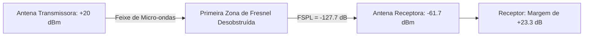

  
⬅️ <b><a href="/pt-br/resource/engenharia-de-computação/6-periodo/comunicacao-de-dados/anotacoes/aula-04-meios-de-transmissao-guiados">Aula Anterior</a></b>

  
🏠 <b><a href="/pt-br/resource/engenharia-de-computação/6-periodo/comunicacao-de-dados">Hub da Disciplina</a></b>

  
➡️ <b><a href="/pt-br/resource/engenharia-de-computação/6-periodo/comunicacao-de-dados/anotacoes/aula-06-tecnicas-de-codificacao-de-linha-em-banda-basica">Próxima Aula</a></b>

> [!info] 📅 Informações da Aula
> - **Disciplina:** Comunicação de Dados (CSECBJI.47)
> - **Professor:** Rômulo / Paulo
> - **Data Realizada:** 29/09/2026
> - **Tópico Principal:** Meios de Transmissão Não-Guiados e Propagação de RF
> - **Status:** Concluída e Revisada

> [!note] 📂 Material Complementar & Slides
> - 📄 **Slides Oficiais:** [[slide-05-comunicacao-de-dados|Acessar Apresentação em PDF]]
> - 🎥 **Short Lecture / Gravação:** [[video-05-comunicacao-de-dados|Assistir Síntese da Aula (Vídeo)]]

---

### 📑 Resumo das Seções
- [📌 1. Anotações do Quadro: Meios de Transmissão Não-Guiados e Propagação de RF](#-anotações-do-quadro-meios-de-transmissão-não-guiados-e-propagação-de-rf)
- [🧮 2. Formulação & Exemplo Prático Resolvido](#-formulação--exemplo-prático-resolvido)
- [📊 3. Esquema Visual & Fluxograma (Mermaid)](#-esquema-visual--fluxograma-mermaid)
- [🧠 4. Resumo Pessoal & Macetes do Professor](#-resumo-pessoal--macetes-do-professor)
- [📝 5. Dúvidas & Exercícios Recomendados para Casa](#-dúvidas--exercícios-recomendados-para-casa)

---

## 📌 Anotações do Quadro: Meios de Transmissão Não-Guiados e Propagação de RF

### 5.1 Propagação de Ondas de Rádio e Espectro Eletromagnético
Na transmissão não-guiada (sem fio), antenas irradiam energia eletromagnética pelo ar/vácuo em frequências de $3\text{ kHz}$ a $300\text{ GHz}$.

### 5.2 Modos de Propagação Terrestre
1. **Onda Terrestre / Superfície ($f < 2\text{ MHz}$, VLF/LF/MF):** A onda acompanha a curvatura da Terra por difração na superfície terrestre (ex: Rádio AM, navegação marítima).
2. **Onda Celeste / Ionosférica ($2\text{ MHz} \le f \le 30\text{ MHz}$, HF):** A onda sofre refração e reflete na camada ionosférica da alta atmosfera, permitindo comunicação intercontinental com saltos (*hops*) múltiplos.
3. **Linha de Visada Direta (*Line-of-Sight - LOS*, $f > 30\text{ MHz}$, VHF/UHF/SHF):** A onda se propaga em linha reta entre transmissor e receptor. Exige que as antenas estejam desobstruídas (ex: Wi-Fi, 4G/5G, Enlaces de Micro-ondas, Satélites).

### 5.3 Equação de Friis e Perda de Espaço Livre (FSPL)
A atenuação no vácuo/ar em linha de visada direta é proporcional ao quadrado da distância e da frequência:
$$\text{FSPL}_{\text{dB}} = 20 \log_{10}(d) + 20 \log_{10}(f) + 20 \log_{10}\left(\frac{4\pi}{c}\right)$$
Em unidades práticas ($d$ em km e $f$ em MHz):
$$\text{FSPL}_{\text{dB}} = 32.44 + 20 \log_{10}(d_{\text{km}}) + 20 \log_{10}(f_{\text{MHz}})$$

### 5.4 A Primeira Zona de Fresnel
Região elipsoidal ao redor do eixo de visada direta. Para garantir propagação sem perdas adicionais por difração e reflexão destrutiva, pelo menos **$60\%$ da Primeira Zona de Fresnel deve estar totalmente livre de obstáculos** (árvores, prédios, montanhas):
$$r_1 = 17.32 \sqrt{\frac{d_1 \cdot d_2}{f_{\text{GHz}} \cdot (d_1 + d_2)}} \quad \text{(metros)}$$

---

## 🧮 Formulação & Exemplo Prático Resolvido

### ✏️ Cálculo de Enlace de Micro-ondas Ponto a Ponto

**Dados:**
- Distância: $d = 10\text{ km}$
- Frequência: $f = 5.8\text{ GHz} = 5.800\text{ MHz}$
- Potência de Transmissão: $P_{tx} = +20\text{ dBm}$
- Ganho da Antena Transmissora: $G_{tx} = +23\text{ dBi}$
- Ganho da Antena Receptora: $G_{rx} = +23\text{ dBi}$
- Sensibilidade do Receptor: $-85\text{ dBm}$

**1. Cálculo da Perda no Espaço Livre:**
$$\text{FSPL} = 32.44 + 20 \log_{10}(10) + 20 \log_{10}(5800) = 32.44 + 20 + 75.27 = 127.71\text{ dB}$$

**2. Potência Recebida ($P_{rx}$):**
$$P_{rx} = P_{tx} + G_{tx} + G_{rx} - \text{FSPL} = 20 + 23 + 23 - 127.71 = -61.71\text{ dBm}$$

**3. Margem de Fade (*Fade Margin*):**
$$\text{Margem} = -61.71\text{ dBm} - (-85\text{ dBm}) = +23.29\text{ dB}$$
Como a margem é superior a $20\text{ dB}$, o enlace é considerado altamente estável e imune a intempéries de chuva!

---

## 📊 Esquema Visual & Fluxograma (Mermaid)

---

## 🧠 Resumo Pessoal & Macetes do Professor

| Conceito-Chave | *Takeaway* do Professor | Dicas de Prova / Atenção |
| :--- | :--- | :--- |
| **Frequência Mais Alta = Maior Atenuação** | Sinais de 5 GHz atenuam muito mais rápido e sofrem mais com obstáculos que sinais de 2.4 GHz. Sinais de 60 GHz sofrem atenuação massiva por absorção de oxigênio. | Por isso frequências baixas são usadas para ampla cobertura territorial. |
| **Regra dos 60% de Fresnel** | Ter visada visual (enxergar a torre) não garante visada de RF! Se o solo invadir a Zona de Fresnel, haverá cancelamento de fase. | Aplicação prática direta |

---

## 📝 Dúvidas & Exercícios Recomendados para Casa

1. Calcule o raio máximo da Primeira Zona de Fresnel no ponto médio de um enlace de $6	ext{ km}$ operando a $2.4	ext{ GHz}$.
2. Explique o fenômeno do desvanecimento por múltiplos percursos (*Multipath Fading*).

---

  
⬅️ <b><a href="/pt-br/resource/engenharia-de-computação/6-periodo/comunicacao-de-dados/anotacoes/aula-04-meios-de-transmissao-guiados">Aula Anterior</a></b>

  
🏠 <b><a href="/pt-br/resource/engenharia-de-computação/6-periodo/comunicacao-de-dados">Hub da Disciplina</a></b>

  
➡️ <b><a href="/pt-br/resource/engenharia-de-computação/6-periodo/comunicacao-de-dados/anotacoes/aula-06-tecnicas-de-codificacao-de-linha-em-banda-basica">Próxima Aula</a></b>

