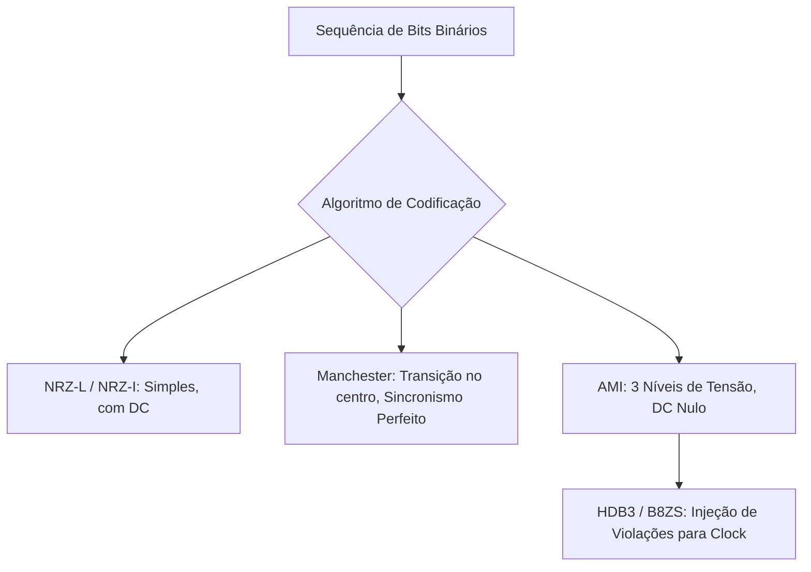

<div style="display: flex; justify-content: space-between; align-items: center; padding: 10px 16px; background: var(--light, #f8fafc); border: 1px solid var(--lightgray, #e2e8f0); border-radius: 10px; margin: 1.5rem 0;">
  <div>⬅️ <b><a href="/pt-br/resource/engenharia-de-computação/6-periodo/comunicacao-de-dados/anotacoes/aula-05-meios-de-transmissao-nao-guiados-e-propagacao-de-rf">Aula Anterior</a></b></div>
  <div>🏠 <b><a href="/pt-br/resource/engenharia-de-computação/6-periodo/comunicacao-de-dados">Hub da Disciplina</a></b></div>
  <div>➡️ <b><a href="/pt-br/resource/engenharia-de-computação/6-periodo/comunicacao-de-dados/anotacoes/aula-07-avaliacao-teorica-p1">Próxima Aula</a></b></div>
</div>

> [!info] 📅 Informações da Aula
> - **Disciplina:** Comunicação de Dados (CSECBJI.47)
> - **Professor:** Rômulo / Paulo
> - **Data Realizada:** 06/10/2026
> - **Tópico Principal:** Técnicas de Codificação de Linha em Banda Básica
> - **Status:** Concluída e Revisada

> [!note] 📂 Material Complementar & Slides
> - 📄 **Slides Oficiais:** [[slide-06-comunicacao-de-dados|Acessar Apresentação em PDF]]
> - 🎥 **Short Lecture / Gravação:** [[video-06-comunicacao-de-dados|Assistir Síntese da Aula (Vídeo)]]

---

### 📑 Resumo das Seções
- [📌 1. Anotações do Quadro: Técnicas de Codificação de Linha em Banda Básica](#-anotações-do-quadro-técnicas-de-codificação-de-linha-em-banda-básica)
- [🧮 2. Formulação & Exemplo Prático Resolvido](#-formulação--exemplo-prático-resolvido)
- [📊 3. Esquema Visual & Fluxograma (Mermaid)](#-esquema-visual--fluxograma-mermaid)
- [🧠 4. Resumo Pessoal & Macetes do Professor](#-resumo-pessoal--macetes-do-professor)
- [📝 5. Dúvidas & Exercícios Recomendados para Casa](#-dúvidas--exercícios-recomendados-para-casa)

---

## 📌 Anotações do Quadro: Técnicas de Codificação de Linha em Banda Básica

### 6.1 Codificação de Linha em Banda Básica
A codificação de linha mapeia uma sequência de bits digitais em uma forma de onda elétrica/óptica adequada para transmissão em banda básica (sem modulação em portadora de alta frequência).

### 6.2 Critérios de Projeto de Códigos de Linha
1. **Auto-Sincronização:** Presença de transições suficientes para que o receptor recupere o clock da transmissão.
2. **Ausência de Componente DC (Nível Contínuo nulo):** Permite acoplamento por transformadores/capacitores em linhas telefônicas e Ethernet.
3. **Eficiência Espectral:** Concentração de energia em faixas estreitas de frequência.
4. **Capacidade de Detecção de Erros:** Violações no padrão do código indicam ruído no canal.

### 6.3 Códigos de Linha Clássicos
- **NRZ-L (Non-Return-to-Zero Level):** $0 = +V$, $1 = -V$. Simples, mas não tem sincronismo em longas sequências de bits iguais e possui alto nível DC.
- **NRZ-I (NRZ Invert on ones):** Transição no início do bit representa '1'; ausência de transição representa '0'.
- **Manchester (Padrão Ethernet 10 Mbps):** Transição obrigatória no meio do intervalo de bit:
  - '0': Transição de nível Alto para Baixo ($\downarrow$).
  - '1': Transição de nível Baixo para Alto ($\uparrow$).
  - *Vantagem:* Sincronismo perfeito de clock e componente DC zero. *Desvantagem:* Dobra a taxa de modulação em bauds ($2\text{ Bauds por bit}$).
- **Manchester Diferencial (Padrão Token Ring):** Transição no início do bit representa '0'; ausência de transição no início representa '1'.
- **AMI (Alternate Mark Inversion):** '0' é nível zero; '1' alterna entre $+V$ e $-V$. Componente DC zero, mas perde sincronismo em longas sequências de '0's.
- **B8ZS e HDB3:** Códigos de substituição que violam propositalmente a regra do AMI para injetar sincronismo quando ocorrem sequências longas de zeros.

---

## 🧮 Formulação & Exemplo Prático Resolvido

### ✏️ Desenho de Formas de Onda para a Sequência de Bits `0 1 0 0 1 1 0`

```text
Bit Stream     :   0      1      0      0      1      1      0
──────────────────────────────────────────────────────────────────
NRZ-L          : ┌────┐      ┌────────────┐             ┌────┐
                 │    │      │            │             │    │
                 ┘    └──────┴────────────┴─────────────┘    └───

Manchester     : ┌──┐   ┌──┐   ┌──┐   ┌──┐   ┌──┐   ┌──┐   ┌──┐
                 │  │   │  │   │  │   │  │   │  │   │  │   │  │
                 ┘  └───┘  └───┘  └───┘  └───┘  └───┘  └───┘  └───
(Transições)   :  Alto->B Baixo->A Alto->B Alto->B Baixo->A Baixo->A Alto->B

AMI            : ─────┐ ┌────┐ ──────────── ┌────┐ ┌────┐ ───────
                 0    │ │ +V │      0       │ +V │ │ -V │   0
                      └─┘    └──────────────┘    └─┘    └─── (-V)
```

---

## 📊 Esquema Visual & Fluxograma (Mermaid)



---

## 🧠 Resumo Pessoal & Macetes do Professor

| Conceito-Chave | *Takeaway* do Professor | Dicas de Prova / Atenção |
| :--- | :--- | :--- |
| **A Transição Central do Manchester** | No código Manchester, a transição no centro do bit serve simultaneamente como sinal de clock e como valor do dado! | A taxa de sinalização em bauds é exatamente o dobro da taxa de bits. |
| **Violação de Bipolaridade no HDB3** | O padrão HDB3 substitui 4 zeros consecutivos (`0000`) por `000V` ou `B00V` com uma violação de polaridade intencional. | Aplicação prática direta |

---

## 📝 Dúvidas & Exercícios Recomendados para Casa

1. Desenhe as formas de onda para a cadeia `1 0 1 1 0 0 1` em NRZ-I, Manchester e Manchester Diferencial.
2. Explique por que a ausência de nível DC é crítica em sistemas de transmissão com isolamento galvânico por transformadores.

---

<div style="display: flex; justify-content: space-between; align-items: center; padding: 10px 16px; background: var(--light, #f8fafc); border: 1px solid var(--lightgray, #e2e8f0); border-radius: 10px; margin: 1.5rem 0;">
  <div>⬅️ <b><a href="/pt-br/resource/engenharia-de-computação/6-periodo/comunicacao-de-dados/anotacoes/aula-05-meios-de-transmissao-nao-guiados-e-propagacao-de-rf">Aula Anterior</a></b></div>
  <div>🏠 <b><a href="/pt-br/resource/engenharia-de-computação/6-periodo/comunicacao-de-dados">Hub da Disciplina</a></b></div>
  <div>➡️ <b><a href="/pt-br/resource/engenharia-de-computação/6-periodo/comunicacao-de-dados/anotacoes/aula-07-avaliacao-teorica-p1">Próxima Aula</a></b></div>
</div>
