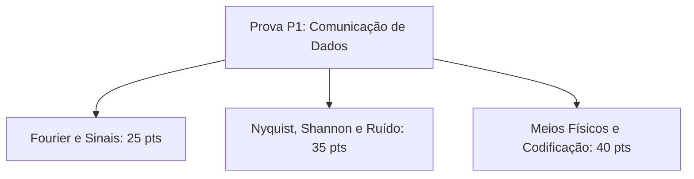

  
⬅️ <b><a href="/pt-br/resource/engenharia-de-computação/6-periodo/comunicacao-de-dados/anotacoes/aula-06-tecnicas-de-codificacao-de-linha-em-banda-basica">Aula Anterior</a></b>

  
🏠 <b><a href="/pt-br/resource/engenharia-de-computação/6-periodo/comunicacao-de-dados">Hub da Disciplina</a></b>

  
➡️ <b><a href="/pt-br/resource/engenharia-de-computação/6-periodo/comunicacao-de-dados/anotacoes/aula-08-modulacao-digital-em-banda-passante-ask-fsk-e-psk">Próxima Aula</a></b>

> [!info] 📅 Informações da Aula
> - **Disciplina:** Comunicação de Dados (CSECBJI.47)
> - **Professor:** Rômulo / Paulo
> - **Data Realizada:** 13/10/2026
> - **Tópico Principal:** Avaliação Teórica P1
> - **Status:** Concluída e Revisada

> [!note] 📂 Material Complementar & Slides
> - 📄 **Slides Oficiais:** [[slide-07-comunicacao-de-dados|Acessar Apresentação em PDF]]
> - 🎥 **Short Lecture / Gravação:** [[video-07-comunicacao-de-dados|Assistir Síntese da Aula (Vídeo)]]

---

### 📑 Resumo das Seções
- [📌 1. Anotações do Quadro: Avaliação Teórica P1](#-anotações-do-quadro-avaliação-teórica-p1)
- [🧮 2. Formulação & Exemplo Prático Resolvido](#-formulação--exemplo-prático-resolvido)
- [📊 3. Esquema Visual & Fluxograma (Mermaid)](#-esquema-visual--fluxograma-mermaid)
- [🧠 4. Resumo Pessoal & Macetes do Professor](#-resumo-pessoal--macetes-do-professor)
- [📝 5. Dúvidas & Exercícios Recomendados para Casa](#-dúvidas--exercícios-recomendados-para-casa)

---

## 📌 Anotações do Quadro: Avaliação Teórica P1

### 7.1 Síntese Conceitual para Avaliação Parcial P1
Revisão integrada de Transmissão de Sinais e Camada Física:
1. **Domínio da Frequência:** Série de Fourier, espectros, largura de banda e distorção harmônica.
2. **Degradações do Canal:** Atenuação, orçamentos em dB/dBm, ruído térmico ($N=kTB$) e cálculo de SNR.
3. **Capacidade de Canal:** Teorema de Nyquist ($C = 2B\log_2 M$) e Teorema de Shannon ($C = B\log_2(1+\text{SNR})$).
4. **Meios Guiados e Não-Guiados:** Fibras ópticas (MMF/SMF, janelas de transmissão), Perda no Espaço Livre (FSPL) e Zona de Fresnel.
5. **Codificação de Linha:** NRZ, Manchester, AMI e recuperação de relógio.

---

## 🧮 Formulação & Exemplo Prático Resolvido

### ✏️ Resolução de Exercício Típico de Prova

**Problema:** Um enlace de fibra óptica monomodo opera com laser em $1550\text{ nm}$ (atenuação de $0.25\text{ dB/km}$) cobrindo uma distância de $80\text{ km}$. A potência emitida pelo laser é $+3\text{ dBm}$. O receptor possui sensibilidade de $-30\text{ dBm}$. No trajeto há 6 fusões de fibra (perda de $0.1\text{ dB}$ cada) e 2 conectores de terminação (perda de $0.5\text{ dB}$ cada).
1. Perda da fibra: $80\text{ km} \times 0.25\text{ dB/km} = 20\text{ dB}$.
2. Perda das fusões: $6 \times 0.1\text{ dB} = 0.6\text{ dB}$.
3. Perda dos conectores: $2 \times 0.5\text{ dB} = 1.0\text{ dB}$.
4. Atenuação total: $A_{tot} = 20 + 0.6 + 1.0 = 21.6\text{ dB}$.
5. Potência na recepção: $P_{rx} = +3\text{ dBm} - 21.6\text{ dB} = -18.6\text{ dBm}$.
6. Margem de segurança: $-18.6\text{ dBm} - (-30\text{ dBm}) = +11.4\text{ dB}$.
**Conclusão:** O enlace opera com ampla folga de segurança.

---

## 📊 Esquema Visual & Fluxograma (Mermaid)

---

## 🧠 Resumo Pessoal & Macetes do Professor

| Conceito-Chave | *Takeaway* do Professor | Dicas de Prova / Atenção |
| :--- | :--- | :--- |
| **Roteiro para Questões de Enlace** | 1. Some todas as perdas e atenuações em dB; 2. Subtraia da potência do transmissor em dBm; 3. Compare com a sensibilidade do receptor. | Organize em formato de tabela para não esquecer conectores. |
| **Atenção com Unidades** | Verifique se distâncias estão em km ou metros, e frequências em Hz, kHz, MHz ou GHz. | Aplicação prática direta |

---

## 📝 Dúvidas & Exercícios Recomendados para Casa

1. Revise todos os exercícios das listas 1 a 6.
2. Refaça o cálculo completo de um orçamento de enlace óptico intermunicipal.

---

  
⬅️ <b><a href="/pt-br/resource/engenharia-de-computação/6-periodo/comunicacao-de-dados/anotacoes/aula-06-tecnicas-de-codificacao-de-linha-em-banda-basica">Aula Anterior</a></b>

  
🏠 <b><a href="/pt-br/resource/engenharia-de-computação/6-periodo/comunicacao-de-dados">Hub da Disciplina</a></b>

  
➡️ <b><a href="/pt-br/resource/engenharia-de-computação/6-periodo/comunicacao-de-dados/anotacoes/aula-08-modulacao-digital-em-banda-passante-ask-fsk-e-psk">Próxima Aula</a></b>

