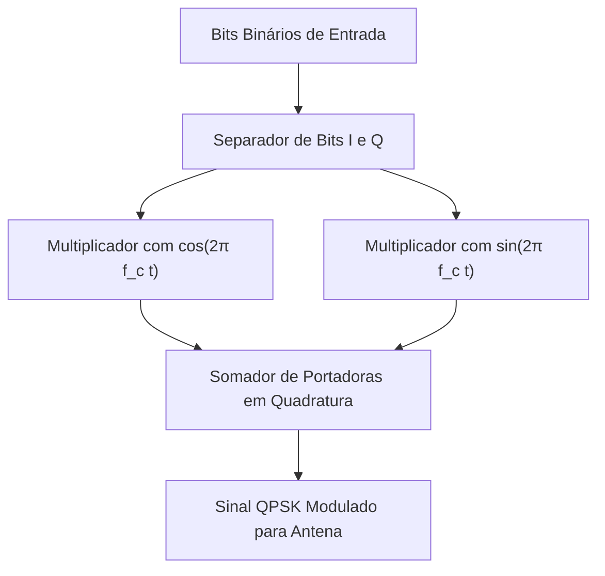

  
⬅️ <b><a href="/pt-br/resource/engenharia-de-computação/6-periodo/comunicacao-de-dados/anotacoes/aula-07-avaliacao-teorica-p1">Aula Anterior</a></b>

  
🏠 <b><a href="/pt-br/resource/engenharia-de-computação/6-periodo/comunicacao-de-dados">Hub da Disciplina</a></b>

  
➡️ <b><a href="/pt-br/resource/engenharia-de-computação/6-periodo/comunicacao-de-dados/anotacoes/aula-09-modulacao-por-amplitude-em-quadratura-qam">Próxima Aula</a></b>

> [!info] 📅 Informações da Aula
> - **Disciplina:** Comunicação de Dados (CSECBJI.47)
> - **Professor:** Rômulo / Paulo
> - **Data Realizada:** 20/10/2026
> - **Tópico Principal:** Modulação Digital em Banda Passante: ASK, FSK e PSK
> - **Status:** Concluída e Revisada

> [!note] 📂 Material Complementar & Slides
> - 📄 **Slides Oficiais:** [[slide-08-comunicacao-de-dados|Acessar Apresentação em PDF]]
> - 🎥 **Short Lecture / Gravação:** [[video-08-comunicacao-de-dados|Assistir Síntese da Aula (Vídeo)]]

---

### 📑 Resumo das Seções
- [📌 1. Anotações do Quadro: Modulação Digital em Banda Passante: ASK, FSK e PSK](#-anotações-do-quadro-modulação-digital-em-banda-passante-ask,-fsk-e-psk)
- [🧮 2. Formulação & Exemplo Prático Resolvido](#-formulação--exemplo-prático-resolvido)
- [📊 3. Esquema Visual & Fluxograma (Mermaid)](#-esquema-visual--fluxograma-mermaid)
- [🧠 4. Resumo Pessoal & Macetes do Professor](#-resumo-pessoal--macetes-do-professor)
- [📝 5. Dúvidas & Exercícios Recomendados para Casa](#-dúvidas--exercícios-recomendados-para-casa)

---

## 📌 Anotações do Quadro: Modulação Digital em Banda Passante: ASK, FSK e PSK

### 8.1 Modulação Digital em Banda Passante
Para transmitir dados digitais através de canais passa-faixa (como o ar em RF ou linhas telefônicas com filtros), os bits modulam uma **onda portadora senoidal de alta frequência**:
$$s(t) = A(t) \cos(2\pi f_c t + \phi(t))$$

### 8.2 Modulações Básicas por Chaveamento
1. **ASK (Amplitude Shift Keying / OOK - On-Off Keying):**
   - Varia a amplitude $A$ da portadora: '1' transmite portadora com amplitude $A$; '0' transmite amplitude zero.
   - Muito sensível a variações de ruído e atenuação.
2. **FSK (Frequency Shift Keying / BFSK):**
   - Varia a frequência $f$: '1' transmite em $f_1 = f_c + \Delta f$; '0' transmite em $f_2 = f_c - \Delta f$.
   - Alta imunidade a ruído, amplamente utilizado em rádio enlaces e telemetria.
3. **PSK (Phase Shift Keying / BPSK / QPSK):**
   - Varia a fase $\phi$ da portadora:
     - **BPSK (Binary PSK, 1 bit/símbolo):** '0' $\to 0^\circ$ ($\cos(2\pi f_c t)$); '1' $\to 180^\circ$ ($-\cos(2\pi f_c t)$).
     - **QPSK (Quadrature PSK, 2 bits/símbolo):** Quatro deslocamentos de fase ($45^\circ, 135^\circ, 225^\circ, 315^\circ$), dobrando a taxa de bits para a mesma largura de banda!

---

## 🧮 Formulação & Exemplo Prático Resolvido

### ✏️ Diagrama de Constelação e Eficiência Espectral

O **Diagrama de Constelação** representa os símbolos de modulação no plano fasorial bidimensional (Eixo em Fase $I$ e Eixo em Quadratura $Q$):

- **BPSK ($M=2$):** 2 pontos no eixo real ($+1$ e $-1$). Eficiência: $1\text{ bps/Hz}$.
- **QPSK ($M=4$):** 4 pontos distribuídos nos quadrantes. Eficiência: $2\text{ bps/Hz}$.

**Taxa de Transmissão ($R$) vs Taxa de Modulação ($S$):**
$$R = S \cdot \log_2(M) = S \cdot n_{\text{bits}}$$
Em QPSK, com taxa de símbolos de $10\text{ Mbaud}$, a taxa de dados é de $20\text{ Mbps}$!

---

## 📊 Esquema Visual & Fluxograma (Mermaid)

---

## 🧠 Resumo Pessoal & Macetes do Professor

| Conceito-Chave | *Takeaway* do Professor | Dicas de Prova / Atenção |
| :--- | :--- | :--- |
| **Diferença entre BPSK e QPSK** | QPSK tem o dobro da taxa de bits do BPSK para a MESMA largura de banda de canal e com a mesma probabilidade de erro de bit ($BER$). | É a modulação preferida em satélites e comunicações móveis. |
| **Distância Euclidiana na Constelação** | Quanto mais distantes os pontos no diagrama de constelação, menor a probabilidade de o ruído causar erros de decodificação. | Aplicação prática direta |

---

## 📝 Dúvidas & Exercícios Recomendados para Casa

1. Desenhe o diagrama de constelação para o BPSK e para o QPSK com mapeamento de código Gray entre símbolos vizinhos.
2. Calcule a largura de banda de canal necessária para transmitir $50	ext{ Mbps}$ utilizando modulação QPSK com fator de roll-off $lpha = 0.25$.

---

  
⬅️ <b><a href="/pt-br/resource/engenharia-de-computação/6-periodo/comunicacao-de-dados/anotacoes/aula-07-avaliacao-teorica-p1">Aula Anterior</a></b>

  
🏠 <b><a href="/pt-br/resource/engenharia-de-computação/6-periodo/comunicacao-de-dados">Hub da Disciplina</a></b>

  
➡️ <b><a href="/pt-br/resource/engenharia-de-computação/6-periodo/comunicacao-de-dados/anotacoes/aula-09-modulacao-por-amplitude-em-quadratura-qam">Próxima Aula</a></b>

