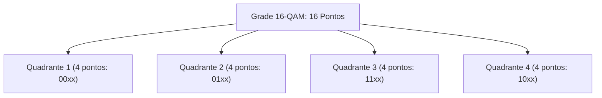

  
⬅️ <b><a href="/pt-br/resource/engenharia-de-computação/6-periodo/comunicacao-de-dados/anotacoes/aula-08-modulacao-digital-em-banda-passante-ask-fsk-e-psk">Aula Anterior</a></b>

  
🏠 <b><a href="/pt-br/resource/engenharia-de-computação/6-periodo/comunicacao-de-dados">Hub da Disciplina</a></b>

  
➡️ <b><a href="/pt-br/resource/engenharia-de-computação/6-periodo/comunicacao-de-dados/anotacoes/aula-10-transmissao-sincrona-vs-assincrona-e-interfaceamento-fisico">Próxima Aula</a></b>

> [!info] 📅 Informações da Aula
> - **Disciplina:** Comunicação de Dados (CSECBJI.47)
> - **Professor:** Rômulo / Paulo
> - **Data Realizada:** 27/10/2026
> - **Tópico Principal:** Modulação por Amplitude em Quadratura (QAM)
> - **Status:** Concluída e Revisada

> [!note] 📂 Material Complementar & Slides
> - 📄 **Slides Oficiais:** [[slide-09-comunicacao-de-dados|Acessar Apresentação em PDF]]
> - 🎥 **Short Lecture / Gravação:** [[video-09-comunicacao-de-dados|Assistir Síntese da Aula (Vídeo)]]

---

### 📑 Resumo das Seções
- [📌 1. Anotações do Quadro: Modulação por Amplitude em Quadratura (QAM)](#-anotações-do-quadro-modulação-por-amplitude-em-quadratura-qam)
- [🧮 2. Formulação & Exemplo Prático Resolvido](#-formulação--exemplo-prático-resolvido)
- [📊 3. Esquema Visual & Fluxograma (Mermaid)](#-esquema-visual--fluxograma-mermaid)
- [🧠 4. Resumo Pessoal & Macetes do Professor](#-resumo-pessoal--macetes-do-professor)
- [📝 5. Dúvidas & Exercícios Recomendados para Casa](#-dúvidas--exercícios-recomendados-para-casa)

---

## 📌 Anotações do Quadro: Modulação por Amplitude em Quadratura (QAM)

### 9.1 Modulação por Amplitude em Quadratura (QAM)
O **QAM (*Quadrature Amplitude Modulation*)** combina simultaneamente a modulação em amplitude (ASK) e a modulação em fase (PSK) sobre duas portadoras ortogonais defasadas de $90^\circ$ ($\cos(2\pi f_c t)$ e $\sin(2\pi f_c t)$):
$$s(t) = I(t) \cos(2\pi f_c t) + Q(t) \sin(2\pi f_c t)$$

### 9.2 Constelações QAM de Alta Ordem
- **16-QAM:** $M=16$ símbolos ($4\text{ bits por símbolo}$), organizado em grade 4x4.
- **64-QAM:** $M=64$ símbolos ($6\text{ bits por símbolo}$), padrão Wi-Fi 5 e TV Digital.
- **256-QAM:** $M=256$ símbolos ($8\text{ bits por símbolo}$), padrão DOCSIS 3.1 e Wi-Fi 6.
- **1024-QAM / 4096-QAM:** Utilizado em enlaces de micro-ondas de altíssima capacidade e Wi-Fi 7.

### 9.3 Trade-off: Eficiência Espectral vs Tolerância ao Ruído
- **Vantagem:** Eficiências espectrais altíssimas (ex: 256-QAM atinge $8\text{ bps/Hz}$).
- **Desvantagem:** Os pontos da constelação ficam extremamente próximos entre si, exigindo canais com altíssimo $\text{SNR}$ ($> 30\text{ dB}$) para evitar erros de símbolo.

---

## 🧮 Formulação & Exemplo Prático Resolvido

### ✏️ Cálculo de Vazão em Wi-Fi 6 com 1024-QAM

**Parâmetros de Canal:**
- Largura de Banda do Canal: $B = 80\text{ MHz}$
- Subportadoras OFDM de dados: $980$ subportadoras úteis
- Modulação: 1024-QAM ($M=1024 \implies \log_2(1024) = 10\text{ bits por símbolo}$)
- Tempo de Símbolo OFDM com Intervalo de Guarda: $T_s = 13.6\ \mu\text{s}$

**Cálculo da Taxa de Dados na Camada Física:**
$$\text{Bits por Símbolo OFDM} = 980 \times 10 = 9.800\text{ bits}$$
$$\text{Taxa de Transferência} = \frac{9.800\text{ bits}}{13.6 \times 10^{-6}\text{ s}} \approx 720.58\text{ Mbps por stream espacial!}$$

---

## 📊 Esquema Visual & Fluxograma (Mermaid)

---

## 🧠 Resumo Pessoal & Macetes do Professor

| Conceito-Chave | *Takeaway* do Professor | Dicas de Prova / Atenção |
| :--- | :--- | :--- |
| **Mapeamento Gray na Constelação QAM** | Pontos vizinhos no diagrama de constelação devem diferir em apenas 1 bit. Se o ruído deslocar o símbolo para o ponto adjacente, ocorrerá erro de apenas 1 bit em vez de 4 ou 8 bits. | Crucial para a eficiência dos códigos corretores de erro FEC. |
| **Adaptative Modulation and Coding (AMC)** | Sistemas modernos (4G/5G/Wi-Fi) ajustam a modulação dinamicamente: usam 256-QAM perto do roteador e recuam para QPSK longe. | Aplicação prática direta |

---

## 📝 Dúvidas & Exercícios Recomendados para Casa

1. Quantos bits são transmitidos em cada símbolo em uma modulação 64-QAM?
2. Explique por que um enlace de 1024-QAM não funciona adequadamente na presença de interferência de ruído com SNR moderado.

---

  
⬅️ <b><a href="/pt-br/resource/engenharia-de-computação/6-periodo/comunicacao-de-dados/anotacoes/aula-08-modulacao-digital-em-banda-passante-ask-fsk-e-psk">Aula Anterior</a></b>

  
🏠 <b><a href="/pt-br/resource/engenharia-de-computação/6-periodo/comunicacao-de-dados">Hub da Disciplina</a></b>

  
➡️ <b><a href="/pt-br/resource/engenharia-de-computação/6-periodo/comunicacao-de-dados/anotacoes/aula-10-transmissao-sincrona-vs-assincrona-e-interfaceamento-fisico">Próxima Aula</a></b>

