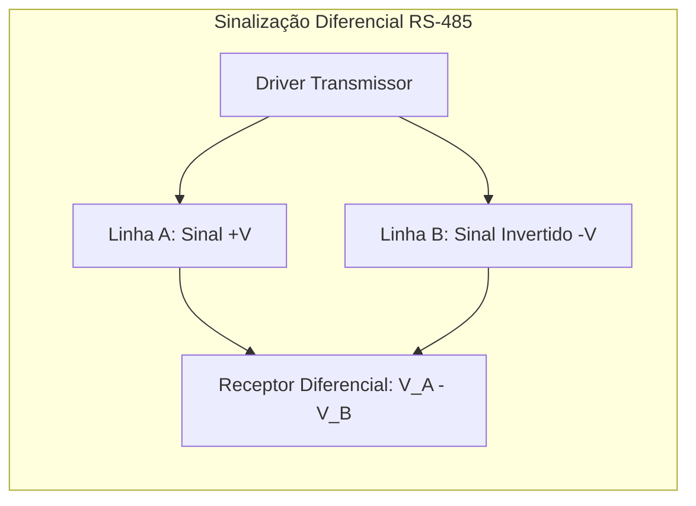

<div style="display: flex; justify-content: space-between; align-items: center; padding: 10px 16px; background: var(--light, #f8fafc); border: 1px solid var(--lightgray, #e2e8f0); border-radius: 10px; margin: 1.5rem 0;">
  <div>⬅️ <b><a href="/pt-br/resource/engenharia-de-computação/6-periodo/comunicacao-de-dados/anotacoes/aula-09-modulacao-por-amplitude-em-quadratura-qam">Aula Anterior</a></b></div>
  <div>🏠 <b><a href="/pt-br/resource/engenharia-de-computação/6-periodo/comunicacao-de-dados">Hub da Disciplina</a></b></div>
  <div>➡️ <b><a href="/pt-br/resource/engenharia-de-computação/6-periodo/comunicacao-de-dados/anotacoes/aula-11-deteccao-e-correcao-de-erros-paridade-checksum-e-crc">Próxima Aula</a></b></div>
</div>

> [!info] 📅 Informações da Aula
> - **Disciplina:** Comunicação de Dados (CSECBJI.47)
> - **Professor:** Rômulo / Paulo
> - **Data Realizada:** 03/11/2026
> - **Tópico Principal:** Transmissão Síncrona vs Assíncrona e Interfaceamento Físico
> - **Status:** Concluída e Revisada

> [!note] 📂 Material Complementar & Slides
> - 📄 **Slides Oficiais:** [[slide-10-comunicacao-de-dados|Acessar Apresentação em PDF]]
> - 🎥 **Short Lecture / Gravação:** [[video-10-comunicacao-de-dados|Assistir Síntese da Aula (Vídeo)]]

---

### 📑 Resumo das Seções
- [📌 1. Anotações do Quadro: Transmissão Síncrona vs Assíncrona e Interfaceamento Físico](#-anotações-do-quadro-transmissão-síncrona-vs-assíncrona-e-interfaceamento-físico)
- [🧮 2. Formulação & Exemplo Prático Resolvido](#-formulação--exemplo-prático-resolvido)
- [📊 3. Esquema Visual & Fluxograma (Mermaid)](#-esquema-visual--fluxograma-mermaid)
- [🧠 4. Resumo Pessoal & Macetes do Professor](#-resumo-pessoal--macetes-do-professor)
- [📝 5. Dúvidas & Exercícios Recomendados para Casa](#-dúvidas--exercícios-recomendados-para-casa)

---

## 📌 Anotações do Quadro: Transmissão Síncrona vs Assíncrona e Interfaceamento Físico

### 10.1 Transmissão Assíncrona
Os dados são transmitidos caractere a caractere (normalmente 8 bits).
- Cada caractere é delimitado por um **Start Bit** (nível lógico 0) para alertar o receptor e um ou dois **Stop Bits** (nível lógico 1) para retornar à linha em repouso (*Mark*).
- Não há linha dedicada de clock compartilhada; os clocks do transmissor e do receptor devem estar sincronizados na mesma taxa (*Baud Rate*, ex: 9600, 115200 bps) com tolerância de desvio inferior a $2\%$.
- *Overhead:* Para 8 bits úteis com 1 start e 1 stop bit, transmitem-se 10 bits ($20\%$ de perda de eficiência).

### 10.2 Transmissão Síncrona
Grandes blocos contínuos de dados (quadros de centenas de bytes) são transmitidos precedidos por **Padrões de Sincronismo de Relógio (Preâmbulo / Flags)**.
- O sinal de clock é transmitido em uma linha separada ou recuperado diretamente do sinal de dados (via codificação Manchester ou scrambler).
- *Eficiência:* Quase $100\%$ de utilização do canal útil.

### 10.3 Padrões de Interfaceamento Físico
- **RS-232-C / EIA-232:** Sinalização *single-ended* (referenciada a GND). Nível lógico $1 = -3\text{V}$ a $-15\text{V}$; Nível $0 = +3\text{V}$ a $+15\text{V}$. Alcance limitado a $\sim 15\text{ metros}$ e velocidades até $115.2\text{ kbps}$.
- **RS-485 / EIA-485:** Sinalização **diferencial** balanceada ($V_A - V_B$). Excelente imunidade a ruídos de modo comum. Suporta topologia multiponto com até 32 transceivers, alcances de até $1.200\text{ metros}$ e taxas até $10\text{ Mbps}$.

---

## 🧮 Formulação & Exemplo Prático Resolvido

### ✏️ Estrutura de Quadro Serial UART e Pinagem RS-232

```text
Linha em Repouso (+12V/-12V) ──┐
                              │ Start  D0  D1  D2  D3  D4  D5  D6  D7 Paridade Stop
                              └───────[ 8 BITS DE DADOS LSB->MSB ]───[ P ]──[ 1/2 ]──▶
```

**Sinais de Controle de Fluxo por Hardware (*Handshaking*):**
- **RTS (*Request to Send*) / CTS (*Clear to Send*):** O transmissor pede autorização para emitir dados e o receptor confirma quando o buffer estiver livre.
- **DTR (*Data Terminal Ready*) / DSR (*Data Set Ready*):** Indica que o modem/terminal está ligado e operacional.

---

## 📊 Esquema Visual & Fluxograma (Mermaid)



---

## 🧠 Resumo Pessoal & Macetes do Professor

| Conceito-Chave | *Takeaway* do Professor | Dicas de Prova / Atenção |
| :--- | :--- | :--- |
| **Por que Sinalização Diferencial é Superior?** | No RS-485, qualquer ruído eletromagnético externo induz a mesma tensão espúria em ambos os condutores trançados. O receptor calcula $(V_A + V_{	ext{ruído}}) - (V_B + V_{	ext{ruído}}) = V_A - V_B$, cancelando o ruído perfeitamente! | Padrão em redes industriais Modbus. |
| **Níveis Invertidos do RS-232** | No RS-232, tensão positiva ($+12	ext{V}$) representa o bit ZERO (*Space*); tensão negativa ($-12	ext{V}$) representa o bit UM (*Mark*). | Aplicação prática direta |

---

## 📝 Dúvidas & Exercícios Recomendados para Casa

1. Calcule a eficiência de transmissão percentual de uma conexão UART configurada em 8-N-1 (8 bits de dados, sem paridade, 1 stop bit) e em 7-E-2 (7 bits de dados, paridade par, 2 stop bits).
2. Explique a função dos resistores de terminação de $120\ \Omega$ nos extremos de um barramento RS-485.

---

<div style="display: flex; justify-content: space-between; align-items: center; padding: 10px 16px; background: var(--light, #f8fafc); border: 1px solid var(--lightgray, #e2e8f0); border-radius: 10px; margin: 1.5rem 0;">
  <div>⬅️ <b><a href="/pt-br/resource/engenharia-de-computação/6-periodo/comunicacao-de-dados/anotacoes/aula-09-modulacao-por-amplitude-em-quadratura-qam">Aula Anterior</a></b></div>
  <div>🏠 <b><a href="/pt-br/resource/engenharia-de-computação/6-periodo/comunicacao-de-dados">Hub da Disciplina</a></b></div>
  <div>➡️ <b><a href="/pt-br/resource/engenharia-de-computação/6-periodo/comunicacao-de-dados/anotacoes/aula-11-deteccao-e-correcao-de-erros-paridade-checksum-e-crc">Próxima Aula</a></b></div>
</div>
