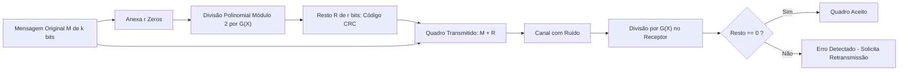

<div style="display: flex; justify-content: space-between; align-items: center; padding: 10px 16px; background: var(--light, #f8fafc); border: 1px solid var(--lightgray, #e2e8f0); border-radius: 10px; margin: 1.5rem 0;">
  <div>⬅️ <b><a href="/pt-br/resource/engenharia-de-computação/6-periodo/comunicacao-de-dados/anotacoes/aula-10-transmissao-sincrona-vs-assincrona-e-interfaceamento-fisico">Aula Anterior</a></b></div>
  <div>🏠 <b><a href="/pt-br/resource/engenharia-de-computação/6-periodo/comunicacao-de-dados">Hub da Disciplina</a></b></div>
  <div>➡️ <b><a href="/pt-br/resource/engenharia-de-computação/6-periodo/comunicacao-de-dados/anotacoes/aula-12-controle-de-enlace-de-dados-e-protocolos-arq">Próxima Aula</a></b></div>
</div>

> [!info] 📅 Informações da Aula
> - **Disciplina:** Comunicação de Dados (CSECBJI.47)
> - **Professor:** Rômulo / Paulo
> - **Data Realizada:** 10/11/2026
> - **Tópico Principal:** Detecção e Correção de Erros: Paridade, Checksum e CRC
> - **Status:** Concluída e Revisada

> [!note] 📂 Material Complementar & Slides
> - 📄 **Slides Oficiais:** [[slide-11-comunicacao-de-dados|Acessar Apresentação em PDF]]
> - 🎥 **Short Lecture / Gravação:** [[video-11-comunicacao-de-dados|Assistir Síntese da Aula (Vídeo)]]

---

### 📑 Resumo das Seções
- [📌 1. Anotações do Quadro: Detecção e Correção de Erros: Paridade, Checksum e CRC](#-anotações-do-quadro-detecção-e-correção-de-erros-paridade,-checksum-e-crc)
- [🧮 2. Formulação & Exemplo Prático Resolvido](#-formulação--exemplo-prático-resolvido)
- [📊 3. Esquema Visual & Fluxograma (Mermaid)](#-esquema-visual--fluxograma-mermaid)
- [🧠 4. Resumo Pessoal & Macetes do Professor](#-resumo-pessoal--macetes-do-professor)
- [📝 5. Dúvidas & Exercícios Recomendados para Casa](#-dúvidas--exercícios-recomendados-para-casa)

---

## 📌 Anotações do Quadro: Detecção e Correção de Erros: Paridade, Checksum e CRC

### 11.1 Fundamentos de Detecção e Correção de Erros
Ruídos e interferências no canal alteram bits de dados ($0 \to 1$ ou $1 \to 0$).
- **Tipos de Erro:** Erro de bit isolado e Erro em rajada (*burst error* de comprimento $B$).
- **Redundância:** Bits adicionais de controle calculados e anexados à mensagem.

### 11.2 Técnicas Clássicas de Detecção
1. **Paridade Simples (VRC):** Bit adicional para tornar a contagem total de '1's par ou ímpar (detecta apenas quantidades ímpares de erros de bits).
2. **Checksum da Internet:** Soma de palavras de 16 bits em Complemento de 1 (usado em cabeçalhos IP/TCP/UDP).
3. **Verificação de Redundância Cíclica (CRC):**
   - Baseado em **aritmética polinomial binária módulo 2** (soma e subtração equivalem à operação XOR, sem transporte / sem *carry*).
   - Um polinômio gerador $G(X)$ de grau $r$ garante detecção de:
     - Todos os erros de bit único.
     - Todos os erros duplos.
     - Qualquer quantidade ímpar de erros.
     - Todos os erros em rajada de comprimento menor ou igual a $r$.

---

## 🧮 Formulação & Exemplo Prático Resolvido

### ✏️ Cálculo de CRC Passo a Passo: Mensagem $M = 1101001110_2$, Gerador $G = 10011_2$

1. O polinômio gerador tem 5 bits, logo seu grau é $r = 5 - 1 = 4$.
2. Anexa $r=4$ zeros à mensagem original: $M' = 11010011100000_2$.
3. Executa a divisão binária módulo 2 ($M' / G$) usando XOR:
   ```text
   11010011100000 | 10011
   10011          |────────
   ─────
   010010
    10011
    ─────
    000011110
        10011
        ─────
        011010
         10011
         ─────
         010010
          10011
          ─────
          000010000
              10011
              ─────
              00011 (Resto R de 4 bits = 0011)
   ```
4. **Quadro Transmitido:** $T = M + R = 1101001110\mathbf{0011}_2$.
5. No receptor, o quadro recebido é dividido por $G$; se o resto for $0000$, a mensagem é aceita como íntegra!

---

## 📊 Esquema Visual & Fluxograma (Mermaid)



---

## 🧠 Resumo Pessoal & Macetes do Professor

| Conceito-Chave | *Takeaway* do Professor | Dicas de Prova / Atenção |
| :--- | :--- | :--- |
| **Propriedades do CRC** | O CRC-32 padrão do Ethernet ($r=32$ bits) detecta 100% dos erros em rajada de até 32 bits e 99.99999997% de qualquer outro padrão de erro arbitrário. | Implementado em hardware em altíssima velocidade via registradores de deslocamento com retroalimentação (LFSR). |
| **Aritmética Módulo 2** | Na divisão polinomial de CRC, soma é XOR ($1+1=0$) e subtração é XOR ($1-1=0$). Nunca faça empréstimo (*borrow*)! | Aplicação prática direta |

---

## 📝 Dúvidas & Exercícios Recomendados para Casa

1. Calcule o código CRC para a mensagem $M = 101001_2$ utilizando o gerador $G(X) = X^3 + X + 1$ ($1011_2$).
2. Simule a chegada da mensagem com o 3º bit invertido e mostre que o resto da divisão no receptor será diferente de zero.

---

<div style="display: flex; justify-content: space-between; align-items: center; padding: 10px 16px; background: var(--light, #f8fafc); border: 1px solid var(--lightgray, #e2e8f0); border-radius: 10px; margin: 1.5rem 0;">
  <div>⬅️ <b><a href="/pt-br/resource/engenharia-de-computação/6-periodo/comunicacao-de-dados/anotacoes/aula-10-transmissao-sincrona-vs-assincrona-e-interfaceamento-fisico">Aula Anterior</a></b></div>
  <div>🏠 <b><a href="/pt-br/resource/engenharia-de-computação/6-periodo/comunicacao-de-dados">Hub da Disciplina</a></b></div>
  <div>➡️ <b><a href="/pt-br/resource/engenharia-de-computação/6-periodo/comunicacao-de-dados/anotacoes/aula-12-controle-de-enlace-de-dados-e-protocolos-arq">Próxima Aula</a></b></div>
</div>
