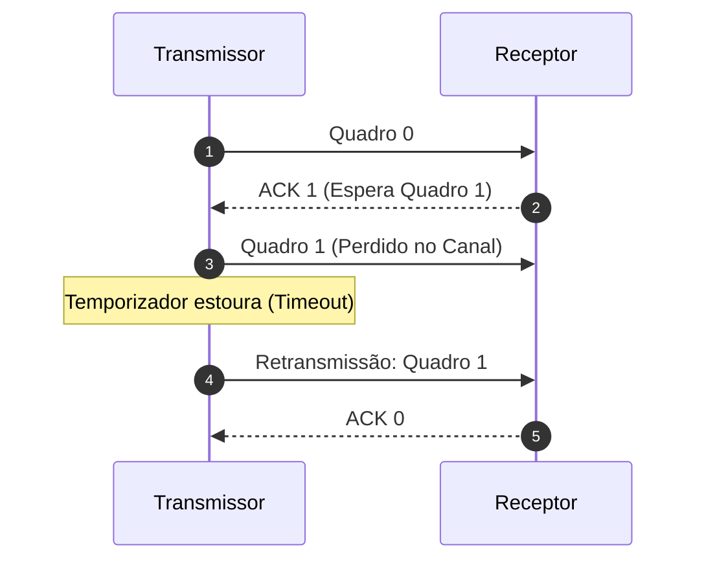

  
⬅️ <b><a href="/pt-br/resource/engenharia-de-computação/6-periodo/comunicacao-de-dados/anotacoes/aula-11-deteccao-e-correcao-de-erros-paridade-checksum-e-crc">Aula Anterior</a></b>

  
🏠 <b><a href="/pt-br/resource/engenharia-de-computação/6-periodo/comunicacao-de-dados">Hub da Disciplina</a></b>

  
➡️ <b><a href="/pt-br/resource/engenharia-de-computação/6-periodo/comunicacao-de-dados/anotacoes/aula-13-protocolos-de-janela-deslizante-go-back-n-e-selective-repeat">Próxima Aula</a></b>

> [!info] 📅 Informações da Aula
> - **Disciplina:** Comunicação de Dados (CSECBJI.47)
> - **Professor:** Rômulo / Paulo
> - **Data Realizada:** 17/11/2026
> - **Tópico Principal:** Controle de Enlace de Dados e Protocolos ARQ
> - **Status:** Concluída e Revisada

> [!note] 📂 Material Complementar & Slides
> - 📄 **Slides Oficiais:** [[slide-12-comunicacao-de-dados|Acessar Apresentação em PDF]]
> - 🎥 **Short Lecture / Gravação:** [[video-12-comunicacao-de-dados|Assistir Síntese da Aula (Vídeo)]]

---

### 📑 Resumo das Seções
- [📌 1. Anotações do Quadro: Controle de Enlace de Dados e Protocolos ARQ](#-anotações-do-quadro-controle-de-enlace-de-dados-e-protocolos-arq)
- [🧮 2. Formulação & Exemplo Prático Resolvido](#-formulação--exemplo-prático-resolvido)
- [📊 3. Esquema Visual & Fluxograma (Mermaid)](#-esquema-visual--fluxograma-mermaid)
- [🧠 4. Resumo Pessoal & Macetes do Professor](#-resumo-pessoal--macetes-do-professor)
- [📝 5. Dúvidas & Exercícios Recomendados para Casa](#-dúvidas--exercícios-recomendados-para-casa)

---

## 📌 Anotações do Quadro: Controle de Enlace de Dados e Protocolos ARQ

### 12.1 Funções da Camada de Enlace de Dados
A Camada de Enlace transforma o canal físico ruidoso e não-estruturado em um enlace de comunicação confiável:
1. **Enquadramento (*Framing*):** Delimitação do fluxo contínuo de bits em quadros com cabeçalho, dados e cauda (Trailer).
   - Técnicas: Contagem de caracteres, Inserção de bytes (*Byte Stuffing*) e Inserção de bits (*Bit Stuffing* com flag `01111110`).
2. **Controle de Fluxo:** Impede que um transmissor rápido sature o buffer de memória de um receptor lento.
3. **Controle de Erros:** Detecção e retransmissão de quadros corrompidos ou perdidos via protocolos **ARQ (*Automatic Repeat reQuest*)**.

### 12.2 Protocolo Stop-and-Wait ARQ
- O transmissor emite um único quadro e aguarda a confirmação positiva (**ACK**) do receptor antes de enviar o próximo.
- Se o ACK não chegar antes do estouro de um temporizador (**Timeout**), o transmissor reenvia o quadro.
- Utiliza numeração alternada de 1 bit (Quadro 0 e Quadro 1) para descartar quadros duplicados gerados por ACKs atrasados.

### 12.3 Eficiência do Stop-and-Wait
A eficiência de utilização do canal ($U$) depende da razão entre o tempo de transmissão do quadro ($t_{frame}$) e o tempo de propagação de ida e volta (*Round-Trip Time - RTT*):
$$a = \frac{t_{prop}}{t_{frame}} \implies U = \frac{1}{1 + 2a}$$
Se $a \gg 1$ (enlaces longos de alta velocidade ou satélite), a eficiência despenca para menos de $1\%$!

---

## 🧮 Formulação & Exemplo Prático Resolvido

### ✏️ Cálculo de Eficiência do Stop-and-Wait em Enlace de Satélite

**Parâmetros:**
- Distância ao Satélite Geoestacionário: $d = 36.000\text{ km} \implies t_{prop} = \frac{36.000\text{ km}}{300.000\text{ km/s}} = 120\text{ ms} = 0.12\text{ s}$
- Taxa de Transmissão: $R = 1\text{ Mbps} = 10^6\text{ bps}$
- Tamanho do Quadro: $L = 1.000\text{ bytes} = 8.000\text{ bits}$

**1. Tempo de Transmissão do Quadro:**
$$t_{frame} = \frac{8.000\text{ bits}}{10^6\text{ bps}} = 8\text{ ms} = 0.008\text{ s}$$

**2. Parâmetro $a$:**
$$a = \frac{t_{prop}}{t_{frame}} = \frac{120\text{ ms}}{8\text{ ms}} = 15$$

**3. Eficiência de Utilização:**
$$U = \frac{1}{1 + 2(15)} = \frac{1}{31} \approx 3.22\%$$
A linha passa $96.8\%$ do tempo totalmente ociosa aguardando o ACK voltar do espaço. Isso exige o uso de **Protocolos de Janela Deslizante**!

---

## 📊 Esquema Visual & Fluxograma (Mermaid)

---

## 🧠 Resumo Pessoal & Macetes do Professor

| Conceito-Chave | *Takeaway* do Professor | Dicas de Prova / Atenção |
| :--- | :--- | :--- |
| **Bit Stuffing (Inserção de Bits)** | Para evitar que a sequência de flag `01111110` apareça nos dados úteis, o transmissor insere um '0' após cada sequência de 5 '1's consecutivos. O receptor remove automaticamente esse '0'. | Permite transparência total de dados. |
| **Numeração de ACKs** | Em protocolos modernos, o `ACK N` confirma o recebimento de todos os quadros anteriores e indica que o receptor está aguardando o quadro de número $N$. | Aplicação prática direta |

---

## 📝 Dúvidas & Exercícios Recomendados para Casa

1. Calcule a eficiência de um protocolo Stop-and-Wait em uma rede local com $t_{prop} = 5\ \mu	ext{s}$ e $t_{frame} = 1	ext{ ms}$.
2. Mostre como a técnica de Bit Stuffing codifica a sequência de dados `01111110111110`.

---

  
⬅️ <b><a href="/pt-br/resource/engenharia-de-computação/6-periodo/comunicacao-de-dados/anotacoes/aula-11-deteccao-e-correcao-de-erros-paridade-checksum-e-crc">Aula Anterior</a></b>

  
🏠 <b><a href="/pt-br/resource/engenharia-de-computação/6-periodo/comunicacao-de-dados">Hub da Disciplina</a></b>

  
➡️ <b><a href="/pt-br/resource/engenharia-de-computação/6-periodo/comunicacao-de-dados/anotacoes/aula-13-protocolos-de-janela-deslizante-go-back-n-e-selective-repeat">Próxima Aula</a></b>

