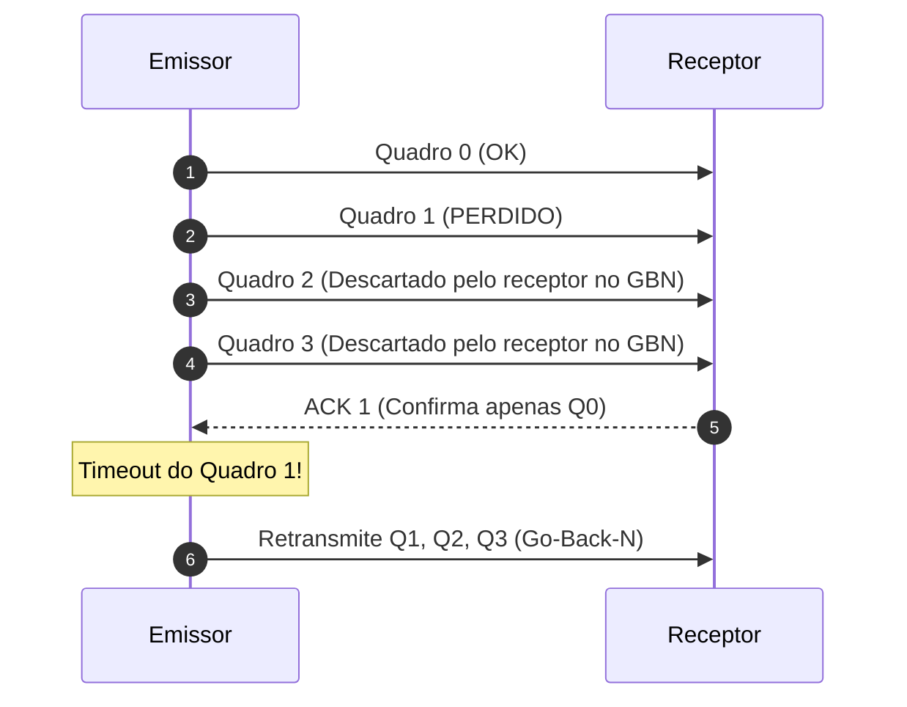

  
⬅️ <b><a href="/pt-br/resource/engenharia-de-computação/6-periodo/comunicacao-de-dados/anotacoes/aula-12-controle-de-enlace-de-dados-e-protocolos-arq">Aula Anterior</a></b>

  
🏠 <b><a href="/pt-br/resource/engenharia-de-computação/6-periodo/comunicacao-de-dados">Hub da Disciplina</a></b>

  
➡️ <b><a href="/pt-br/resource/engenharia-de-computação/6-periodo/comunicacao-de-dados/anotacoes/aula-14-tecnicas-de-multiplexacao-fdm-tdm-e-wdm">Próxima Aula</a></b>

> [!info] 📅 Informações da Aula
> - **Disciplina:** Comunicação de Dados (CSECBJI.47)
> - **Professor:** Rômulo / Paulo
> - **Data Realizada:** 24/11/2026
> - **Tópico Principal:** Protocolos de Janela Deslizante: Go-Back-N e Selective Repeat
> - **Status:** Concluída e Revisada

> [!note] 📂 Material Complementar & Slides
> - 📄 **Slides Oficiais:** [[slide-13-comunicacao-de-dados|Acessar Apresentação em PDF]]
> - 🎥 **Short Lecture / Gravação:** [[video-13-comunicacao-de-dados|Assistir Síntese da Aula (Vídeo)]]

---

### 📑 Resumo das Seções
- [📌 1. Anotações do Quadro: Protocolos de Janela Deslizante: Go-Back-N e Selective Repeat](#-anotações-do-quadro-protocolos-de-janela-deslizante-go-back-n-e-selective-repeat)
- [🧮 2. Formulação & Exemplo Prático Resolvido](#-formulação--exemplo-prático-resolvido)
- [📊 3. Esquema Visual & Fluxograma (Mermaid)](#-esquema-visual--fluxograma-mermaid)
- [🧠 4. Resumo Pessoal & Macetes do Professor](#-resumo-pessoal--macetes-do-professor)
- [📝 5. Dúvidas & Exercícios Recomendados para Casa](#-dúvidas--exercícios-recomendados-para-casa)

---

## 📌 Anotações do Quadro: Protocolos de Janela Deslizante: Go-Back-N e Selective Repeat

### 13.1 Fundamentos dos Protocolos de Janela Deslizante
Os protocolos de janela deslizante permitem que o transmissor envie múltiplos quadros consecutivos (até o tamanho máximo da janela $W$) **sem esperar a confirmação imediata de cada um**, preenchendo a capacidade de trânsito da linha (*Bandwidth-Delay Product*).

### 13.2 Go-Back-N (GBN) ARQ
- **Janela do Emissor:** $W_E = 2^k - 1$ (onde $k$ é o número de bits do campo de sequência).
- **Janela do Receptor:** $W_R = 1$ (aceita apenas quadros em ordem estrita).
- **Mecanismo:** Se um quadro $i$ for corrompido ou perdido, o receptor descarta todos os quadros subsequentes ($i+1, i+2, \dots$), mesmo que cheguem sem erro. Ao estourar o timeout de $i$, o transmissor **volta e retransmite todos os quadros da janela** a partir de $i$.
- *Vantagem:* Receptor simples, não necessita de buffer de reordenação.

### 13.3 Selective-Repeat (SR) ARQ
- **Janela do Emissor:** $W_E = 2^{k-1}$.
- **Janela do Receptor:** $W_R = 2^{k-1}$ (possui buffer de armazenamento para reordenação).
- **Mecanismo:** O receptor aceita e armazena quadros fora de ordem que estejam dentro de sua janela e emite confirmações negativas (**NACK**) ou ACKs seletivos. O transmissor **retransmite apenas o quadro específico danificado**.
- *Vantagem:* Eficiência máxima em canais ruidosos de alta velocidade.

---

## 🧮 Formulação & Exemplo Prático Resolvido

### ✏️ Comparativo de Eficiência Teórica

| Protocolo | Janela Emissor | Janela Receptor | Eficiência Máxima ($U$) |
| :--- | :--- | :--- | :--- |
| **Stop-and-Wait** | $W=1$ | $W=1$ | $U = \frac{1}{1 + 2a}$ |
| **Go-Back-N** | $W > 1$ | $W=1$ | $U = \min\left(1, \; \frac{W}{1 + 2a}\right)$ |
| **Selective-Repeat** | $W > 1$ | $W > 1$ | $U = \min\left(1, \; \frac{W}{1 + 2a}\right)$ |

**Exemplo:** No enlace de satélite anterior com $a=15$, escolhendo uma janela $W = 31$, a eficiência salta de $3.2\%$ para **$100\%$ de utilização contínua da banda**!

---

## 📊 Esquema Visual & Fluxograma (Mermaid)

---

## 🧠 Resumo Pessoal & Macetes do Professor

| Conceito-Chave | *Takeaway* do Professor | Dicas de Prova / Atenção |
| :--- | :--- | :--- |
| **Tamanho Máximo da Janela no GBN** | Em Go-Back-N com $k$ bits de sequência, o tamanho da janela DEVE ser no máximo $2^k - 1$. Se usar $W = 2^k$, o receptor não conseguirá distinguir quadros novos de retransmissões se todos os ACKs forem perdidos! | Questão clássica de pegadinha em concursos e provas. |
| **Tamanho da Janela no Selective-Repeat** | No Selective-Repeat, $W \le 2^{k-1}$ (metade do espaço total de numeração). | Aplicação prática direta |

---

## 📝 Dúvidas & Exercícios Recomendados para Casa

1. Para um campo de número de sequência de 3 bits ($k=3$), determine o tamanho máximo da janela transmissora em Go-Back-N e em Selective-Repeat.
2. Explique o funcionamento do mecanismo de Piggybacking (transmissão de confirmações ACKs no cabeçalho de quadros de dados de retorno).

---

  
⬅️ <b><a href="/pt-br/resource/engenharia-de-computação/6-periodo/comunicacao-de-dados/anotacoes/aula-12-controle-de-enlace-de-dados-e-protocolos-arq">Aula Anterior</a></b>

  
🏠 <b><a href="/pt-br/resource/engenharia-de-computação/6-periodo/comunicacao-de-dados">Hub da Disciplina</a></b>

  
➡️ <b><a href="/pt-br/resource/engenharia-de-computação/6-periodo/comunicacao-de-dados/anotacoes/aula-14-tecnicas-de-multiplexacao-fdm-tdm-e-wdm">Próxima Aula</a></b>

