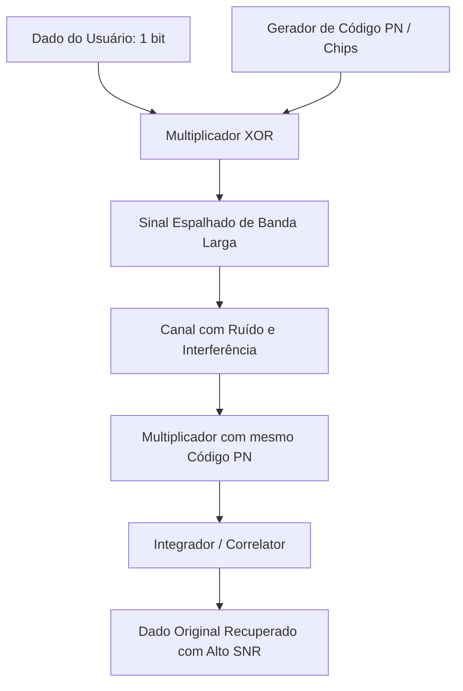

  
⬅️ <b><a href="/pt-br/resource/engenharia-de-computação/6-periodo/comunicacao-de-dados/anotacoes/aula-14-tecnicas-de-multiplexacao-fdm-tdm-e-wdm">Aula Anterior</a></b>

  
🏠 <b><a href="/pt-br/resource/engenharia-de-computação/6-periodo/comunicacao-de-dados">Hub da Disciplina</a></b>

  
➡️ <b><a href="/pt-br/resource/engenharia-de-computação/6-periodo/comunicacao-de-dados/anotacoes/aula-16-prova-final-de-comunicacao-de-dados-e-fechamento">Próxima Aula</a></b>

> [!info] 📅 Informações da Aula
> - **Disciplina:** Comunicação de Dados (CSECBJI.47)
> - **Professor:** Rômulo / Paulo
> - **Data Realizada:** 08/12/2026
> - **Tópico Principal:** Espalhamento Espectral: DSSS, FHSS e CDMA
> - **Status:** Concluída e Revisada

> [!note] 📂 Material Complementar & Slides
> - 📄 **Slides Oficiais:** [[slide-15-comunicacao-de-dados|Acessar Apresentação em PDF]]
> - 🎥 **Short Lecture / Gravação:** [[video-15-comunicacao-de-dados|Assistir Síntese da Aula (Vídeo)]]

---

### 📑 Resumo das Seções
- [📌 1. Anotações do Quadro: Espalhamento Espectral: DSSS, FHSS e CDMA](#-anotações-do-quadro-espalhamento-espectral-dsss,-fhss-e-cdma)
- [🧮 2. Formulação & Exemplo Prático Resolvido](#-formulação--exemplo-prático-resolvido)
- [📊 3. Esquema Visual & Fluxograma (Mermaid)](#-esquema-visual--fluxograma-mermaid)
- [🧠 4. Resumo Pessoal & Macetes do Professor](#-resumo-pessoal--macetes-do-professor)
- [📝 5. Dúvidas & Exercícios Recomendados para Casa](#-dúvidas--exercícios-recomendados-para-casa)

---

## 📌 Anotações do Quadro: Espalhamento Espectral: DSSS, FHSS e CDMA

### 15.1 Princípio do Espalhamento Espectral (*Spread Spectrum*)
Técnica em que a largura de banda do sinal transmitido é propositalmente expandida para uma faixa **muito maior que a largura de banda mínima estritamente necessária** para transmitir os dados.
- O espalhamento é realizado por um código de ruído pseudoaleatório (**PN - *Pseudonoise Code***) conhecido apenas pelo transmissor e receptor.
- **Objetivos:** Imunidade altíssima a interferências e ruídos de banda estreita (*Jamming*), baixa densidade espectral de potência (sinal fica abaixo do piso de ruído, parecendo ruído térmico aleatório) e acesso múltiplo simultâneo.

### 15.2 Técnicas de Espalhamento Espectral
1. **DSSS (Direct Sequence Spread Spectrum):**
   - Cada bit de dado é multiplicado por uma sequência de $N$ pulsos rápidos de alta frequência chamados **Chips** ($R_{\text{chip}} \gg R_{\text{dados}}$).
   - O ganho de processamento é $G_p = \frac{B_{\text{espalhado}}}{B_{\text{dados}}} = \frac{T_{\text{bit}}}{T_{\text{chip}}} = N$.
   - Utilizado em Wi-Fi 802.11b, GPS e sistemas militares.
2. **FHSS (Frequency Hopping Spread Spectrum):**
   - A portadora salta pseudorrandomicamente entre dezenas de frequências discretas ao longo do tempo.
   - Padrão Bluetooth ($1.600\text{ saltos por segundo}$ em 79 canais de 1 MHz).

### 15.3 Acesso Múltiplo por Divisão de Código (CDMA)
Permite que múltiplos usuários transmitam **simultaneamente na mesma faixa de frequência**, atribuindo a cada usuário um **código de Walsh ortogonal** ($\mathbf{C}_i \cdot \mathbf{C}_j = 0$ para $i \neq j$ e $\mathbf{C}_i \cdot \mathbf{C}_i = 1$).

---

## 🧮 Formulação & Exemplo Prático Resolvido

### ✏️ Simulação Numérica de Transmissão CDMA com 2 Usuários

**Códigos de Walsh Ortogonais de 4 Chips:**
- Usuário 1: $\mathbf{C}_1 = (+1, +1, +1, +1)$
- Usuário 2: $\mathbf{C}_2 = (+1, -1, +1, -1)$
- Verificação de Ortogonalidade: $\mathbf{C}_1 \cdot \mathbf{C}_2 = (+1)(+1) + (+1)(-1) + (+1)(+1) + (+1)(-1) = 1 - 1 + 1 - 1 = 0$.

**Transmissão Simultânea:**
- Usuário 1 quer enviar bit '1' ($d_1 = +1$) $\implies \mathbf{S}_1 = d_1 \cdot \mathbf{C}_1 = (+1, +1, +1, +1)$.
- Usuário 2 quer enviar bit '0' ($d_2 = -1$) $\implies \mathbf{S}_2 = d_2 \cdot \mathbf{C}_2 = (-1, +1, -1, +1)$.
- Sinal combinado no meio aéreo: $\mathbf{S}_{\text{total}} = \mathbf{S}_1 + \mathbf{S}_2 = (0, +2, 0, +2)$.

**Decodificação no Receptor do Usuário 1:**
$$\text{Resultado} = \frac{\mathbf{S}_{\text{total}} \cdot \mathbf{C}_1}{4} = \frac{(0)(1) + (2)(1) + (0)(1) + (2)(1)}{4} = \frac{4}{4} = +1 \implies \text{Bit '1' recuperado!}$$
O sinal do Usuário 2 foi completamente cancelado devido à ortogonalidade matemática perfeita!

---

## 📊 Esquema Visual & Fluxograma (Mermaid)

---

## 🧠 Resumo Pessoal & Macetes do Professor

| Conceito-Chave | *Takeaway* do Professor | Dicas de Prova / Atenção |
| :--- | :--- | :--- |
| **Ganho de Processamento (*Processing Gain*)** | $G_p = 10 \log_{10}(N)	ext{ dB}$. Permite que o sinal CDMA seja recuperado com perfeição mesmo operando com SNR negativo (sinal mais fraco que o próprio ruído ambiente!). | A mágica matemática do espalhamento espectral. |
| **Controle de Potência no CDMA** | Se um celular estiver muito perto da torre, ele pode ofuscar celulares distantes (*Near-Far Problem*). O CDMA exige controle rigoroso de potência de transmissão mil vezes por segundo. | Aplicação prática direta |

---

## 📝 Dúvidas & Exercícios Recomendados para Casa

1. Calcule o ganho de processamento em dB de um sistema DSSS que utiliza uma sequência de código de 64 chips para cada bit de dados.
2. Demonstre algebricamente a recuperação do bit transmitido pelo Usuário 2 no exemplo de CDMA apresentado.

---

  
⬅️ <b><a href="/pt-br/resource/engenharia-de-computação/6-periodo/comunicacao-de-dados/anotacoes/aula-14-tecnicas-de-multiplexacao-fdm-tdm-e-wdm">Aula Anterior</a></b>

  
🏠 <b><a href="/pt-br/resource/engenharia-de-computação/6-periodo/comunicacao-de-dados">Hub da Disciplina</a></b>

  
➡️ <b><a href="/pt-br/resource/engenharia-de-computação/6-periodo/comunicacao-de-dados/anotacoes/aula-16-prova-final-de-comunicacao-de-dados-e-fechamento">Próxima Aula</a></b>

