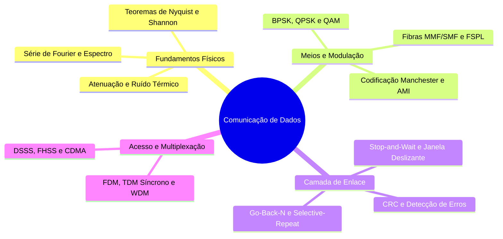

<div style="display: flex; justify-content: space-between; align-items: center; padding: 10px 16px; background: var(--light, #f8fafc); border: 1px solid var(--lightgray, #e2e8f0); border-radius: 10px; margin: 1.5rem 0;">
  <div>⬅️ <b><a href="/pt-br/resource/engenharia-de-computação/6-periodo/comunicacao-de-dados/anotacoes/aula-15-espalhamento-espectral-dsss-fhss-e-cdma">Aula Anterior</a></b></div>
  <div>🏠 <b><a href="/pt-br/resource/engenharia-de-computação/6-periodo/comunicacao-de-dados">Hub da Disciplina</a></b></div>
  <div>➡️ <span style="color: gray;">Última Aula</span></div>
</div>

> [!info] 📅 Informações da Aula
> - **Disciplina:** Comunicação de Dados (CSECBJI.47)
> - **Professor:** Rômulo / Paulo
> - **Data Realizada:** 15/12/2026
> - **Tópico Principal:** Prova Final de Comunicação de Dados e Fechamento
> - **Status:** Concluída e Revisada

> [!note] 📂 Material Complementar & Slides
> - 📄 **Slides Oficiais:** [[slide-16-comunicacao-de-dados|Acessar Apresentação em PDF]]
> - 🎥 **Short Lecture / Gravação:** [[video-16-comunicacao-de-dados|Assistir Síntese da Aula (Vídeo)]]

---

### 📑 Resumo das Seções
- [📌 1. Anotações do Quadro: Prova Final de Comunicação de Dados e Fechamento](#-anotações-do-quadro-prova-final-de-comunicação-de-dados-e-fechamento)
- [🧮 2. Formulação & Exemplo Prático Resolvido](#-formulação--exemplo-prático-resolvido)
- [📊 3. Esquema Visual & Fluxograma (Mermaid)](#-esquema-visual--fluxograma-mermaid)
- [🧠 4. Resumo Pessoal & Macetes do Professor](#-resumo-pessoal--macetes-do-professor)
- [📝 5. Dúvidas & Exercícios Recomendados para Casa](#-dúvidas--exercícios-recomendados-para-casa)

---

## 📌 Anotações do Quadro: Prova Final de Comunicação de Dados e Fechamento

### 16.1 Síntese Holística de Comunicação de Dados
A disciplina consolida toda a base científica e matemática do transporte de informação física:
```text
Sinais e Fourier ──▶ Canais e Ruído (Nyquist/Shannon) ──▶ Meios Físicos ──▶ Codificação e Modulação ──▶ Enlace e ARQ ──▶ CDMA
```

### 16.2 Tecnologias Modernas no Mercado de Telecomunicações
- **Redes Móveis 5G e 6G:** Utilização de ondas milimétricas (mmWave), antenas Massivas MIMO e modulações adaptativas.
- **Comunicações Ópticas Coerentes:** Fibras de 800 Gbps e 1.6 Tbps com modulação 64-QAM de polarização dupla (DP-QAM).
- **Internet das Coisas (IoT):** Tecnologias LoRaWAN (Chirp Spread Spectrum) e NB-IoT para sensores de ultrabaixo consumo.

---

## 🧮 Formulação & Exemplo Prático Resolvido

### ✏️ Fechamento do Semestre e Continuidade Curricular

1. **Revisão das Avaliações:** P1 (Camada Física e Sinais) + P2 (Modulação, Enlace e Multiplexação).
2. **Integração:** Esta disciplina é o pré-requisito fundamental e direto para **Redes de Computadores I (7ºP)** e **Processamento de Sinais (Eletiva)**.

---

## 📊 Esquema Visual & Fluxograma (Mermaid)



---

## 🧠 Resumo Pessoal & Macetes do Professor

| Conceito-Chave | *Takeaway* do Professor | Dicas de Prova / Atenção |
| :--- | :--- | :--- |
| **Conhecimento Estruturante** | A teoria de modulação, ruído e protocolos de enlace rege absolutamente tudo o que trafega na Internet, redes móveis e links de satélite mundiais. | Mantenha estes compêndios teóricos para consulta profissional contínua. |
| **Encerramento do Semestre** | Parabéns pela dedicação e conclusão da disciplina de Comunicação de Dados! | Aplicação prática direta |

---

## 📝 Dúvidas & Exercícios Recomendados para Casa

1. Revisão geral dos compêndios teóricos para a Prova Final.
2. Consulte as referências clássicas recomendadas: Forouzan (Comunicação de Dados e Redes de Computadores) e Stallings (Data and Computer Communications).

---

<div style="display: flex; justify-content: space-between; align-items: center; padding: 10px 16px; background: var(--light, #f8fafc); border: 1px solid var(--lightgray, #e2e8f0); border-radius: 10px; margin: 1.5rem 0;">
  <div>⬅️ <b><a href="/pt-br/resource/engenharia-de-computação/6-periodo/comunicacao-de-dados/anotacoes/aula-15-espalhamento-espectral-dsss-fhss-e-cdma">Aula Anterior</a></b></div>
  <div>🏠 <b><a href="/pt-br/resource/engenharia-de-computação/6-periodo/comunicacao-de-dados">Hub da Disciplina</a></b></div>
  <div>➡️ <span style="color: gray;">Última Aula</span></div>
</div>
