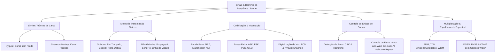
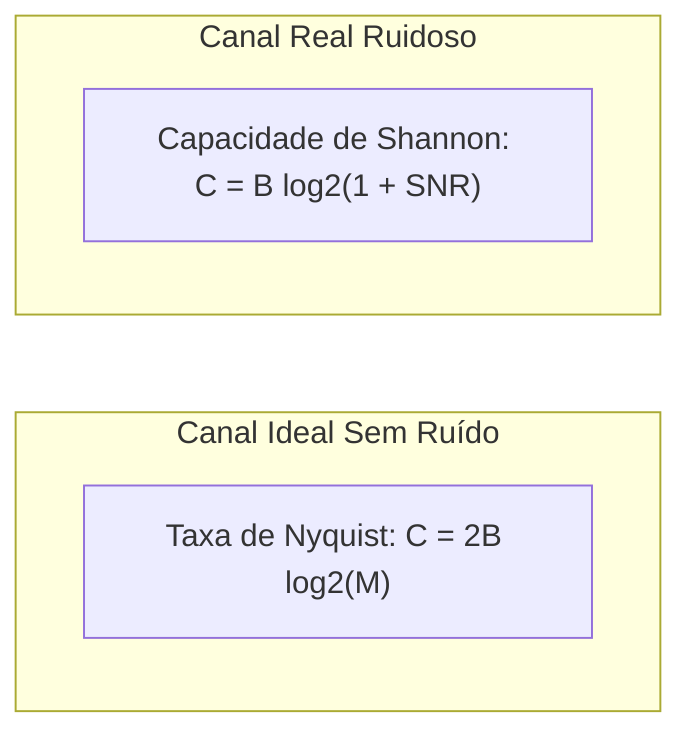
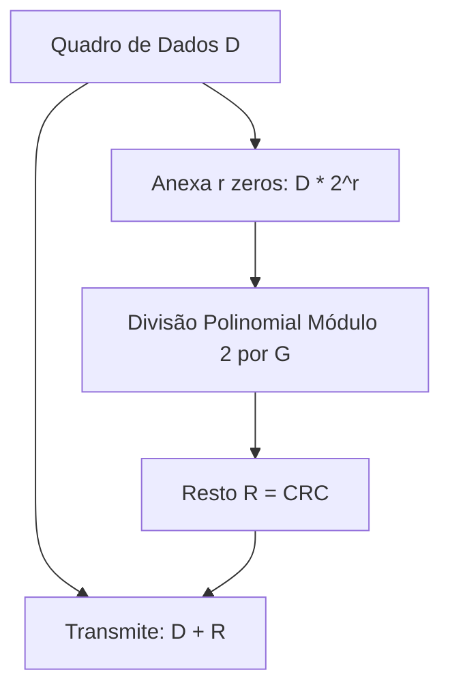
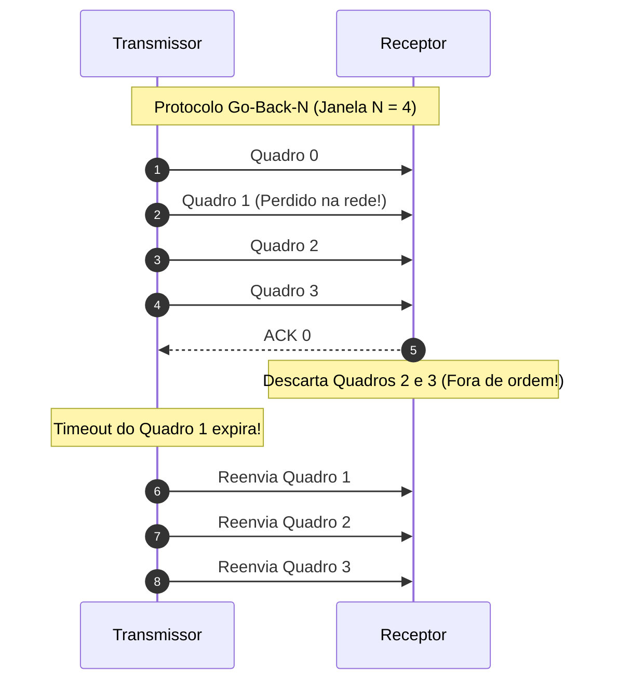

# 📡 Short Lecture — Comunicação de Dados

> [!abstract] 📌 Visão Geral da Disciplina
> * **Código:** `CSECBJI.47` | **Carga Horária:** 60 h/a | **Período:** 6º Período
> * **Pré-requisito:** Nenhum
> * **Tranca:** [[02 - Áreas/Acadêmico/IFF - Engenharia de Computação/07 - Periodo/55 - Redes de Computadores I/Ementa - Redes de Computadores I|Redes de Computadores I (CSECBJI.55)]], [[02 - Áreas/Acadêmico/IFF - Engenharia de Computação/Eletivas/83 - Processamento de Sinais/Ementa - Processamento de Sinais|Processamento de Sinais (CSECBJI.83)]]
> * **Ementa Síntese:** Transmissão de Dados e Análise de Sinais; Meios de Transmissão Guiados e Sem Fio; Teoremas de Nyquist e Shannon-Hartley; Codificação de Linha e Modulação Digital/Analógica; Camada de Enlace, Detecção/Correção de Erros (CRC) e Protocolos de Janela Deslizante; Técnicas de Multiplexação (FDM, TDM, WDM) e Espalhamento Espectral (DSSS, FHSS, CDMA).

---

## 🗺️ Mapa Conceitual da Disciplina

---

## 📈 Módulo 1: Fundamentos da Transmissão e Limites de Canal

### 1.1 Análise de Fourier e Largura de Banda
Qualquer sinal periódico composto $s(t)$ no domínio do tempo pode ser decomposto em uma soma infinita de senoides e cossenoides harmônicas no domínio da frequência:
$$s(t) = \frac{a_0}{2} + \sum_{n=1}^{\infty} \left[ a_n \cos(2\pi n f_0 t) + b_n \sin(2\pi n f_0 t) \right]$$
- **Largura de Banda ($B$ em Hz):** A faixa de frequências que o meio de transmissão é capaz de conduzir sem atenuação excessiva: $B = f_{max} - f_{min}$.

### 1.2 Limites Fundamentais de Capacidade de Canal

#### 1. Teorema de Nyquist (Canal sem Ruído):
Estabelece a taxa máxima de transmissão teórica em bits por segundo (bps) para um canal com largura de banda $B$ e $M$ níveis discretos de sinalização:
$$C = 2B \log_2(M) \quad \text{[bps]}$$

#### 2. Teorema de Shannon-Hartley (Canal Térmico Ruidoso):
Estabelece a capacidade teórica máxima intransponível na presença de ruído branco gaussiano:
$$C = B \log_2\left(1 + \text{SNR}\right) \quad \text{[bps]}$$
Onde a Relação Sinal-Ruído ($\text{SNR}$) linear é dada em decibéis por:
$$\text{SNR}_{dB} = 10 \log_{10}\left(\frac{P_{sinal}}{P_{ruido}}\right) \implies \text{SNR}_{linear} = 10^{\frac{\text{SNR}_{dB}}{10}}$$

> [!example] Exemplo Numérico de Prova
> Para um canal telefônico padrão com $B = 3000\text{ Hz}$ e $\text{SNR} = 30\text{ dB}$:
> 1. $\text{SNR}_{linear} = 10^{30/10} = 10^3 = 1000$.
> 2. $C = 3000 \cdot \log_2(1 + 1000) \approx 3000 \cdot \log_2(1001) \approx 3000 \cdot 9.967 \approx 29.901\text{ bps} \approx 30\text{ kbps}$.

---

## 🔌 Módulo 2: Meios Físicos de Transmissão

### 2.1 Meios Guiados
1. **Par Trançado (Twisted Pair):** Pares de condutores de cobre trançados helicoidalmente para cancelar a interferência eletromagnética (ruído de modo comum).
   - **UTP (Unshielded) vs STP (Shielded):** Categorias (Cat 5e, Cat 6, Cat 6a até 10 Gbps).
2. **Cabo Coaxial:** Condutor central cercado por isolante dielétrico e malha metálica externa. Alta imunidade a ruídos, utilizado em TV a cabo e DOCSIS.
3. **Fibra Óptica:** Transmite pulsos de luz baseando-se no princípio da **Reflexão Interna Total** (o índice de refração do núcleo $n_1$ é maior que o da casca $n_2$, operando acima do ângulo crítico $\theta_c = \arcsin(n_2/n_1)$):
   - **Multimodo (MMF):** Vários modos de propagação de raios; sofre de dispersão modal; ideal para curtas distâncias (LANs/Datacenters).
   - **Monomodo (SMF):** Núcleo microscópico ($\approx 9\,\mu\text{m}$) permitindo apenas um único modo de propagação; zero dispersão modal; ideal para longas distâncias (Backbones transoceânicos).

### 2.2 Meios Não-Guiados (Sem Fio)
- Propagação em Linha de Visada (*Line-of-Sight - LOS*), reflexão na ionosfera, difração e refração.
- Atenuação no espaço livre (Equação de Friis): $P_r = P_t G_t G_r \left(\frac{\lambda}{4\pi d}\right)^2$.

---

## 🎚️ Módulo 3: Codificação de Linha e Modulação

### 3.1 Códigos de Linha em Banda Base
Transformam uma sequência de bits binários em sinais de tensão elétrica:

| Código de Linha | Esquema de Tensão | Auto-Sincronismo de Clock | Vantagens / Desvantagens |
|---|---|:---:|---|
| **NRZ-L** | `0` = Nível Alto, `1` = Nível Baixo | Ruim | Simples, mas sofre de desvio de nível DC e perda de clock em longas sequências de bits idênticos. |
| **NRZ-I** | Inverte o sinal se o bit for `1`; mantém se for `0` | Médio | Usado em USB; resolve problemas de polaridade invertida. |
| **Manchester** | `0` = Transição Alto $\rightarrow$ Baixo; `1` = Baixo $\rightarrow$ Alto | **Excelente** | Transição obrigatória no meio de **cada** bit (garante sincronismo), mas dobra a largura de banda necessária. |
| **AMI (Bipolar)** | `0` = Nível Zero; `1` = Pulsos alternados $+V$ e $-V$ | Médio | Componente DC nula; detecta erros de violação de polaridade. |

### 3.2 Modulação Digital Passa-Faixa
Modulação de uma onda portadora senoidal analógica $s(t) = A \cos(2\pi f_c t + \phi)$:
- **ASK (Amplitude Shift Keying):** Variação da amplitude $A$.
- **FSK (Frequency Shift Keying):** Variação da frequência $f_c$.
- **PSK (Phase Shift Keying - BPSK, QPSK):** Variação da fase $\phi$.
- **QAM (Quadrature Amplitude Modulation):** Combina modulação simultânea de amplitude e fase (ex: 16-QAM, 64-QAM, 256-QAM). No 16-QAM, cada símbolo transporta $\log_2(16) = 4\text{ bits}$.

### 3.3 Digitalização de Áudio: Modulação por Código de Pulsos (PCM)
1. **Amostragem (Teorema de Nyquist-Shannon):** Frequência de amostragem $f_s \ge 2 f_{max}$ para evitar *aliasing*. Para voz humana ($f_{max} = 4\text{ kHz}$), $f_s = 8000\text{ amostras/s}$.
2. **Quantização:** Mapeamento dos valores contínuos amostrados em $2^8 = 256$ níveis discretos (8 bits por amostra).
3. **Codificação:** Taxa resultante do canal de voz digital padrão (DS0): $8000 \times 8 = 64\text{ kbps}$.

---

## 🛡️ Módulo 4: Enlace de Dados, Detecção de Erros e Controle de Fluxo

### 4.1 Detecção de Erros por Redundância Cíclica (CRC)
O CRC utiliza aritmética polinomial módulo 2 (operações XOR sem vai-um):
1. Seja o dado $D = 101001$ e o polinômio gerador $G = 1101$ (grau $r = 3$).
2. Adicionam-se $r$ zeros à direita do dado: $D \cdot 2^r = 101001000$.
3. Divide-se esse valor por $G$ usando XOR sucessivo. O resto da divisão $R$ de $r$ bits é o CRC.
4. Transmite-se o quadro $T = [D \mid R]$. No receptor, a divisão de $T$ por $G$ deve resultar em resto zero.

### 4.2 Protocolos de Janela Deslizante (*Sliding Window*)

- **Stop-and-Wait:** Envia 1 quadro e bloqueia até receber o ACK. Ineficiente para produtos Banda $\times$ Atraso elevados.
- **Go-Back-N (GBN):** O transmissor pode enviar até $N$ quadros sem receber ACK. Se um quadro for perdido, todos os quadros subsequentes já enviados são descartados pelo receptor e devem ser retransmitidos pelo transmissor.
- **Selective Repeat (SR):** O receptor possui buffer para armazenar quadros fora de ordem e confirma cada quadro individualmente com ACK seletivo. O transmissor retransmite **apenas** o quadro que sofreu falha.

---

## 🔀 Módulo 5: Multiplexação e Espalhamento Espectral

### 5.1 Técnicas de Multiplexação
- **FDM (Frequency-Division Multiplexing):** O espectro total de frequência é dividido em subfaixas lógicas separadas por bandas de guarda (ex: rádio FM, TV analógica).
- **TDM (Time-Division Multiplexing):**
  - **TDM Síncrono:** Cada canal recebe um intervalo de tempo (*timeslot*) fixo e periódico, mesmo que não tenha dados para enviar (desperdiça capacidade).
  - **TDM Estatístico (STDM):** Aloca dinamicamente os timeslots apenas para os canais que têm pacotes na fila de transmissão.
- **WDM / DWDM (Wavelength-Division Multiplexing):** Multiplexação por divisão de comprimento de onda (cores de laser) em fibras ópticas, atingindo múltiplos Terabits/s.

### 5.2 Espalhamento Espectral e CDMA (Code Division Multiple Access)
Permite que múltiplos usuários transmitam simultaneamente sobre a **mesma faixa de frequência e ao mesmo tempo**, distinguindo-se por códigos ortogonais:
- **DSSS (Direct Sequence Spread Spectrum):** O sinal de dados é multiplicado por uma sequência de ruído pseudoaleatório (*PN Code / Chipping sequence*) de alta frequência, espalhando a energia do sinal abaixo do piso de ruído térmico.
- **CDMA via Códigos de Walsh:** Códigos ortogonais onde o produto interno $\mathbf{C}_i \cdot \mathbf{C}_j = 0$ para $i \neq j$ e $\mathbf{C}_i \cdot \mathbf{C}_i = 1$. O receptor multiplica o sinal composto pelo código do transmissor desejado, extraindo perfeitamente os dados e anulando as transmissões dos demais usuários como ruído.

---

## 🧪 Resumo Executivo / Cheat Sheet para Provas & Cálculos

1. **Nyquist vs Shannon:** Nyquist limita pela largura de banda e níveis de sinal ($C = 2B\log_2 M$); Shannon limita pelo ruído físico inescapável ($C = B\log_2(1+\text{SNR})$).
2. **Manchester:** Transição obrigatória no meio de cada bit. Taxa de modulação (Baud) = $2 \times$ Taxa de bits.
3. **CRC:** Operações baseadas em XOR bit a bit. Resto anexado ao final da mensagem.
4. **Go-Back-N vs Selective Repeat:** No GBN, tamanho da janela $W \le 2^k - 1$; no SR, tamanho da janela $W \le 2^{k-1}$.
5. **CDMA:** Ortogonalidade garante recepção simultânea sem colisão na mesma portadora de frequência.

---

## 🔗 Referências e Conexões no Cofre
* [[02 - Áreas/Acadêmico/IFF - Engenharia de Computação/06 - Periodo/47 - Comunicação de Dados/Ementa - Comunicação de Dados|📄 Ementa Oficial de Comunicação de Dados]]
* [[02 - Áreas/Acadêmico/IFF - Engenharia de Computação/07 - Periodo/55 - Redes de Computadores I/Ementa - Redes de Computadores I|Redes de Computadores I (CSECBJI.55)]]
* [[02 - Áreas/Acadêmico/IFF - Engenharia de Computação/00 - Documentos/PPC_EngComp_Completo_Ementario|📜 PPC & Ementário Geral]]
* Livros Base:
  * FOROUZAN, Behrouz A. *Comunicação de Dados e Redes de Computadores*. 4ª Edição. Bookman, 2008.
  * ROCHOL, Juergen. *Comunicação de Dados*. Bookman, 2011.
  * HAYKIN, Simon. *Sistemas de Comunicação: Analógicos e Digitais*. 5ª Edição. Bookman, 2010.
