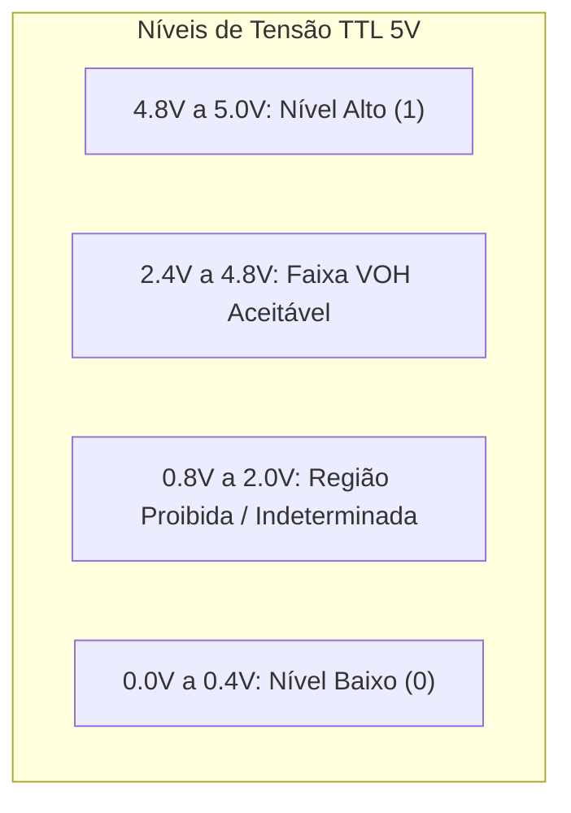

  
⬅️ Primeira Aula

  
🏠 <b><a href="/pt-br/resource/engenharia-de-computação/6-periodo/eletronica-digital">Hub da Disciplina</a></b>

  
➡️ <b><a href="/pt-br/resource/engenharia-de-computação/6-periodo/eletronica-digital/anotacoes/aula-01-sistemas-de-numeracao-e-conversao-entre-bases">Próxima Aula</a></b>

> [!info] 📅 Informações da Aula
> - **Disciplina:** Eletrônica Digital (CSECBJI.46)
> - **Professor:** Rogério
> - **Data Realizada:** 24/08/2026
> - **Tópico Principal:** Apresentação da Disciplina, Ementa e Ambiente de Simulação
> - **Status:** Concluída e Revisada

> [!note] 📂 Material Complementar & Slides
> - 📄 **Slides Oficiais:** [[slide-00-eletronica-digital|Acessar Apresentação em PDF]]
> - 🎥 **Short Lecture / Gravação:** [[video-00-eletronica-digital|Assistir Síntese da Aula (Vídeo)]]

---

### 📑 Resumo das Seções
- [📌 1. Anotações do Quadro: Apresentação da Disciplina, Ementa e Ambiente de Simulação](#-anotações-do-quadro-apresentação-da-disciplina,-ementa-e-ambiente-de-simulação)
- [🧮 2. Formulação & Exemplo Prático Resolvido](#-formulação--exemplo-prático-resolvido)
- [📊 3. Esquema Visual & Fluxograma (Mermaid)](#-esquema-visual--fluxograma-mermaid)
- [🧠 4. Resumo Pessoal & Macetes do Professor](#-resumo-pessoal--macetes-do-professor)
- [📝 5. Dúvidas & Exercícios Recomendados para Casa](#-dúvidas--exercícios-recomendados-para-casa)

---

## 📌 Anotações do Quadro: Apresentação da Disciplina, Ementa e Ambiente de Simulação

### 1.1 Sinais Analógicos vs Sinais Digitais
Na engenharia eletrônica, grandezas físicas (tensão, corrente, temperatura) são originalmente contínuas no tempo e na amplitude (**sinais analógicos**). Em sistemas digitais, a informação é discretizada em níveis discretos de tensão representando dígitos binários (**bits: 0 e 1**).

Vantagens dos sistemas digitais:
- Alta imunidade a ruídos eletromagnéticos.
- Facilidade de armazenamento, transmissão e processamento numérico.
- Confiabilidade e reprodutibilidade em circuitos integrados (CIs).

### 1.2 Famílias Lógicas e Níveis de Tensão
- **Família TTL (Transistor-Transistor Logic, 5V):**
  - Nível Lógico Baixo ($0$): $0.0\text{V} \le V_{in} \le 0.8\text{V}$ ($V_{OL} \le 0.4\text{V}$)
  - Nível Lógico Alto ($1$): $2.0\text{V} \le V_{in} \le 5.0\text{V}$ ($V_{OH} \ge 2.4\text{V}$)
  - Faixa Indeterminada: $0.8\text{V} < V < 2.0\text{V}$
- **Família CMOS (Complementary MOS, ex: 3.3V / 5V):**
  - Consumo de potência estática quase nulo, maior margem de ruído ($V_{IL} \le 30\% V_{DD}$, $V_{IH} \ge 70\% V_{DD}$).

### 1.3 Ambiente de Laboratório e Simulação
Utilização do software **Logisim / Logisim-Evolution** para projeto esquemático e verificação de cronogramas de tempo antes da prototipagem em protoboard.

---

## 🧮 Formulação & Exemplo Prático Resolvido

### ✏️ Teste Prático de Níveis Lógicos e Margem de Ruído

**Margem de Ruído em Nível Alto ($NM_H$) e Nível Baixo ($NM_L$):**
$$NM_H = V_{OH(min)} - V_{IH(min)} = 2.4\text{V} - 2.0\text{V} = 0.4\text{V}$$
$$NM_L = V_{IL(max)} - V_{OL(max)} = 0.8\text{V} - 0.4\text{V} = 0.4\text{V}$$

Qualquer ruído espúrio acoplado à linha com amplitude inferior a $0.4\text{V}$ será totalmente rejeitado pelas portas lógicas TTL!

---

## 📊 Esquema Visual & Fluxograma (Mermaid)

---

## 🧠 Resumo Pessoal & Macetes do Professor

| Conceito-Chave | *Takeaway* do Professor | Dicas de Prova / Atenção |
| :--- | :--- | :--- |
| **Entradas Flutuantes em TTL vs CMOS** | Em TTL, uma entrada desconectada (flutuante) assume nível lógico alto (1) por padrão. Em CMOS, entradas flutuantes oscilam de forma caótica e consomem alta corrente! | Nunca deixe pinos de entrada CMOS desconectados; use resistores de Pull-up ou Pull-down. |
| **Margem de Ruído** | Quanto maior a margem de ruído de uma família lógica, mais robusto é o circuito contra interferências. | Aplicação prática direta |

---

## 📝 Dúvidas & Exercícios Recomendados para Casa

1. Calcule a margem de ruído em nível alto e baixo para uma família CMOS operando com $V_{DD} = 5	ext{V}$, $V_{OH} = 4.4	ext{V}$, $V_{IH} = 3.5	ext{V}$, $V_{IL} = 1.5	ext{V}$, $V_{OL} = 0.1	ext{V}$.
2. Explique por que a região indeterminada de tensão deve ser evitada em circuitos digitais.

---

  
⬅️ Primeira Aula

  
🏠 <b><a href="/pt-br/resource/engenharia-de-computação/6-periodo/eletronica-digital">Hub da Disciplina</a></b>

  
➡️ <b><a href="/pt-br/resource/engenharia-de-computação/6-periodo/eletronica-digital/anotacoes/aula-01-sistemas-de-numeracao-e-conversao-entre-bases">Próxima Aula</a></b>

