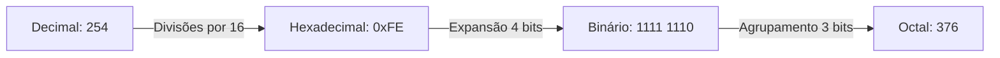

<div style="display: flex; justify-content: space-between; align-items: center; padding: 10px 16px; background: var(--light, #f8fafc); border: 1px solid var(--lightgray, #e2e8f0); border-radius: 10px; margin: 1.5rem 0;">
  <div>⬅️ <b><a href="/pt-br/resource/engenharia-de-computação/6-periodo/eletronica-digital/anotacoes/aula-00-apresentacao-da-disciplina-ementa-e-ambiente-de-simulacao">Aula Anterior</a></b></div>
  <div>🏠 <b><a href="/pt-br/resource/engenharia-de-computação/6-periodo/eletronica-digital">Hub da Disciplina</a></b></div>
  <div>➡️ <b><a href="/pt-br/resource/engenharia-de-computação/6-periodo/eletronica-digital/anotacoes/aula-02-algebra-booleana-postulados-e-teoremas-de-de-morgan">Próxima Aula</a></b></div>
</div>

> [!info] 📅 Informações da Aula
> - **Disciplina:** Eletrônica Digital (CSECBJI.46)
> - **Professor:** Rogério
> - **Data Realizada:** 31/08/2026
> - **Tópico Principal:** Sistemas de Numeração e Conversão entre Bases
> - **Status:** Concluída e Revisada

> [!note] 📂 Material Complementar & Slides
> - 📄 **Slides Oficiais:** [[slide-01-eletronica-digital|Acessar Apresentação em PDF]]
> - 🎥 **Short Lecture / Gravação:** [[video-01-eletronica-digital|Assistir Síntese da Aula (Vídeo)]]

---

### 📑 Resumo das Seções
- [📌 1. Anotações do Quadro: Sistemas de Numeração e Conversão entre Bases](#-anotações-do-quadro-sistemas-de-numeração-e-conversão-entre-bases)
- [🧮 2. Formulação & Exemplo Prático Resolvido](#-formulação--exemplo-prático-resolvido)
- [📊 3. Esquema Visual & Fluxograma (Mermaid)](#-esquema-visual--fluxograma-mermaid)
- [🧠 4. Resumo Pessoal & Macetes do Professor](#-resumo-pessoal--macetes-do-professor)
- [📝 5. Dúvidas & Exercícios Recomendados para Casa](#-dúvidas--exercícios-recomendados-para-casa)

---

## 📌 Anotações do Quadro: Sistemas de Numeração e Conversão entre Bases

### 1.1 Notação Posicional e Bases Numéricas
Um número em uma base $b$ qualquer é expresso pelo somatório posicional de seus dígitos $d_i$:
$$N = \sum_{i=-m}^{n-1} d_i \cdot b^i$$

Bases Fundamentais na Computação:
- **Binária ($b=2$):** Dígitos $\{0, 1\}$.
- **Octal ($b=8$):** Dígitos $\{0, 1, 2, 3, 4, 5, 6, 7\}$ (cada dígito agrupa 3 bits).
- **Hexadecimal ($b=16$):** Dígitos $\{0-9, A, B, C, D, E, F\}$ (cada dígito agrupa 4 bits).

### 1.2 Representação de Números Inteiros com Sinal
1. **Sinal e Magnitude:** O bit mais significativo ($MSB$) representa o sinal ($0=+, 1=-$). Possui dois zeros ($+0$ e $-0$).
2. **Complemento de 1 ($C1$):** Inverte todos os bits. Possui dois zeros.
3. **Complemento de 2 ($C2$ - Padrão Universal do Hardware):**
   $$C2(A) = \overline{A} + 1$$
   - Intervalo de representação para $n$ bits: $[-2^{n-1}, \; +2^{n-1}-1]$
   - Possui apenas um zero ($0000_2 = 0$).
   - A subtração $A - B$ é executada internamente pelo somador como $A + C2(B)$.

### 1.3 Códigos Binários Especiais
- **BCD 8421 (*Binary-Coded Decimal*):** Codifica cada dígito decimal em 4 bits independentes.
- **Código Gray:** Código não-ponderado onde palavras de código adjacentes diferem em **apenas 1 bit** (essencial para encoders ópticos e Mapas de Karnaugh).

---

## 🧮 Formulação & Exemplo Prático Resolvido

### ✏️ Operação em Complemento de 2: Cálculo de $7 - 12$ com 8 bits

1. Representar $+7$: $00000111_2$
2. Representar $+12$: $00001100_2$
3. Obter $-12$ em Complemento de 2:
   - Inverte bits: $11110011_2$
   - Soma 1: $11110011_2 + 1 = 11110100_2$
4. Somar $+7$ com $-12$:
   ```text
      00000111  (+7)
    + 11110100  (-12)
    ──────────
      11111011  (Resultado)
   ```
5. Decodificar o resultado (como o MSB é 1, é negativo):
   - $C2(11111011) = 00000100 + 1 = 00000101_2 = -5_{10}$. Resultado exato!

---

## 📊 Esquema Visual & Fluxograma (Mermaid)



---

## 🧠 Resumo Pessoal & Macetes do Professor

| Conceito-Chave | *Takeaway* do Professor | Dicas de Prova / Atenção |
| :--- | :--- | :--- |
| **Detecção de Overflow em Complemento de 2** | Ocorre *overflow* se e somente se somarmos dois números de mesmo sinal e o resultado tiver sinal oposto (ou se o transporte de entrada do MSB for diferente do transporte de saída: $C_{in} \oplus C_{out} = 1$). | Muito cobrado em provas de hardware! |
| **Conversão Rápida para Gray** | Bit mais significativo permanece igual; os bits seguintes são obtidos pelo XOR com o bit anterior: $G_i = B_i \oplus B_{i+1}$. | Aplicação prática direta |

---

## 📝 Dúvidas & Exercícios Recomendados para Casa

1. Converta o número fracionário $27.625_{10}$ para as bases binária e hexadecimal.
2. Realize a operação $-18_{10} - 15_{10}$ em Complemento de 2 utilizando registradores de 8 bits e indique se houve overflow.

---

<div style="display: flex; justify-content: space-between; align-items: center; padding: 10px 16px; background: var(--light, #f8fafc); border: 1px solid var(--lightgray, #e2e8f0); border-radius: 10px; margin: 1.5rem 0;">
  <div>⬅️ <b><a href="/pt-br/resource/engenharia-de-computação/6-periodo/eletronica-digital/anotacoes/aula-00-apresentacao-da-disciplina-ementa-e-ambiente-de-simulacao">Aula Anterior</a></b></div>
  <div>🏠 <b><a href="/pt-br/resource/engenharia-de-computação/6-periodo/eletronica-digital">Hub da Disciplina</a></b></div>
  <div>➡️ <b><a href="/pt-br/resource/engenharia-de-computação/6-periodo/eletronica-digital/anotacoes/aula-02-algebra-booleana-postulados-e-teoremas-de-de-morgan">Próxima Aula</a></b></div>
</div>
