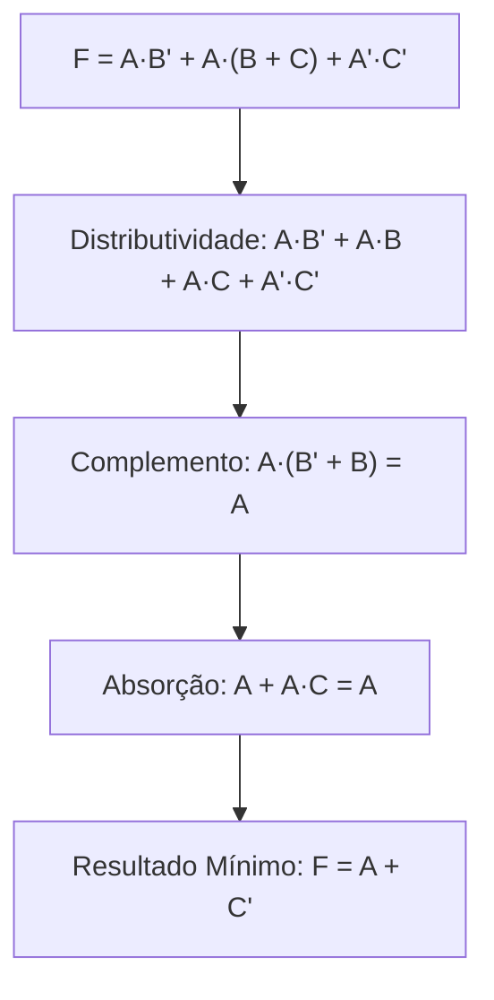

  
⬅️ <b><a href="/pt-br/resource/engenharia-de-computação/6-periodo/eletronica-digital/anotacoes/aula-01-sistemas-de-numeracao-e-conversao-entre-bases">Aula Anterior</a></b>

  
🏠 <b><a href="/pt-br/resource/engenharia-de-computação/6-periodo/eletronica-digital">Hub da Disciplina</a></b>

  
➡️ <b><a href="/pt-br/resource/engenharia-de-computação/6-periodo/eletronica-digital/anotacoes/aula-03-portas-logicas-fundamentais-e-formas-canonicas">Próxima Aula</a></b>

> [!info] 📅 Informações da Aula
> - **Disciplina:** Eletrônica Digital (CSECBJI.46)
> - **Professor:** Rogério
> - **Data Realizada:** 07/09/2026
> - **Tópico Principal:** Álgebra Booleana, Postulados e Teoremas de De Morgan
> - **Status:** Concluída e Revisada

> [!note] 📂 Material Complementar & Slides
> - 📄 **Slides Oficiais:** [[slide-02-eletronica-digital|Acessar Apresentação em PDF]]
> - 🎥 **Short Lecture / Gravação:** [[video-02-eletronica-digital|Assistir Síntese da Aula (Vídeo)]]

---

### 📑 Resumo das Seções
- [📌 1. Anotações do Quadro: Álgebra Booleana, Postulados e Teoremas de De Morgan](#-anotações-do-quadro-álgebra-booleana,-postulados-e-teoremas-de-de-morgan)
- [🧮 2. Formulação & Exemplo Prático Resolvido](#-formulação--exemplo-prático-resolvido)
- [📊 3. Esquema Visual & Fluxograma (Mermaid)](#-esquema-visual--fluxograma-mermaid)
- [🧠 4. Resumo Pessoal & Macetes do Professor](#-resumo-pessoal--macetes-do-professor)
- [📝 5. Dúvidas & Exercícios Recomendados para Casa](#-dúvidas--exercícios-recomendados-para-casa)

---

## 📌 Anotações do Quadro: Álgebra Booleana, Postulados e Teoremas de De Morgan

### 2.1 Postulados de Huntington e Álgebra Booleana
A álgebra booleana opera sobre o conjunto $B = \{0, 1\}$ com os operadores lógicos $\text{AND} (\cdot)$, $\text{OR} (+)$ e $\text{NOT} (\overline{A})$:
1. **Fechamento:** $a + b \in B$ e $a \cdot b \in B$.
2. **Elemento Neutro:** $a + 0 = a$ e $a \cdot 1 = a$.
3. **Comutatividade:** $a + b = b + a$ e $a \cdot b = b \cdot a$.
4. **Distributividade:** $a \cdot (b + c) = (a \cdot b) + (a \cdot c)$ e $a + (b \cdot c) = (a + b) \cdot (a + c)$.
5. **Complemento:** $a + \overline{a} = 1$ e $a \cdot \overline{a} = 0$.

### 2.2 Teoremas Fundamentais e Teoremas de De Morgan
- **Idempotência:** $A + A = A$ e $A \cdot A = A$.
- **Absorção:** $A + A \cdot B = A$ e $A \cdot (A + B) = A$.
- **Consenso:** $A B + \overline{A} C + B C = A B + \overline{A} C$.
- **Teoremas de De Morgan:**
  $$\overline{A \cdot B} = \overline{A} + \overline{B}$$
  $$\overline{A + B} = \overline{A} \cdot \overline{B}$$

### 2.3 Princípio da Dualidade
Qualquer identidade algébrica permanece válida se trocarmos todos os operadores $+$ por $\cdot$ (e vice-versa) e todas as constantes $0$ por $1$ (e vice-versa).

---

## 🧮 Formulação & Exemplo Prático Resolvido

### ✏️ Simplificação Algébrica Passo a Passo: $F = A \overline{B} + A (B + C) + \overline{A} \overline{C}$

1. **Aplica distributividade no segundo termo:**
   $$F = A \overline{B} + A B + A C + \overline{A} \overline{C}$$
2. **Coloca $A$ em evidência nos dois primeiros termos:**
   $$F = A (\overline{B} + B) + A C + \overline{A} \overline{C}$$
3. **Usa o postulado do complemento ($\overline{B} + B = 1$):**
   $$F = A \cdot 1 + A C + \overline{A} \overline{C} = A + A C + \overline{A} \overline{C}$$
4. **Aplica absorção ($A + A C = A$):**
   $$F = A + \overline{A} \overline{C}$$
5. **Aplica distributividade da soma ($A + \overline{A} X = A + X$):**
   $$F = (A + \overline{A}) (A + \overline{C}) = 1 \cdot (A + \overline{C}) = A + \overline{C}$$

Expressão mínima obtida: $F = A + \overline{C}$ (reduziu de 4 portas complexas para apenas 1 porta NOT e 1 porta OR!).

---

## 📊 Esquema Visual & Fluxograma (Mermaid)

---

## 🧠 Resumo Pessoal & Macetes do Professor

| Conceito-Chave | *Takeaway* do Professor | Dicas de Prova / Atenção |
| :--- | :--- | :--- |
| **Teorema do Consenso** | A expressão $A B + \overline{A} C + B C = A B + \overline{A} C$ permite eliminar diretamente o termo redundante $B C$. | Economiza muito tempo em provas de simplificação. |
| **Regra da Barra Contínua** | Para quebrar uma barra de negação longa em De Morgan, troque o operador interno ($+$ vira $\cdot$ ou $\cdot$ vira $+$) e divida a barra. | Aplicação prática direta |

---

## 📝 Dúvidas & Exercícios Recomendados para Casa

1. Demonstre o teorema da distributividade $A + (B \cdot C) = (A + B) \cdot (A + C)$ utilizando tabela-verdade.
2. Simplifique algebricamente a expressão $F = \overline{\overline{A} B + A \overline{B}} + A B$.

---

  
⬅️ <b><a href="/pt-br/resource/engenharia-de-computação/6-periodo/eletronica-digital/anotacoes/aula-01-sistemas-de-numeracao-e-conversao-entre-bases">Aula Anterior</a></b>

  
🏠 <b><a href="/pt-br/resource/engenharia-de-computação/6-periodo/eletronica-digital">Hub da Disciplina</a></b>

  
➡️ <b><a href="/pt-br/resource/engenharia-de-computação/6-periodo/eletronica-digital/anotacoes/aula-03-portas-logicas-fundamentais-e-formas-canonicas">Próxima Aula</a></b>

