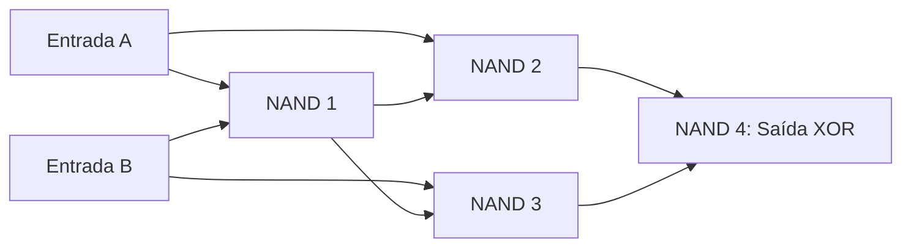

  
⬅️ <b><a href="/pt-br/resource/engenharia-de-computação/6-periodo/eletronica-digital/anotacoes/aula-02-algebra-booleana-postulados-e-teoremas-de-de-morgan">Aula Anterior</a></b>

  
🏠 <b><a href="/pt-br/resource/engenharia-de-computação/6-periodo/eletronica-digital">Hub da Disciplina</a></b>

  
➡️ <b><a href="/pt-br/resource/engenharia-de-computação/6-periodo/eletronica-digital/anotacoes/aula-04-minimizacao-logica-mapas-de-karnaugh-de-2-a-4-variaveis">Próxima Aula</a></b>

> [!info] 📅 Informações da Aula
> - **Disciplina:** Eletrônica Digital (CSECBJI.46)
> - **Professor:** Rogério
> - **Data Realizada:** 14/09/2026
> - **Tópico Principal:** Portas Lógicas Fundamentais e Formas Canônicas
> - **Status:** Concluída e Revisada

> [!note] 📂 Material Complementar & Slides
> - 📄 **Slides Oficiais:** [[slide-03-eletronica-digital|Acessar Apresentação em PDF]]
> - 🎥 **Short Lecture / Gravação:** [[video-03-eletronica-digital|Assistir Síntese da Aula (Vídeo)]]

---

### 📑 Resumo das Seções
- [📌 1. Anotações do Quadro: Portas Lógicas Fundamentais e Formas Canônicas](#-anotações-do-quadro-portas-lógicas-fundamentais-e-formas-canônicas)
- [🧮 2. Formulação & Exemplo Prático Resolvido](#-formulação--exemplo-prático-resolvido)
- [📊 3. Esquema Visual & Fluxograma (Mermaid)](#-esquema-visual--fluxograma-mermaid)
- [🧠 4. Resumo Pessoal & Macetes do Professor](#-resumo-pessoal--macetes-do-professor)
- [📝 5. Dúvidas & Exercícios Recomendados para Casa](#-dúvidas--exercícios-recomendados-para-casa)

---

## 📌 Anotações do Quadro: Portas Lógicas Fundamentais e Formas Canônicas

### 3.1 Portas Lógicas Fundamentais e Tabelas-Verdade
- **Inversor (NOT):** $Y = \overline{A}$
- **AND:** $Y = A \cdot B$ (Saída 1 se todas as entradas forem 1)
- **OR:** $Y = A + B$ (Saída 1 se pelo menos uma entrada for 1)
- **NAND:** $Y = \overline{A \cdot B}$ (Universal)
- **NOR:** $Y = \overline{A + B}$ (Universal)
- **XOR (OU-Exclusivo):** $Y = A \oplus B = A \overline{B} + \overline{A} B$ (Saída 1 se as entradas forem diferentes)
- **XNOR (Coincidência):** $Y = \overline{A \oplus B} = A B + \overline{A} \overline{B}$

### 3.2 Universalidade das Portas NAND e NOR
Qualquer circuito combinacional pode ser implementado exclusivamente com portas NAND (ou exclusivamente com portas NOR).
- $\text{NOT}(A) = A \;\text{NAND}\; A$
- $\text{AND}(A, B) = \text{NOT}(A \;\text{NAND}\; B)$
- $\text{OR}(A, B) = \text{NOT}(A) \;\text{NAND}\; \text{NOT}(B)$

### 3.3 Formas Canônicas
1. **Soma de Produtos (SOP - Mintermos $\sum m$):** Expressa a função como a soma lógica de todos os mintermos onde $F=1$.
2. **Produto de Somas (POS - Maxtermos $\prod M$):** Expressa a função como o produto lógico de todos os maxtermos onde $F=0$.

---

## 🧮 Formulação & Exemplo Prático Resolvido

### ✏️ Extração das Formas Canônicas a partir de Tabela-Verdade

| $A$ | $B$ | $C$ | $F$ | Mintermo ($m_i$) | Maxtermo ($M_i$) |
| :---: | :---: | :---: | :---: | :---: | :---: |
| 0 | 0 | 0 | **0** | $\overline{A}\overline{B}\overline{C}$ ($m_0$) | $A + B + C$ ($M_0$) |
| 0 | 0 | 1 | **1** | $\overline{A}\overline{B}C$ ($m_1$) | $A + B + \overline{C}$ ($M_1$) |
| 0 | 1 | 0 | **0** | $\overline{A}B\overline{C}$ ($m_2$) | $A + \overline{B} + C$ ($M_2$) |
| 0 | 1 | 1 | **1** | $\overline{A}BC$ ($m_3$) | $A + \overline{B} + \overline{C}$ ($M_3$) |
| 1 | 0 | 0 | **0** | $A\overline{B}\overline{C}$ ($m_4$) | $\overline{A} + B + C$ ($M_4$) |
| 1 | 0 | 1 | **0** | $A\overline{B}C$ ($m_5$) | $\overline{A} + B + \overline{C}$ ($M_5$) |
| 1 | 1 | 0 | **1** | $AB\overline{C}$ ($m_6$) | $\overline{A} + \overline{B} + C$ ($M_6$) |
| 1 | 1 | 1 | **1** | $ABC$ ($m_7$) | $\overline{A} + \overline{B} + \overline{C}$ ($M_7$) |

- **Forma Canônica SOP:** $F = \sum m(1, 3, 6, 7) = \overline{A}\overline{B}C + \overline{A}BC + AB\overline{C} + ABC$
- **Forma Canônica POS:** $F = \prod M(0, 2, 4, 5) = (A+B+C)(A+\overline{B}+C)(\overline{A}+B+C)(\overline{A}+B+\overline{C})$

---

## 📊 Esquema Visual & Fluxograma (Mermaid)

---

## 🧠 Resumo Pessoal & Macetes do Professor

| Conceito-Chave | *Takeaway* do Professor | Dicas de Prova / Atenção |
| :--- | :--- | :--- |
| **Mintermos vs Maxtermos** | Mintermos olham para as linhas com saída 1 (variável sem barra = 1); Maxtermos olham para linhas com saída 0 (variável com barra = 1). | Cuidado para não inverter a lógica dos maxtermos! |
| **Conversão em Duas Etapas para NAND** | Desenhe o circuito em SOP (AND-OR) e simplesmente substitua todas as portas AND e OR por portas NAND (adicionando inversores nas entradas isoladas). | Aplicação prática direta |

---

## 📝 Dúvidas & Exercícios Recomendados para Casa

1. Implemente uma porta OR de 2 entradas utilizando apenas portas NOR de 2 entradas.
2. Converta a função $F(A, B, C) = \sum m(0, 2, 5, 7)$ para a forma canônica POS correspondente.

---

  
⬅️ <b><a href="/pt-br/resource/engenharia-de-computação/6-periodo/eletronica-digital/anotacoes/aula-02-algebra-booleana-postulados-e-teoremas-de-de-morgan">Aula Anterior</a></b>

  
🏠 <b><a href="/pt-br/resource/engenharia-de-computação/6-periodo/eletronica-digital">Hub da Disciplina</a></b>

  
➡️ <b><a href="/pt-br/resource/engenharia-de-computação/6-periodo/eletronica-digital/anotacoes/aula-04-minimizacao-logica-mapas-de-karnaugh-de-2-a-4-variaveis">Próxima Aula</a></b>

