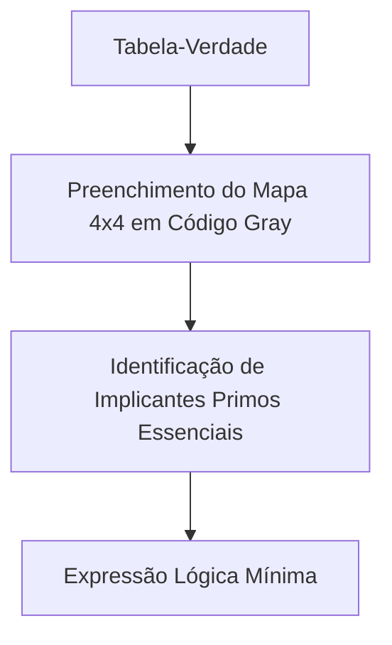

  
⬅️ <b><a href="/pt-br/resource/engenharia-de-computação/6-periodo/eletronica-digital/anotacoes/aula-03-portas-logicas-fundamentais-e-formas-canonicas">Aula Anterior</a></b>

  
🏠 <b><a href="/pt-br/resource/engenharia-de-computação/6-periodo/eletronica-digital">Hub da Disciplina</a></b>

  
➡️ <b><a href="/pt-br/resource/engenharia-de-computação/6-periodo/eletronica-digital/anotacoes/aula-05-condicoes-irrelevantes-don-t-cares-e-mapas-de-5-variaveis">Próxima Aula</a></b>

> [!info] 📅 Informações da Aula
> - **Disciplina:** Eletrônica Digital (CSECBJI.46)
> - **Professor:** Rogério
> - **Data Realizada:** 21/09/2026
> - **Tópico Principal:** Minimização Lógica: Mapas de Karnaugh de 2 a 4 Variáveis
> - **Status:** Concluída e Revisada

> [!note] 📂 Material Complementar & Slides
> - 📄 **Slides Oficiais:** [[slide-04-eletronica-digital|Acessar Apresentação em PDF]]
> - 🎥 **Short Lecture / Gravação:** [[video-04-eletronica-digital|Assistir Síntese da Aula (Vídeo)]]

---

### 📑 Resumo das Seções
- [📌 1. Anotações do Quadro: Minimização Lógica: Mapas de Karnaugh de 2 a 4 Variáveis](#-anotações-do-quadro-minimização-lógica-mapas-de-karnaugh-de-2-a-4-variáveis)
- [🧮 2. Formulação & Exemplo Prático Resolvido](#-formulação--exemplo-prático-resolvido)
- [📊 3. Esquema Visual & Fluxograma (Mermaid)](#-esquema-visual--fluxograma-mermaid)
- [🧠 4. Resumo Pessoal & Macetes do Professor](#-resumo-pessoal--macetes-do-professor)
- [📝 5. Dúvidas & Exercícios Recomendados para Casa](#-dúvidas--exercícios-recomendados-para-casa)

---

## 📌 Anotações do Quadro: Minimização Lógica: Mapas de Karnaugh de 2 a 4 Variáveis

### 4.1 Princípio do Mapa de Karnaugh (K-Map)
O **Mapa de Karnaugh** é uma representação bidimensional da tabela-verdade estruturada de forma que células geometricamente adjacentes correspondam a mintermos logicamente adjacentes (que diferem em apenas **1 bit**, utilizando código Gray: `00, 01, 11, 10`).

Isso permite aplicar visualmente o teorema da adjacência lógica:
$$A B + A \overline{B} = A (B + \overline{B}) = A \cdot 1 = A$$

### 4.2 Regras de Agrupamento
1. Os grupos de células com valor 1 (ou 0) devem ter tamanhos iguais a **potências de 2** ($1, 2, 4, 8, 16$).
2. Os grupos devem ser retangulares ou quadrados e tão grandes quanto possível.
3. O mapa é toroidal: as bordas esquerda/direita e superior/inferior são adjacentes.
4. **Implicante Primo:** Qualquer grupo retangular maximal de tamanho $2^k$.
5. **Implicante Primo Essencial (EPI):** Um implicante primo que cobre pelo menos uma célula que não é coberta por nenhum outro implicante primo (obrigatório na função mínima).

---

## 🧮 Formulação & Exemplo Prático Resolvido

### ✏️ Minimização de Função de 4 Variáveis: $F(A, B, C, D) = \sum m(0, 2, 5, 7, 8, 10, 14, 15)$

**Montagem do Mapa 4x4:**

| $AB \backslash CD$ | 00 | 01 | 11 | 10 |
| :---: | :---: | :---: | :---: | :---: |
| **00** | **1** ($m_0$) | 0 | **1** ($m_3$) | **1** ($m_2$) |
| **01** | 0 | **1** ($m_5$) | **1** ($m_7$) | 0 |
| **11** | 0 | 0 | **1** ($m_{15}$) | **1** ($m_{14}$) |
| **10** | **1** ($m_8$) | 0 | 0 | **1** ($m_{10}$) |

**Identificação dos Grupos:**
1. **Grupo dos 4 Cantos** ($m_0, m_2, m_8, m_{10}$): $\overline{B} \cdot \overline{D}$
2. **Grupo de 4 Células** ($m_3, m_7, m_{15}, m_? \to m_5, m_7$): $\overline{A} B D$
3. **Grupo Linha 11 / Coluna 10-11** ($m_{14}, m_{15}$): $A B C$

**Expressão Mínima SOP:**
$$F = \overline{B}\overline{D} + \overline{A}BD + ABC$$

---

## 📊 Esquema Visual & Fluxograma (Mermaid)

---

## 🧠 Resumo Pessoal & Macetes do Professor

| Conceito-Chave | *Takeaway* do Professor | Dicas de Prova / Atenção |
| :--- | :--- | :--- |
| **O Agrupamento dos 4 Cantos** | Os quatro cantos do mapa de 4 variáveis formam um grupo válido de 4 células que simplifica para $\overline{B}\overline{D}$. | É a simplificação mais esquecida pelos alunos em provas! |
| **Ordem das Linhas/Colunas** | Lembre-se sempre da ordem do código Gray: `00`, `01`, `11`, `10` (o 11 vem antes do 10). | Aplicação prática direta |

---

## 📝 Dúvidas & Exercícios Recomendados para Casa

1. Minimize pelo Mapa de Karnaugh a função $F(A, B, C, D) = \sum m(1, 3, 4, 5, 9, 11, 12, 13, 15)$.
2. Identifique todos os implicantes primos e primos essenciais para a função anterior.

---

  
⬅️ <b><a href="/pt-br/resource/engenharia-de-computação/6-periodo/eletronica-digital/anotacoes/aula-03-portas-logicas-fundamentais-e-formas-canonicas">Aula Anterior</a></b>

  
🏠 <b><a href="/pt-br/resource/engenharia-de-computação/6-periodo/eletronica-digital">Hub da Disciplina</a></b>

  
➡️ <b><a href="/pt-br/resource/engenharia-de-computação/6-periodo/eletronica-digital/anotacoes/aula-05-condicoes-irrelevantes-don-t-cares-e-mapas-de-5-variaveis">Próxima Aula</a></b>

