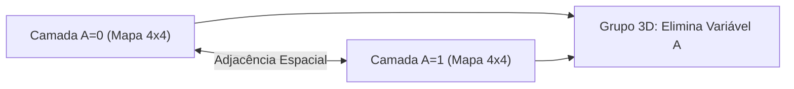

  
⬅️ <b><a href="/pt-br/resource/engenharia-de-computação/6-periodo/eletronica-digital/anotacoes/aula-04-minimizacao-logica-mapas-de-karnaugh-de-2-a-4-variaveis">Aula Anterior</a></b>

  
🏠 <b><a href="/pt-br/resource/engenharia-de-computação/6-periodo/eletronica-digital">Hub da Disciplina</a></b>

  
➡️ <b><a href="/pt-br/resource/engenharia-de-computação/6-periodo/eletronica-digital/anotacoes/aula-06-circuitos-combinacionais-aritmeticos-somadores-e-subtratores">Próxima Aula</a></b>

> [!info] 📅 Informações da Aula
> - **Disciplina:** Eletrônica Digital (CSECBJI.46)
> - **Professor:** Rogério
> - **Data Realizada:** 28/09/2026
> - **Tópico Principal:** Condições Irrelevantes (Don't Cares) e Mapas de 5 Variáveis
> - **Status:** Concluída e Revisada

> [!note] 📂 Material Complementar & Slides
> - 📄 **Slides Oficiais:** [[slide-05-eletronica-digital|Acessar Apresentação em PDF]]
> - 🎥 **Short Lecture / Gravação:** [[video-05-eletronica-digital|Assistir Síntese da Aula (Vídeo)]]

---

### 📑 Resumo das Seções
- [📌 1. Anotações do Quadro: Condições Irrelevantes (Don't Cares) e Mapas de 5 Variáveis](#-anotações-do-quadro-condições-irrelevantes-don't-cares-e-mapas-de-5-variáveis)
- [🧮 2. Formulação & Exemplo Prático Resolvido](#-formulação--exemplo-prático-resolvido)
- [📊 3. Esquema Visual & Fluxograma (Mermaid)](#-esquema-visual--fluxograma-mermaid)
- [🧠 4. Resumo Pessoal & Macetes do Professor](#-resumo-pessoal--macetes-do-professor)
- [📝 5. Dúvidas & Exercícios Recomendados para Casa](#-dúvidas--exercícios-recomendados-para-casa)

---

## 📌 Anotações do Quadro: Condições Irrelevantes (Don't Cares) e Mapas de 5 Variáveis

### 5.1 Condições Irrelevantes (*Don't Care* / $d$)
Em muitos sistemas digitais, certas combinações de entrada **nunca ocorrem** na prática (ex: dígitos de 10 a 15 em um decodificador decimal BCD) ou sua saída é indiferente para o sistema.
- Essas células são marcadas com **$X$** ou **$d$** no Mapa de Karnaugh.
- **Regra de Ouro do Don't Care:** Um termo $d$ pode ser tratado como **1** se ajudar a formar um grupo maior (mais simples), ou como **0** se não for necessário. Não é obrigatório cobrir todos os termos $d$.

### 5.2 Mapas de Karnaugh de 5 Variáveis ($A, B, C, D, E$)
Estruturado em **duas camadas superpostas de 4x4**:
- Camada 1: Para $A = 0$ (mintermos $m_0$ a $m_{15}$).
- Camada 2: Para $A = 1$ (mintermos $m_{16}$ a $m_{31}$).
- Células na mesma posição relativa nas duas camadas são **adjacentes** entre si, permitindo grupos tridimensionais que eliminam a variável $A$.

---

## 🧮 Formulação & Exemplo Prático Resolvido

### ✏️ Minimização com Don't Cares: Decodificador BCD para Display de 7 Segmentos (Segmento $a$)

Entradas BCD: $A, B, C, D$ ($0$ a $9$). Combinações $10$ a $15$ ($m_{10}$ a $m_{15}$) são *Don't Cares* ($d$).
Mintermos do segmento 'a': $\sum m(0, 2, 3, 5, 6, 7, 8, 9) + d(10, 11, 12, 13, 14, 15)$.

**Agrupamentos aproveitando os termos $d$:**
1. Grupo de 8 células ($m_8, m_9, m_{10}, m_{11}, m_{12}, m_{13}, m_{14}, m_{15}$): $A$
2. Grupo de 4 células ($m_2, m_3, m_{10}, m_{11}$): $C$
3. Grupo de 4 células ($m_0, m_2, m_8, m_{10}$): $B \overline{D}$
4. Grupo de 4 células ($m_5, m_7, m_{13}, m_{15}$): $B D$

**Expressão Mínima:**
$$Segmento_a = A + C + B D + \overline{B}\overline{D}$$

---

## 📊 Esquema Visual & Fluxograma (Mermaid)

---

## 🧠 Resumo Pessoal & Macetes do Professor

| Conceito-Chave | *Takeaway* do Professor | Dicas de Prova / Atenção |
| :--- | :--- | :--- |
| **Uso Oportunista do Don't Care** | Nunca crie um grupo composto exclusivamente por termos $d$. Don't cares existem apenas para aumentar grupos que já contêm pelo menos um '1' real. | Cobrir $d$ isolado apenas adiciona portas desnecessárias ao circuito. |
| **Mapas de 5 Variáveis** | Pense no mapa de 5 variáveis como dois andares de um prédio. Um grupo pode ser uma 'coluna' que atravessa os dois andares. | Aplicação prática direta |

---

## 📝 Dúvidas & Exercícios Recomendados para Casa

1. Minimize a função $F(A, B, C, D) = \sum m(1, 5, 6, 7, 11, 12, 13) + d(0, 2, 8, 10)$.
2. Desenhe o mapa de Karnaugh de 5 variáveis para a função $F(A, B, C, D, E) = \sum m(0, 2, 4, 6, 16, 18, 20, 22, 24, 26)$.

---

  
⬅️ <b><a href="/pt-br/resource/engenharia-de-computação/6-periodo/eletronica-digital/anotacoes/aula-04-minimizacao-logica-mapas-de-karnaugh-de-2-a-4-variaveis">Aula Anterior</a></b>

  
🏠 <b><a href="/pt-br/resource/engenharia-de-computação/6-periodo/eletronica-digital">Hub da Disciplina</a></b>

  
➡️ <b><a href="/pt-br/resource/engenharia-de-computação/6-periodo/eletronica-digital/anotacoes/aula-06-circuitos-combinacionais-aritmeticos-somadores-e-subtratores">Próxima Aula</a></b>

