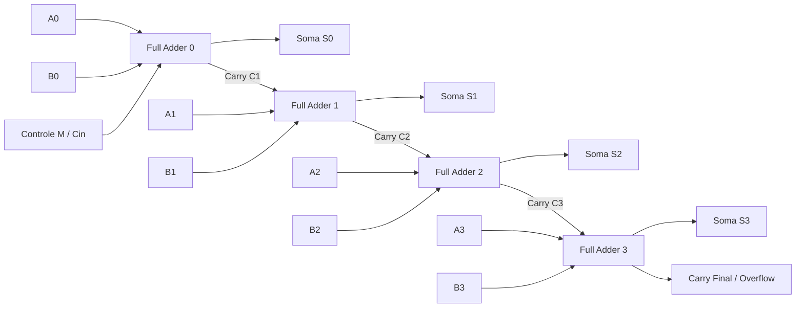

<div style="display: flex; justify-content: space-between; align-items: center; padding: 10px 16px; background: var(--light, #f8fafc); border: 1px solid var(--lightgray, #e2e8f0); border-radius: 10px; margin: 1.5rem 0;">
  <div>⬅️ <b><a href="/pt-br/resource/engenharia-de-computação/6-periodo/eletronica-digital/anotacoes/aula-05-condicoes-irrelevantes-don-t-cares-e-mapas-de-5-variaveis">Aula Anterior</a></b></div>
  <div>🏠 <b><a href="/pt-br/resource/engenharia-de-computação/6-periodo/eletronica-digital">Hub da Disciplina</a></b></div>
  <div>➡️ <b><a href="/pt-br/resource/engenharia-de-computação/6-periodo/eletronica-digital/anotacoes/aula-07-multiplexadores-demultiplexadores-codificadores-e-decodificadores">Próxima Aula</a></b></div>
</div>

> [!info] 📅 Informações da Aula
> - **Disciplina:** Eletrônica Digital (CSECBJI.46)
> - **Professor:** Rogério
> - **Data Realizada:** 05/10/2026
> - **Tópico Principal:** Circuitos Combinacionais Aritméticos: Somadores e Subtratores
> - **Status:** Concluída e Revisada

> [!note] 📂 Material Complementar & Slides
> - 📄 **Slides Oficiais:** [[slide-06-eletronica-digital|Acessar Apresentação em PDF]]
> - 🎥 **Short Lecture / Gravação:** [[video-06-eletronica-digital|Assistir Síntese da Aula (Vídeo)]]

---

### 📑 Resumo das Seções
- [📌 1. Anotações do Quadro: Circuitos Combinacionais Aritméticos: Somadores e Subtratores](#-anotações-do-quadro-circuitos-combinacionais-aritméticos-somadores-e-subtratores)
- [🧮 2. Formulação & Exemplo Prático Resolvido](#-formulação--exemplo-prático-resolvido)
- [📊 3. Esquema Visual & Fluxograma (Mermaid)](#-esquema-visual--fluxograma-mermaid)
- [🧠 4. Resumo Pessoal & Macetes do Professor](#-resumo-pessoal--macetes-do-professor)
- [📝 5. Dúvidas & Exercícios Recomendados para Casa](#-dúvidas--exercícios-recomendados-para-casa)

---

## 📌 Anotações do Quadro: Circuitos Combinacionais Aritméticos: Somadores e Subtratores

### 6.1 Meio-Somador (*Half Adder*)
Soma dois bits $A$ e $B$, gerando a Soma ($S$) e o Transporte de Saída (*Carry Out* - $C_{out}$):
$$S = A \oplus B$$
$$C_{out} = A \cdot B$$

### 6.2 Somador Completo (*Full Adder*)
Soma três bits ($A$, $B$ e o Transporte de Entrada $C_{in}$):
$$S = A \oplus B \oplus C_{in}$$
$$C_{out} = A B + (A \oplus B) C_{in} = A B + A C_{in} + B C_{in}$$

### 6.3 Somador Paralelo com Propagação de Transporte (*Ripple Carry Adder*)
Cascata de $N$ somadores completos para somar duas palavras binárias de $N$ bits.
- **Atraso de Propagação:** O tempo total é limitado pelo tempo de propagação do carry através dos $N$ estágios: $t_{prop} = N \cdot t_{carry}$.
- **Somador com Antecipação de Transporte (*Carry Lookahead Adder - CLA*):** Elimina o atraso linear gerando todos os carries em tempo constante através das funções de Geração ($G_i = A_i B_i$) e Propagação ($P_i = A_i \oplus B_i$).

---

## 🧮 Formulação & Exemplo Prático Resolvido

### ✏️ Somador/Subtrator de 4 Bits com Controle de Operação ($M$)

Utiliza 4 Full Adders e 4 portas XOR controladas pelo sinal $M$:
- Se $M=0$ (Soma): $B_i \oplus 0 = B_i$ e $C_{in(0)} = 0 \implies S = A + B$.
- Se $M=1$ (Subtração): $B_i \oplus 1 = \overline{B_i}$ e $C_{in(0)} = 1 \implies S = A + \overline{B} + 1 = A - B$ (Complemento de 2!).

```text
    A3 B3        A2 B2        A1 B1        A0 B0
     │  │         │  │         │  │         │  │
     │ ┌┴┐        │ ┌┴┐        │ ┌┴┐        │ ┌┴┐
     │ │⊕│<─M     │ │⊕│<─M     │ │⊕│<─M     │ │⊕│<─M (Cin=M)
     │ └┬┘        │ └┬┘        │ └┬┘        │ └┬┘
   ┌─▼──▼────┐  ┌─▼──▼────┐  ┌─▼──▼────┐  ┌─▼──▼────┐
   │ FA 3    │<─│ FA 2    │<─│ FA 1    │<─│ FA 0    │<─ M
   └─┬───────┘  └─┬───────┘  └─┬───────┘  └─┬───────┘
     │ S3         │ S2         │ S1         │ S0
```

---

## 📊 Esquema Visual & Fluxograma (Mermaid)



---

## 🧠 Resumo Pessoal & Macetes do Professor

| Conceito-Chave | *Takeaway* do Professor | Dicas de Prova / Atenção |
| :--- | :--- | :--- |
| **A Magia da Porta XOR como Inversor Programável** | $X \oplus 0 = X$ e $X \oplus 1 = \overline{X}$. A porta XOR atua como um inversor controlado por software/hardware. | Permite usar o mesmo hardware somador para fazer subtrações. |
| **Detecção de Overflow no Somador** | $V = C_{3} \oplus C_{4}$ (o XOR entre os dois últimos carries indica overflow em inteiros com sinal). | Aplicação prática direta |

---

## 📝 Dúvidas & Exercícios Recomendados para Casa

1. Projete um Comparador de Magnitude de 2 bits que gere as saídas $A > B$, $A = B$ e $A < B$.
2. Derive as equações booleanas para os carries $C_1, C_2, C_3, C_4$ em um Somador Carry Lookahead (CLA) de 4 bits.

---

<div style="display: flex; justify-content: space-between; align-items: center; padding: 10px 16px; background: var(--light, #f8fafc); border: 1px solid var(--lightgray, #e2e8f0); border-radius: 10px; margin: 1.5rem 0;">
  <div>⬅️ <b><a href="/pt-br/resource/engenharia-de-computação/6-periodo/eletronica-digital/anotacoes/aula-05-condicoes-irrelevantes-don-t-cares-e-mapas-de-5-variaveis">Aula Anterior</a></b></div>
  <div>🏠 <b><a href="/pt-br/resource/engenharia-de-computação/6-periodo/eletronica-digital">Hub da Disciplina</a></b></div>
  <div>➡️ <b><a href="/pt-br/resource/engenharia-de-computação/6-periodo/eletronica-digital/anotacoes/aula-07-multiplexadores-demultiplexadores-codificadores-e-decodificadores">Próxima Aula</a></b></div>
</div>
