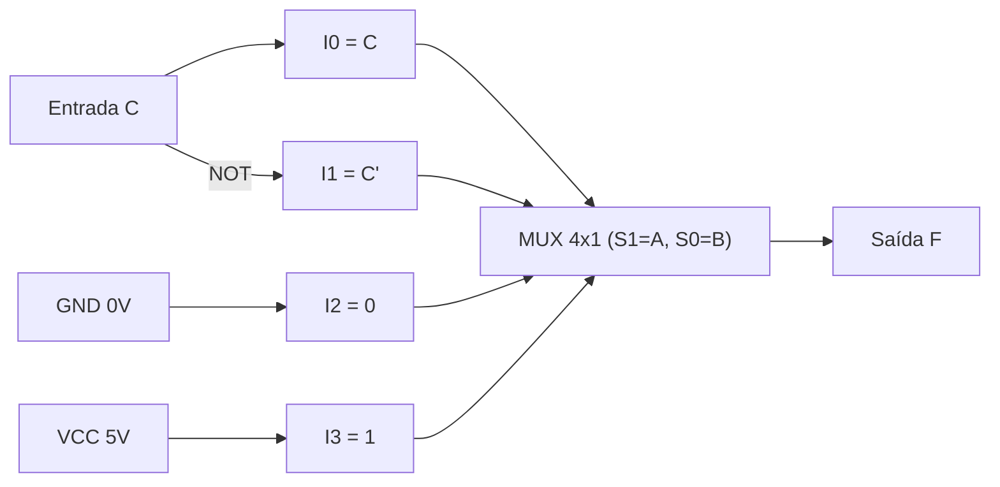

  
⬅️ <b><a href="/pt-br/resource/engenharia-de-computação/6-periodo/eletronica-digital/anotacoes/aula-06-circuitos-combinacionais-aritmeticos-somadores-e-subtratores">Aula Anterior</a></b>

  
🏠 <b><a href="/pt-br/resource/engenharia-de-computação/6-periodo/eletronica-digital">Hub da Disciplina</a></b>

  
➡️ <b><a href="/pt-br/resource/engenharia-de-computação/6-periodo/eletronica-digital/anotacoes/aula-08-avaliacao-teorico-pratica-p1">Próxima Aula</a></b>

> [!info] 📅 Informações da Aula
> - **Disciplina:** Eletrônica Digital (CSECBJI.46)
> - **Professor:** Rogério
> - **Data Realizada:** 12/10/2026
> - **Tópico Principal:** Multiplexadores, Demultiplexadores, Codificadores e Decodificadores
> - **Status:** Concluída e Revisada

> [!note] 📂 Material Complementar & Slides
> - 📄 **Slides Oficiais:** [[slide-07-eletronica-digital|Acessar Apresentação em PDF]]
> - 🎥 **Short Lecture / Gravação:** [[video-07-eletronica-digital|Assistir Síntese da Aula (Vídeo)]]

---

### 📑 Resumo das Seções
- [📌 1. Anotações do Quadro: Multiplexadores, Demultiplexadores, Codificadores e Decodificadores](#-anotações-do-quadro-multiplexadores,-demultiplexadores,-codificadores-e-decodificadores)
- [🧮 2. Formulação & Exemplo Prático Resolvido](#-formulação--exemplo-prático-resolvido)
- [📊 3. Esquema Visual & Fluxograma (Mermaid)](#-esquema-visual--fluxograma-mermaid)
- [🧠 4. Resumo Pessoal & Macetes do Professor](#-resumo-pessoal--macetes-do-professor)
- [📝 5. Dúvidas & Exercícios Recomendados para Casa](#-dúvidas--exercícios-recomendados-para-casa)

---

## 📌 Anotações do Quadro: Multiplexadores, Demultiplexadores, Codificadores e Decodificadores

### 7.1 Multiplexadores (MUX) e Demultiplexadores (DEMUX)
- **Multiplexador ($2^n \to 1$):** Seleciona uma entre $2^n$ linhas de dados de entrada e encaminha para uma única saída, controlado por $n$ linhas de seleção:
  $$Y = \sum_{i=0}^{2^n-1} I_i \cdot m_i(S)$$
  - *Universalidade do MUX:* Um MUX de $2^n \to 1$ pode implementar diretamente qualquer função booleana de $n+1$ variáveis.
- **Demultiplexador ($1 \to 2^n$):** Encaminha um dado de entrada para uma de $2^n$ saídas possíveis.

### 7.2 Decodificadores e Codificadores
- **Decodificador ($n \to 2^n$, ex: 74HC138):** Ativa exatamente uma saída correspondente ao código binário de entrada (gerador universal de mintermos).
- **Codificador de Prioridade (ex: 74HC148):** Converte a entrada ativa de maior prioridade em código binário de saída, ignorando entradas de menor prioridade.

---

## 🧮 Formulação & Exemplo Prático Resolvido

### ✏️ Implementação da Função $F(A, B, C) = \sum m(1, 2, 6, 7)$ com MUX 4x1

Utilizando as variáveis $A, B$ nas linhas de seleção $S_1, S_0$, a variável $C$ entra nas entradas de dados $I_0, I_1, I_2, I_3$:

| $A$ ($S_1$) | $B$ ($S_0$) | $C$ | $F$ | Entrada do MUX |
| :---: | :---: | :---: | :---: | :---: |
| 0 | 0 | 0 | 0 | $I_0 = C$ ($F=1$ quando $C=1$) |
| 0 | 0 | 1 | 1 | |
| 0 | 1 | 0 | 1 | $I_1 = \overline{C}$ ($F=1$ quando $C=0$) |
| 0 | 1 | 1 | 0 | |
| 1 | 0 | 0 | 0 | $I_2 = 0$ ($F=0$ sempre) |
| 1 | 0 | 1 | 0 | |
| 1 | 1 | 0 | 1 | $I_3 = 1$ ($F=1$ sempre) |
| 1 | 1 | 1 | 1 | |

**Ligação Física:** $I_0 = C$, $I_1 = \overline{C}$, $I_2 = \text{GND} (0)$, $I_3 = V_{CC} (1)$.

---

## 📊 Esquema Visual & Fluxograma (Mermaid)

---

## 🧠 Resumo Pessoal & Macetes do Professor

| Conceito-Chave | *Takeaway* do Professor | Dicas de Prova / Atenção |
| :--- | :--- | :--- |
| **Decodificador como Gerador de Funções** | Qualquer função na forma de mintermos pode ser implementada ligando as saídas correspondentes de um decodificador a uma porta OR (ou NAND se as saídas forem ativas em nível baixo). | Economiza tempo de síntese. |
| **Habilitação (*Enable*)** | Pinos de Enable permitem associar múltiplos MUX/DEMUX menores para formar estruturas maiores (ex: dois MUX 8x1 formando um MUX 16x1). | Aplicação prática direta |

---

## 📝 Dúvidas & Exercícios Recomendados para Casa

1. Implemente a função de maioria de 3 votos $F(A, B, C) = \sum m(3, 5, 6, 7)$ utilizando um MUX 4x1.
2. Projete um decodificador de 4 para 16 linhas utilizando dois decodificadores 74HC138 de 3 para 8 linhas.

---

  
⬅️ <b><a href="/pt-br/resource/engenharia-de-computação/6-periodo/eletronica-digital/anotacoes/aula-06-circuitos-combinacionais-aritmeticos-somadores-e-subtratores">Aula Anterior</a></b>

  
🏠 <b><a href="/pt-br/resource/engenharia-de-computação/6-periodo/eletronica-digital">Hub da Disciplina</a></b>

  
➡️ <b><a href="/pt-br/resource/engenharia-de-computação/6-periodo/eletronica-digital/anotacoes/aula-08-avaliacao-teorico-pratica-p1">Próxima Aula</a></b>

