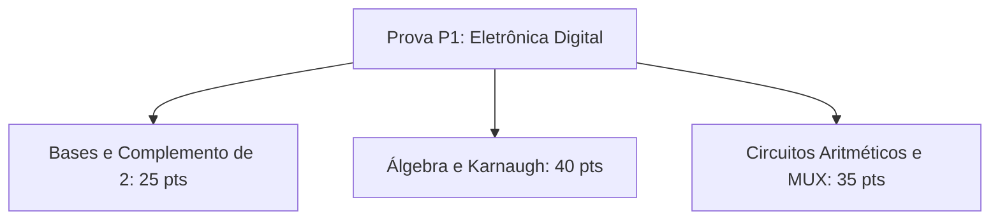

  
⬅️ <b><a href="/pt-br/resource/engenharia-de-computação/6-periodo/eletronica-digital/anotacoes/aula-07-multiplexadores-demultiplexadores-codificadores-e-decodificadores">Aula Anterior</a></b>

  
🏠 <b><a href="/pt-br/resource/engenharia-de-computação/6-periodo/eletronica-digital">Hub da Disciplina</a></b>

  
➡️ <b><a href="/pt-br/resource/engenharia-de-computação/6-periodo/eletronica-digital/anotacoes/aula-09-elementos-de-memoria-latches-sr-e-d-com-habilitacao">Próxima Aula</a></b>

> [!info] 📅 Informações da Aula
> - **Disciplina:** Eletrônica Digital (CSECBJI.46)
> - **Professor:** Rogério
> - **Data Realizada:** 19/10/2026
> - **Tópico Principal:** Avaliação Teórico-Prática P1
> - **Status:** Concluída e Revisada

> [!note] 📂 Material Complementar & Slides
> - 📄 **Slides Oficiais:** [[slide-08-eletronica-digital|Acessar Apresentação em PDF]]
> - 🎥 **Short Lecture / Gravação:** [[video-08-eletronica-digital|Assistir Síntese da Aula (Vídeo)]]

---

### 📑 Resumo das Seções
- [📌 1. Anotações do Quadro: Avaliação Teórico-Prática P1](#-anotações-do-quadro-avaliação-teórico-prática-p1)
- [🧮 2. Formulação & Exemplo Prático Resolvido](#-formulação--exemplo-prático-resolvido)
- [📊 3. Esquema Visual & Fluxograma (Mermaid)](#-esquema-visual--fluxograma-mermaid)
- [🧠 4. Resumo Pessoal & Macetes do Professor](#-resumo-pessoal--macetes-do-professor)
- [📝 5. Dúvidas & Exercícios Recomendados para Casa](#-dúvidas--exercícios-recomendados-para-casa)

---

## 📌 Anotações do Quadro: Avaliação Teórico-Prática P1

### 8.1 Síntese Conceitual para Avaliação Parcial P1
Revisão dos tópicos de Circuitos Lógicos Combinacionais:
1. **Sistemas de Numeração:** Conversões de base, Complemento de 2, overflow e códigos BCD/Gray.
2. **Álgebra Booleana:** Postulados de Huntington, teoremas de De Morgan e simplificação algébrica.
3. **Formas Canônicas e Universalidade:** SOP, POS e implementação exclusiva com portas NAND e NOR.
4. **Minimização com Karnaugh:** Mapas de 2 a 5 variáveis, identificação de EPIs e condições *Don't Care*.
5. **Módulos Combinacionais MSI:** Meio-Somador, Somador Completo, MUX, DEMUX, Codificadores de prioridade e Decodificadores.

---

## 🧮 Formulação & Exemplo Prático Resolvido

### ✏️ Resolução de Questão de Prova: Projeto de Circuito de Controle Industrial

**Enunciado:** Uma esteira transportadora possui 3 sensores de segurança $S_1, S_2, S_3$. O alarme $A$ deve disparar se pelo menos dois sensores forem ativados simultaneamente.
- Tabela-Verdade: $A(S_1, S_2, S_3) = \sum m(3, 5, 6, 7)$.
- Mapa de Karnaugh 2x4:
  - Grupo 1 ($m_3, m_7$): $S_2 S_3$
  - Grupo 2 ($m_5, m_7$): $S_1 S_3$
  - Grupo 3 ($m_6, m_7$): $S_1 S_2$
- **Equação Mínima:** $A = S_1 S_2 + S_1 S_3 + S_2 S_3$.
- **Implementação com Portas NAND:**
  $$A = \overline{\overline{S_1 S_2} \cdot \overline{S_1 S_3} \cdot \overline{S_2 S_3}}$$

---

## 📊 Esquema Visual & Fluxograma (Mermaid)

---

## 🧠 Resumo Pessoal & Macetes do Professor

| Conceito-Chave | *Takeaway* do Professor | Dicas de Prova / Atenção |
| :--- | :--- | :--- |
| **Checklist de Prova P1** | 1. Verifique se o mapa de Karnaugh tem todas as potências de 2 corretas; 2. Não esqueça do bit de sinal em complemento de 2; 3. Use parênteses ao aplicar De Morgan. | Atenção ao tempo de prova! |
| **Economia de Portas** | Procure fatores comuns para compartilhar portas lógicas entre múltiplas saídas. | Aplicação prática direta |

---

## 📝 Dúvidas & Exercícios Recomendados para Casa

1. Revise todos os exercícios das listas 1 a 7.
2. Implemente o circuito de alarme industrial anterior no simulador Logisim e valide todas as 8 combinações da tabela-verdade.

---

  
⬅️ <b><a href="/pt-br/resource/engenharia-de-computação/6-periodo/eletronica-digital/anotacoes/aula-07-multiplexadores-demultiplexadores-codificadores-e-decodificadores">Aula Anterior</a></b>

  
🏠 <b><a href="/pt-br/resource/engenharia-de-computação/6-periodo/eletronica-digital">Hub da Disciplina</a></b>

  
➡️ <b><a href="/pt-br/resource/engenharia-de-computação/6-periodo/eletronica-digital/anotacoes/aula-09-elementos-de-memoria-latches-sr-e-d-com-habilitacao">Próxima Aula</a></b>

