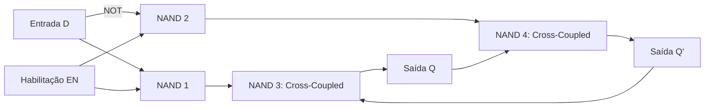

<div style="display: flex; justify-content: space-between; align-items: center; padding: 10px 16px; background: var(--light, #f8fafc); border: 1px solid var(--lightgray, #e2e8f0); border-radius: 10px; margin: 1.5rem 0;">
  <div>⬅️ <b><a href="/pt-br/resource/engenharia-de-computação/6-periodo/eletronica-digital/anotacoes/aula-08-avaliacao-teorico-pratica-p1">Aula Anterior</a></b></div>
  <div>🏠 <b><a href="/pt-br/resource/engenharia-de-computação/6-periodo/eletronica-digital">Hub da Disciplina</a></b></div>
  <div>➡️ <b><a href="/pt-br/resource/engenharia-de-computação/6-periodo/eletronica-digital/anotacoes/aula-10-flip-flops-disparados-por-borda-sr-d-jk-t">Próxima Aula</a></b></div>
</div>

> [!info] 📅 Informações da Aula
> - **Disciplina:** Eletrônica Digital (CSECBJI.46)
> - **Professor:** Rogério
> - **Data Realizada:** 26/10/2026
> - **Tópico Principal:** Elementos de Memória: Latches SR e D com Habilitação
> - **Status:** Concluída e Revisada

> [!note] 📂 Material Complementar & Slides
> - 📄 **Slides Oficiais:** [[slide-09-eletronica-digital|Acessar Apresentação em PDF]]
> - 🎥 **Short Lecture / Gravação:** [[video-09-eletronica-digital|Assistir Síntese da Aula (Vídeo)]]

---

### 📑 Resumo das Seções
- [📌 1. Anotações do Quadro: Elementos de Memória: Latches SR e D com Habilitação](#-anotações-do-quadro-elementos-de-memória-latches-sr-e-d-com-habilitação)
- [🧮 2. Formulação & Exemplo Prático Resolvido](#-formulação--exemplo-prático-resolvido)
- [📊 3. Esquema Visual & Fluxograma (Mermaid)](#-esquema-visual--fluxograma-mermaid)
- [🧠 4. Resumo Pessoal & Macetes do Professor](#-resumo-pessoal--macetes-do-professor)
- [📝 5. Dúvidas & Exercícios Recomendados para Casa](#-dúvidas--exercícios-recomendados-para-casa)

---

## 📌 Anotações do Quadro: Elementos de Memória: Latches SR e D com Habilitação

### 9.1 Transição para Circuitos Sequenciais
Em circuitos puramente combinacionais, as saídas dependem **exclusivamente das entradas atuais**. Em **circuitos sequenciais**, as saídas dependem das entradas atuais e do **histórico passado** (armazenado em elementos de memória).

### 9.2 Latch SR Básico com Portas NOR
Possui duas entradas ($S$ - *Set*, $R$ - *Reset*) e duas saídas complementares ($Q$ e $\overline{Q}$):
- $S=0, R=0$: **Memória / Manutenção** ($Q_{t+1} = Q_t$).
- $S=1, R=0$: **Set** ($Q_{t+1} = 1$).
- $S=0, R=1$: **Reset** ($Q_{t+1} = 0$).
- $S=1, R=1$: **Estado Proibido / Inválido** (Força $Q = \overline{Q} = 0$, violando a complementaridade e causando oscilação metaestável se liberado simultaneamente).

### 9.3 Latch D com Habilitação (*Gated D Latch*)
Elimina o estado proibido conectando $S=D$ e $R=\overline{D}$ através de uma entrada de controle *Enable* ($EN$):
- Quando $EN=1$: O Latch é **transparente** ($Q$ segue $D$ em tempo real).
- Quando $EN=0$: O Latch trava o último valor armazenado (modo memória).

---

## 🧮 Formulação & Exemplo Prático Resolvido

### ✏️ Cronograma de Tempo do Latch D Transparente

```text
Clock / EN  : ───┐     ┌─────┐     ┌─────┐     ┌───
                 └─────┘     └─────┘     └─────┘
Dado D      : ───────┐         ┌───────┐
                     └─────────┘       └───────────
Saída Q     : ───────┐         ┌───────┐
                     └─────────┘       └───────────
              (Q segue D enquanto EN=1; trava quando EN=0)
```

---

## 📊 Esquema Visual & Fluxograma (Mermaid)



---

## 🧠 Resumo Pessoal & Macetes do Professor

| Conceito-Chave | *Takeaway* do Professor | Dicas de Prova / Atenção |
| :--- | :--- | :--- |
| **Problema da Transparência do Latch** | Como o Latch D é sensível a nível (enquanto $EN=1$), qualquer pulso de ruído ou variação em $D$ altera a saída imediatamente. | Por isso computadores utilizam Flip-Flops disparados por BORDA e não Latches sensíveis a nível! |
| **Latch SR com NAND** | No Latch SR com portas NAND, as entradas são ativas em nível baixo ($\overline{S}$ e $\overline{R}$). O estado proibido ocorre em $00$. | Aplicação prática direta |

---

## 📝 Dúvidas & Exercícios Recomendados para Casa

1. Desenhe o diagrama esquemático e a tabela-verdade do Latch SR com portas NAND.
2. Explique o fenômeno de metaestabilidade em latches biestáveis.

---

<div style="display: flex; justify-content: space-between; align-items: center; padding: 10px 16px; background: var(--light, #f8fafc); border: 1px solid var(--lightgray, #e2e8f0); border-radius: 10px; margin: 1.5rem 0;">
  <div>⬅️ <b><a href="/pt-br/resource/engenharia-de-computação/6-periodo/eletronica-digital/anotacoes/aula-08-avaliacao-teorico-pratica-p1">Aula Anterior</a></b></div>
  <div>🏠 <b><a href="/pt-br/resource/engenharia-de-computação/6-periodo/eletronica-digital">Hub da Disciplina</a></b></div>
  <div>➡️ <b><a href="/pt-br/resource/engenharia-de-computação/6-periodo/eletronica-digital/anotacoes/aula-10-flip-flops-disparados-por-borda-sr-d-jk-t">Próxima Aula</a></b></div>
</div>
