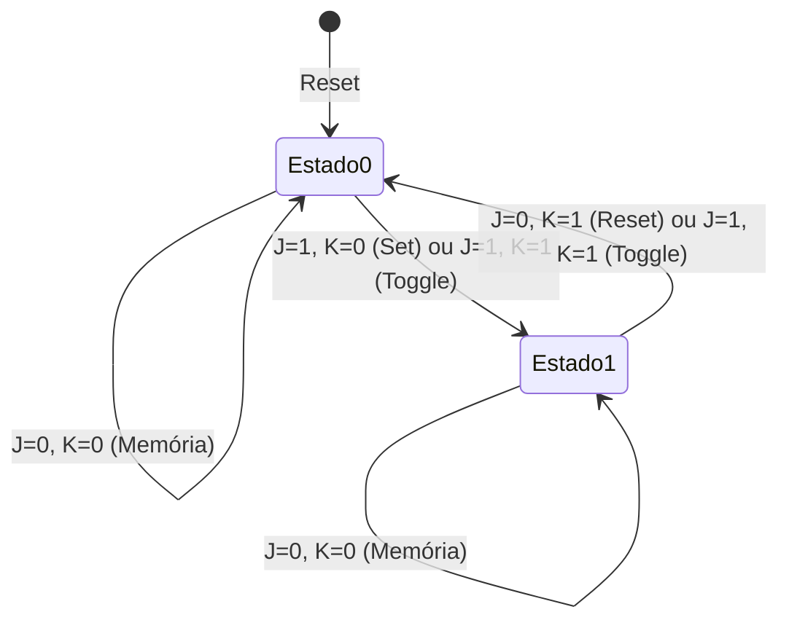

  
⬅️ <b><a href="/pt-br/resource/engenharia-de-computação/6-periodo/eletronica-digital/anotacoes/aula-09-elementos-de-memoria-latches-sr-e-d-com-habilitacao">Aula Anterior</a></b>

  
🏠 <b><a href="/pt-br/resource/engenharia-de-computação/6-periodo/eletronica-digital">Hub da Disciplina</a></b>

  
➡️ <b><a href="/pt-br/resource/engenharia-de-computação/6-periodo/eletronica-digital/anotacoes/aula-11-analise-de-circuitos-sequenciais-sincronos">Próxima Aula</a></b>

> [!info] 📅 Informações da Aula
> - **Disciplina:** Eletrônica Digital (CSECBJI.46)
> - **Professor:** Rogério
> - **Data Realizada:** 02/11/2026
> - **Tópico Principal:** Flip-Flops Disparados por Borda (SR, D, JK, T)
> - **Status:** Concluída e Revisada

> [!note] 📂 Material Complementar & Slides
> - 📄 **Slides Oficiais:** [[slide-10-eletronica-digital|Acessar Apresentação em PDF]]
> - 🎥 **Short Lecture / Gravação:** [[video-10-eletronica-digital|Assistir Síntese da Aula (Vídeo)]]

---

### 📑 Resumo das Seções
- [📌 1. Anotações do Quadro: Flip-Flops Disparados por Borda (SR, D, JK, T)](#-anotações-do-quadro-flip-flops-disparados-por-borda-sr,-d,-jk,-t)
- [🧮 2. Formulação & Exemplo Prático Resolvido](#-formulação--exemplo-prático-resolvido)
- [📊 3. Esquema Visual & Fluxograma (Mermaid)](#-esquema-visual--fluxograma-mermaid)
- [🧠 4. Resumo Pessoal & Macetes do Professor](#-resumo-pessoal--macetes-do-professor)
- [📝 5. Dúvidas & Exercícios Recomendados para Casa](#-dúvidas--exercícios-recomendados-para-casa)

---

## 📌 Anotações do Quadro: Flip-Flops Disparados por Borda (SR, D, JK, T)

### 10.1 Flip-Flops Disparados por Borda (*Edge-Triggered*)
Um **Flip-Flop** altera seu estado exclusivamente no instante exato da transição do sinal de clock (borda de subida $\uparrow$ ou descida $\downarrow$), ignorando variações na entrada durante o restante do período.

### 10.2 Tipos Principais de Flip-Flops
1. **Flip-Flop D (*Data*):** $Q_{t+1} = D$.
2. **Flip-Flop JK (Universal):** Elimina o estado proibido do SR:
   - $J=0, K=0$: Memória ($Q_{t+1} = Q_t$).
   - $J=1, K=0$: Set ($Q_{t+1} = 1$).
   - $J=0, K=1$: Reset ($Q_{t+1} = 0$).
   - $J=1, K=1$: **Alternância (*Toggle*)** ($Q_{t+1} = \overline{Q_t}$).
   - Equação Característica: $Q_{t+1} = J \overline{Q} + \overline{K} Q$.
3. **Flip-Flop T (*Toggle*):** $Q_{t+1} = T \oplus Q$.

### 10.3 Parâmetros Temporais Críticos
- **Tempo de Setup ($t_{su}$):** Tempo mínimo que o dado deve permanecer estável ANTES da borda do clock.
- **Tempo de Hold ($t_h$):** Tempo mínimo que o dado deve permanecer estável DEPOIS da borda do clock.
- **Atraso de Propagação ($t_{pd}$):** Tempo para a saída $Q$ refletir o novo estado após a borda.

---

## 🧮 Formulação & Exemplo Prático Resolvido

### ✏️ Tabelas de Excitação dos Flip-Flops (Fundamentais para Síntese)

Indica qual entrada deve ser aplicada para forçar a transição de estado $Q_t \to Q_{t+1}$:

| Transição $Q_t \to Q_{t+1}$ | Entradas $S, R$ | Entrada $D$ | Entradas $J, K$ | Entrada $T$ |
| :---: | :---: | :---: | :---: | :---: |
| $0 \to 0$ | $0, X$ | **0** | **$0, X$** | **0** |
| $0 \to 1$ | $1, 0$ | **1** | **$1, X$** | **1** |
| $1 \to 0$ | $0, 1$ | **0** | **$X, 1$** | **1** |
| $1 \to 1$ | $X, 0$ | **1** | **$X, 0$** | **0** |

Os termos $X$ (*Don't Care*) nas tabelas de excitação do Flip-Flop JK geram simplificações massivas nos mapas de Karnaugh de circuitos contadores!

---

## 📊 Esquema Visual & Fluxograma (Mermaid)

---

## 🧠 Resumo Pessoal & Macetes do Professor

| Conceito-Chave | *Takeaway* do Professor | Dicas de Prova / Atenção |
| :--- | :--- | :--- |
| **Violação de Setup e Hold** | Se a entrada de dados mudar dentro da janela $[t_{su}, t_h]$, o flip-flop entra em estado metaestável (saída oscila em tensão intermediária por tempo indeterminado). | Causa travamentos inexplicáveis em processadores. |
| **Entradas Assíncronas (Preset e Clear)** | Pinos PRESET e CLEAR têm prioridade absoluta sobre o clock e entradas síncronas, forçando $Q=1$ ou $Q=0$ instantaneamente. | Aplicação prática direta |

---

## 📝 Dúvidas & Exercícios Recomendados para Casa

1. Converta um Flip-Flop JK em um Flip-Flop D adicionando apenas portas lógicas combinacionais externas.
2. Desenhe o diagrama de temporização para um Flip-Flop T recebendo uma sequência periódica de pulsos de clock.

---

  
⬅️ <b><a href="/pt-br/resource/engenharia-de-computação/6-periodo/eletronica-digital/anotacoes/aula-09-elementos-de-memoria-latches-sr-e-d-com-habilitacao">Aula Anterior</a></b>

  
🏠 <b><a href="/pt-br/resource/engenharia-de-computação/6-periodo/eletronica-digital">Hub da Disciplina</a></b>

  
➡️ <b><a href="/pt-br/resource/engenharia-de-computação/6-periodo/eletronica-digital/anotacoes/aula-11-analise-de-circuitos-sequenciais-sincronos">Próxima Aula</a></b>

