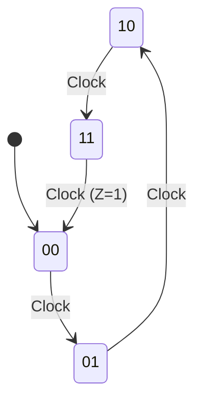

  
⬅️ <b><a href="/pt-br/resource/engenharia-de-computação/6-periodo/eletronica-digital/anotacoes/aula-10-flip-flops-disparados-por-borda-sr-d-jk-t">Aula Anterior</a></b>

  
🏠 <b><a href="/pt-br/resource/engenharia-de-computação/6-periodo/eletronica-digital">Hub da Disciplina</a></b>

  
➡️ <b><a href="/pt-br/resource/engenharia-de-computação/6-periodo/eletronica-digital/anotacoes/aula-12-projeto-de-contadores-sincronos-e-assincronos">Próxima Aula</a></b>

> [!info] 📅 Informações da Aula
> - **Disciplina:** Eletrônica Digital (CSECBJI.46)
> - **Professor:** Rogério
> - **Data Realizada:** 09/11/2026
> - **Tópico Principal:** Análise de Circuitos Sequenciais Síncronos
> - **Status:** Concluída e Revisada

> [!note] 📂 Material Complementar & Slides
> - 📄 **Slides Oficiais:** [[slide-11-eletronica-digital|Acessar Apresentação em PDF]]
> - 🎥 **Short Lecture / Gravação:** [[video-11-eletronica-digital|Assistir Síntese da Aula (Vídeo)]]

---

### 📑 Resumo das Seções
- [📌 1. Anotações do Quadro: Análise de Circuitos Sequenciais Síncronos](#-anotações-do-quadro-análise-de-circuitos-sequenciais-síncronos)
- [🧮 2. Formulação & Exemplo Prático Resolvido](#-formulação--exemplo-prático-resolvido)
- [📊 3. Esquema Visual & Fluxograma (Mermaid)](#-esquema-visual--fluxograma-mermaid)
- [🧠 4. Resumo Pessoal & Macetes do Professor](#-resumo-pessoal--macetes-do-professor)
- [📝 5. Dúvidas & Exercícios Recomendados para Casa](#-dúvidas--exercícios-recomendados-para-casa)

---

## 📌 Anotações do Quadro: Análise de Circuitos Sequenciais Síncronos

### 11.1 Estrutura Geral de Circuitos Sequenciais Síncronos
Um circuito sequencial síncrono é composto por:
1. Um conjunto de $N$ Flip-Flops sincronizados por um **Clock comum**.
2. **Lógica Combinacional de Próximo Estado:** Calcula as entradas de excitação dos FFs ($D_i, J_i, K_i$) em função das variáveis de estado atual ($Q_i$) e das entradas primárias ($X$).
3. **Lógica Combinacional de Saída:** Calcula as saídas do circuito ($Z$).

### 11.2 Procedimento Sistemático de Análise
1. Identificar as equações booleanas de excitação dos Flip-Flops e as equações de saída.
2. Substituir as equações de excitação nas equações características dos FFs para obter as **Equações de Próximo Estado** ($Q_{t+1}$).
3. Construir a **Tabela de Transição de Estados**.
4. Desenhar o **Diagrama de Estados** (Grafo direcionado com bolhas de estado e transições).

---

## 🧮 Formulação & Exemplo Prático Resolvido

### ✏️ Análise Passo a Passo de Circuito com 2 Flip-Flops D

**Circuito Fornecido:**
- $D_A = A \overline{B} + \overline{A} B = A \oplus B$
- $D_B = \overline{B}$
- Saída $Z = A B$

**Equações de Próximo Estado:**
- $A_{t+1} = D_A = A \oplus B$
- $B_{t+1} = D_B = \overline{B}$

**Tabela de Transição de Estados:**

| Estado Atual $A B$ | Próximo Estado $A_{t+1} B_{t+1}$ | Saída $Z$ |
| :---: | :---: | :---: |
| **00** | **01** | 0 |
| **01** | **10** | 0 |
| **10** | **11** | 0 |
| **11** | **00** | **1** |

**Diagnóstico do Circuito:** É um **Contador Binário Módulo 4** crescente ($0 \to 1 \to 2 \to 3 \to 0$) que emite um pulso de saída $Z=1$ quando atinge a contagem máxima 3!

---

## 📊 Esquema Visual & Fluxograma (Mermaid)

---

## 🧠 Resumo Pessoal & Macetes do Professor

| Conceito-Chave | *Takeaway* do Professor | Dicas de Prova / Atenção |
| :--- | :--- | :--- |
| **Roteiro de Análise** | Equações de Excitação $\to$ Equações de Próximo Estado $\to$ Tabela de Transição $\to$ Diagrama de Estados. | Siga rigorosamente essa ordem para não errar. |
| **Frequência de Saída** | Em um contador módulo $N$, a frequência do sinal de saída é $f_{out} = \frac{f_{clock}}{N}$. | Aplicação prática direta |

---

## 📝 Dúvidas & Exercícios Recomendados para Casa

1. Analise um circuito com 2 Flip-Flops JK dados por $J_A = B$, $K_A = 1$, $J_B = \overline{A}$, $K_B = 1$ e desenhe o diagrama de estados.
2. Determine o módulo de contagem do circuito acima.

---

  
⬅️ <b><a href="/pt-br/resource/engenharia-de-computação/6-periodo/eletronica-digital/anotacoes/aula-10-flip-flops-disparados-por-borda-sr-d-jk-t">Aula Anterior</a></b>

  
🏠 <b><a href="/pt-br/resource/engenharia-de-computação/6-periodo/eletronica-digital">Hub da Disciplina</a></b>

  
➡️ <b><a href="/pt-br/resource/engenharia-de-computação/6-periodo/eletronica-digital/anotacoes/aula-12-projeto-de-contadores-sincronos-e-assincronos">Próxima Aula</a></b>

