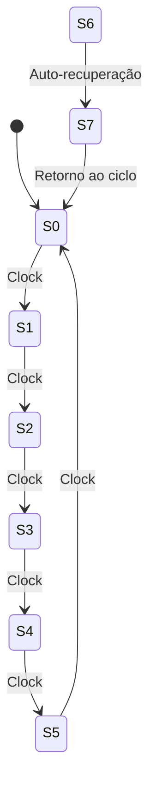

  
⬅️ <b><a href="/pt-br/resource/engenharia-de-computação/6-periodo/eletronica-digital/anotacoes/aula-11-analise-de-circuitos-sequenciais-sincronos">Aula Anterior</a></b>

  
🏠 <b><a href="/pt-br/resource/engenharia-de-computação/6-periodo/eletronica-digital">Hub da Disciplina</a></b>

  
➡️ <b><a href="/pt-br/resource/engenharia-de-computação/6-periodo/eletronica-digital/anotacoes/aula-13-registradores-de-deslocamento">Próxima Aula</a></b>

> [!info] 📅 Informações da Aula
> - **Disciplina:** Eletrônica Digital (CSECBJI.46)
> - **Professor:** Rogério
> - **Data Realizada:** 16/11/2026
> - **Tópico Principal:** Projeto de Contadores Síncronos e Assíncronos
> - **Status:** Concluída e Revisada

> [!note] 📂 Material Complementar & Slides
> - 📄 **Slides Oficiais:** [[slide-12-eletronica-digital|Acessar Apresentação em PDF]]
> - 🎥 **Short Lecture / Gravação:** [[video-12-eletronica-digital|Assistir Síntese da Aula (Vídeo)]]

---

### 📑 Resumo das Seções
- [📌 1. Anotações do Quadro: Projeto de Contadores Síncronos e Assíncronos](#-anotações-do-quadro-projeto-de-contadores-síncronos-e-assíncronos)
- [🧮 2. Formulação & Exemplo Prático Resolvido](#-formulação--exemplo-prático-resolvido)
- [📊 3. Esquema Visual & Fluxograma (Mermaid)](#-esquema-visual--fluxograma-mermaid)
- [🧠 4. Resumo Pessoal & Macetes do Professor](#-resumo-pessoal--macetes-do-professor)
- [📝 5. Dúvidas & Exercícios Recomendados para Casa](#-dúvidas--exercícios-recomendados-para-casa)

---

## 📌 Anotações do Quadro: Projeto de Contadores Síncronos e Assíncronos

### 12.1 Contadores Assíncronos (*Ripple Counters*)
A saída $Q$ de cada Flip-Flop é conectada como sinal de clock do estágio seguinte:
- Circuito simples e com poucas portas lógicas.
- **Desvantagem Crítica:** Efeito cascata de atraso de propagação acumulado ($N \cdot t_{pd}$), podendo gerar *glitches* temporários perigosos na decodificação.

### 12.2 Contadores Síncronos (Projeto Sistemático)
Todos os Flip-Flops recebem o sinal de clock **em paralelo e simultaneamente**.

**Metodologia de Síntese de Contadores Síncronos:**
1. Definir a sequência de contagem desejada e desenhar o diagrama de estados.
2. Montar a tabela de transição de estados ($Q_t \to Q_{t+1}$).
3. Utilizar a **Tabela de Excitação** do Flip-Flop escolhido (JK, D ou T) para preencher as colunas de excitação.
4. Minimizar as equações de excitação através de **Mapas de Karnaugh**.
5. Implementar o circuito esquemático e verificar **auto-inicialização** para estados não-utilizados.

---

## 🧮 Formulação & Exemplo Prático Resolvido

### ✏️ Projeto de Contador Síncrono Módulo 6 ($0 \to 1 \to 2 \to 3 \to 4 \to 5 \to 0$) com FFs JK

Variáveis de estado: $A, B, C$ ($2^3 = 8$ estados possíveis; estados $6, 7$ são *Don't Cares*).

**Mapeamento de Excitação:**
- Mapa para $J_C, K_C$: $J_C = A B$, $K_C = 1$
- Mapa para $J_B, K_B$: $J_B = A \overline{C}$, $K_B = A$
- Mapa para $J_A, K_A$: $J_A = 1$, $K_A = 1$

**Verificação de Auto-Inicialização (Estados 6 e 7):**
- Estado 6 ($110$): Próximo estado $\to 111$ (7).
- Estado 7 ($111$): Próximo estado $\to 000$ (0).
O circuito é auto-inicializável: mesmo que inicie em um estado proibido após ligar a energia, ele entra no ciclo útil em no máximo 2 pulsos de clock!

---

## 📊 Esquema Visual & Fluxograma (Mermaid)

---

## 🧠 Resumo Pessoal & Macetes do Professor

| Conceito-Chave | *Takeaway* do Professor | Dicas de Prova / Atenção |
| :--- | :--- | :--- |
| **Eliminação de Estados Travados** | Sempre verifique para onde vão os estados não-utilizados. Se eles formarem um laço isolado fechado, o circuito pode travar na inicialização! | Projetistas devem garantir que estados espúrios converjam para a sequência normal. |
| **Contador em Anel vs Johnson** | Contador em anel com $N$ FFs tem $N$ estados; Contador Johnson com $N$ FFs tem $2N$ estados. | Aplicação prática direta |

---

## 📝 Dúvidas & Exercícios Recomendados para Casa

1. Projete um contador síncrono Gray de 3 bits ($000 	o 001 	o 011 	o 010 	o 110 	o 111 	o 101 	o 100 	o 000$) utilizando Flip-Flops D.
2. Calcule a frequência máxima de operação de um contador síncrono de 4 bits considerando $t_{pd} = 10	ext{ns}$ e $t_{logic} = 5	ext{ns}$, $t_{su} = 3	ext{ns}$.

---

  
⬅️ <b><a href="/pt-br/resource/engenharia-de-computação/6-periodo/eletronica-digital/anotacoes/aula-11-analise-de-circuitos-sequenciais-sincronos">Aula Anterior</a></b>

  
🏠 <b><a href="/pt-br/resource/engenharia-de-computação/6-periodo/eletronica-digital">Hub da Disciplina</a></b>

  
➡️ <b><a href="/pt-br/resource/engenharia-de-computação/6-periodo/eletronica-digital/anotacoes/aula-13-registradores-de-deslocamento">Próxima Aula</a></b>

