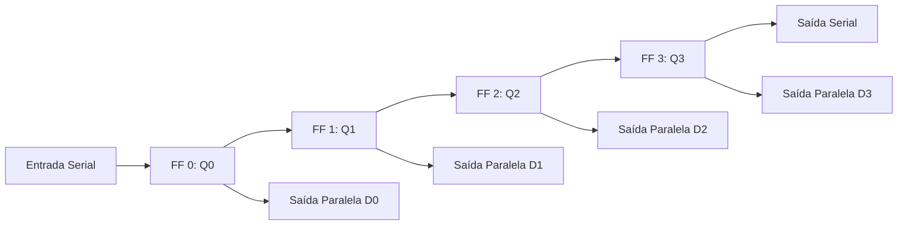

  
⬅️ <b><a href="/pt-br/resource/engenharia-de-computação/6-periodo/eletronica-digital/anotacoes/aula-12-projeto-de-contadores-sincronos-e-assincronos">Aula Anterior</a></b>

  
🏠 <b><a href="/pt-br/resource/engenharia-de-computação/6-periodo/eletronica-digital">Hub da Disciplina</a></b>

  
➡️ <b><a href="/pt-br/resource/engenharia-de-computação/6-periodo/eletronica-digital/anotacoes/aula-14-maquinas-de-estados-finitos-fsm-modelos-de-mealy-e-moore">Próxima Aula</a></b>

> [!info] 📅 Informações da Aula
> - **Disciplina:** Eletrônica Digital (CSECBJI.46)
> - **Professor:** Rogério
> - **Data Realizada:** 23/11/2026
> - **Tópico Principal:** Registradores de Deslocamento
> - **Status:** Concluída e Revisada

> [!note] 📂 Material Complementar & Slides
> - 📄 **Slides Oficiais:** [[slide-13-eletronica-digital|Acessar Apresentação em PDF]]
> - 🎥 **Short Lecture / Gravação:** [[video-13-eletronica-digital|Assistir Síntese da Aula (Vídeo)]]

---

### 📑 Resumo das Seções
- [📌 1. Anotações do Quadro: Registradores de Deslocamento](#-anotações-do-quadro-registradores-de-deslocamento)
- [🧮 2. Formulação & Exemplo Prático Resolvido](#-formulação--exemplo-prático-resolvido)
- [📊 3. Esquema Visual & Fluxograma (Mermaid)](#-esquema-visual--fluxograma-mermaid)
- [🧠 4. Resumo Pessoal & Macetes do Professor](#-resumo-pessoal--macetes-do-professor)
- [📝 5. Dúvidas & Exercícios Recomendados para Casa](#-dúvidas--exercícios-recomendados-para-casa)

---

## 📌 Anotações do Quadro: Registradores de Deslocamento

### 13.1 Modos de Operação de Registradores de Deslocamento
Um registrador de deslocamento é uma cadeia encadeada de Flip-Flops em que os dados se movem uma posição a cada pulso de clock:
1. **SISO (Serial-In Serial-Out):** Entrada e saída serial (usado para linhas de atraso digital).
2. **SIPO (Serial-In Parallel-Out):** Conversão serial-paralelo (ex: receptor UART).
3. **PISO (Parallel-In Serial-Out):** Conversão paralelo-serial (ex: transmissor UART).
4. **PIPO (Parallel-In Parallel-Out):** Carga e leitura paralelas instantâneas (ex: registradores de CPU).

### 13.2 Registrador de Deslocamento Universal (ex: 74HC194)
Possui duas linhas de controle de modo ($S_1, S_0$):
- $S_1 S_0 = 00$: Manutenção de dados (Hold).
- $S_1 S_0 = 01$: Deslocamento para a Direita (*Shift Right*).
- $S_1 S_0 = 10$: Deslocamento para a Esquerda (*Shift Left*).
- $S_1 S_0 = 11$: Carga Paralela Síncrona (*Parallel Load*).

---

## 🧮 Formulação & Exemplo Prático Resolvido

### ✏️ Aplicação: Multiplicação e Divisão Aritmética por Potências de 2

Em números binários não-assinados:
- **Shift Left Lógico (1 bit):** Multiplica o valor por 2 ($N \times 2$).
  - `0000 0101` ($5_{10}$) $\to$ `0000 1010` ($10_{10}$).
- **Shift Right Lógico (1 bit):** Divide o valor por 2 com descarte de resto ($\lfloor N / 2 \rfloor$).
  - `0000 1010` ($10_{10}$) $\to$ `0000 0101` ($5_{10}$).

Operação executada em apenas **1 ciclo de clock**, sendo fundamental em ULAs de processadores!

---

## 📊 Esquema Visual & Fluxograma (Mermaid)

---

## 🧠 Resumo Pessoal & Macetes do Professor

| Conceito-Chave | *Takeaway* do Professor | Dicas de Prova / Atenção |
| :--- | :--- | :--- |
| **Shift Aritmético vs Lógico** | Shift Lógico insere zeros nas extremidades; Shift Aritmético à Direita preserva e replica o bit de sinal ($MSB$) para manter o sinal negativo em complemento de 2. | Essencial para divisão de números negativos. |
| **Geração de Ruído Pseudoaleatório (LFSR)** | Conectando saídas selecionadas de um registrador de deslocamento via portas XOR à entrada serial cria-se um LFSR (*Linear Feedback Shift Register*). | Aplicação prática direta |

---

## 📝 Dúvidas & Exercícios Recomendados para Casa

1. Projete um conversor Serial-Paralelo de 8 bits utilizando o CI 74HC164.
2. Explique a diferença funcional entre um Contador em Anel e um Contador Johnson de 4 estágios.

---

  
⬅️ <b><a href="/pt-br/resource/engenharia-de-computação/6-periodo/eletronica-digital/anotacoes/aula-12-projeto-de-contadores-sincronos-e-assincronos">Aula Anterior</a></b>

  
🏠 <b><a href="/pt-br/resource/engenharia-de-computação/6-periodo/eletronica-digital">Hub da Disciplina</a></b>

  
➡️ <b><a href="/pt-br/resource/engenharia-de-computação/6-periodo/eletronica-digital/anotacoes/aula-14-maquinas-de-estados-finitos-fsm-modelos-de-mealy-e-moore">Próxima Aula</a></b>

