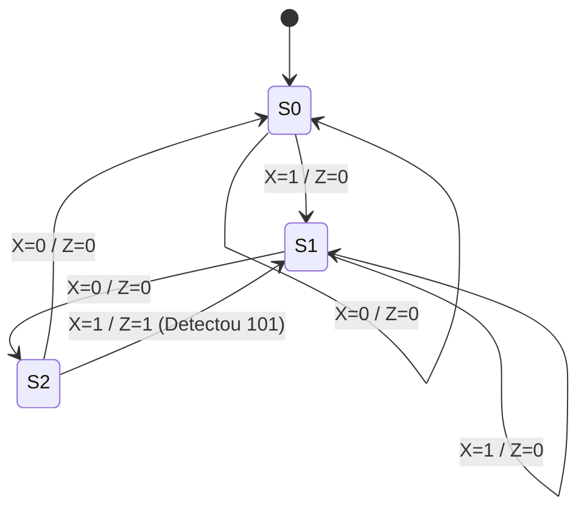

  
⬅️ <b><a href="/pt-br/resource/engenharia-de-computação/6-periodo/eletronica-digital/anotacoes/aula-13-registradores-de-deslocamento">Aula Anterior</a></b>

  
🏠 <b><a href="/pt-br/resource/engenharia-de-computação/6-periodo/eletronica-digital">Hub da Disciplina</a></b>

  
➡️ <b><a href="/pt-br/resource/engenharia-de-computação/6-periodo/eletronica-digital/anotacoes/aula-15-avaliacao-pratica-p2-e-montagem-de-circuitos-sequenciais">Próxima Aula</a></b>

> [!info] 📅 Informações da Aula
> - **Disciplina:** Eletrônica Digital (CSECBJI.46)
> - **Professor:** Rogério
> - **Data Realizada:** 30/11/2026
> - **Tópico Principal:** Máquinas de Estados Finitos (FSM): Modelos de Mealy e Moore
> - **Status:** Concluída e Revisada

> [!note] 📂 Material Complementar & Slides
> - 📄 **Slides Oficiais:** [[slide-14-eletronica-digital|Acessar Apresentação em PDF]]
> - 🎥 **Short Lecture / Gravação:** [[video-14-eletronica-digital|Assistir Síntese da Aula (Vídeo)]]

---

### 📑 Resumo das Seções
- [📌 1. Anotações do Quadro: Máquinas de Estados Finitos (FSM): Modelos de Mealy e Moore](#-anotações-do-quadro-máquinas-de-estados-finitos-fsm-modelos-de-mealy-e-moore)
- [🧮 2. Formulação & Exemplo Prático Resolvido](#-formulação--exemplo-prático-resolvido)
- [📊 3. Esquema Visual & Fluxograma (Mermaid)](#-esquema-visual--fluxograma-mermaid)
- [🧠 4. Resumo Pessoal & Macetes do Professor](#-resumo-pessoal--macetes-do-professor)
- [📝 5. Dúvidas & Exercícios Recomendados para Casa](#-dúvidas--exercícios-recomendados-para-casa)

---

## 📌 Anotações do Quadro: Máquinas de Estados Finitos (FSM): Modelos de Mealy e Moore

### 14.1 Máquinas de Estados Finitos (FSM)
Uma FSM é o modelo matemático formal para controladores digitais sequenciais complexos.

### 14.2 Modelos de Mealy vs Moore
- **Máquina de Moore:** As saídas dependem **exclusivamente do estado atual**.
  $$Z = \lambda(S)$$
  - *Vantagem:* Saídas síncronas e limpas, imunes a variações imediatas nas entradas.
- **Máquina de Mealy:** As saídas dependem do **estado atual e das entradas primárias**.
  $$Z = \lambda(S, X)$$
  - *Vantagem:* Geralmente exige **menos estados** que a máquina de Moore equivalente, respondendo no mesmo ciclo de clock à variação da entrada.

### 14.3 Técnicas de Codificação de Estados
- **Codificação Binária Padrão:** $N$ estados exigem $\lceil \log_2 N \rceil$ Flip-Flops.
- **Codificação Gray:** Minimiza chaveamento de linhas em transições adjacentes.
- **Codificação One-Hot:** Utiliza 1 Flip-Flop por estado (apenas um FF ativo com '1' por vez). Ideal para FPGAs devido à abundância de flip-flops e simplificação da lógica combinacional.

---

## 🧮 Formulação & Exemplo Prático Resolvido

### ✏️ Síntese de FSM: Detector de Sequência `101` com Sobreposição (Mealy)

**Diagrama de Estados:**
- Estado $S_0$: Nenhum bit casado (inicial).
- Estado $S_1$: Recebeu bit `1`.
- Estado $S_2$: Recebeu sequência `10`.

**Transições:**
- Em $S_0$: Se $X=0 \to S_0 (Z=0)$; Se $X=1 \to S_1 (Z=0)$.
- Em $S_1$: Se $X=0 \to S_2 (Z=0)$; Se $X=1 \to S_1 (Z=0)$.
- Em $S_2$: Se $X=0 \to S_0 (Z=0)$; Se $X=1 \to S_1 (Z=1)$ (Detectou `101` e reaproveita o último '1' para sobreposição!).

**Equações com FFs D ($A B$):**
- $D_A = X \overline{A} B$
- $D_B = X$
- Saída $Z = X A$

---

## 📊 Esquema Visual & Fluxograma (Mermaid)

---

## 🧠 Resumo Pessoal & Macetes do Professor

| Conceito-Chave | *Takeaway* do Professor | Dicas de Prova / Atenção |
| :--- | :--- | :--- |
| **Detecção com ou sem Sobreposição** | Com sobreposição: na cadeia `10101`, detecta no 3º e no 5º bit; Sem sobreposição: reinicia busca do zero após cada detecção. | Atenção ao enunciado em questões de prova! |
| **Mealy vs Moore em Diagramas** | Em Moore, a saída é escrita dentro da bolha do estado `(S0 / Z=0)`; em Mealy, a saída é escrita sobre a seta de transição `X=1 / Z=0`. | Aplicação prática direta |

---

## 📝 Dúvidas & Exercícios Recomendados para Casa

1. Projete o detector da sequência `101` utilizando o Modelo de Moore e compare o número de estados com o modelo de Mealy.
2. Implemente a tabela de transição e as equações de excitação em codificação One-Hot para um semáforo de 3 estados.

---

  
⬅️ <b><a href="/pt-br/resource/engenharia-de-computação/6-periodo/eletronica-digital/anotacoes/aula-13-registradores-de-deslocamento">Aula Anterior</a></b>

  
🏠 <b><a href="/pt-br/resource/engenharia-de-computação/6-periodo/eletronica-digital">Hub da Disciplina</a></b>

  
➡️ <b><a href="/pt-br/resource/engenharia-de-computação/6-periodo/eletronica-digital/anotacoes/aula-15-avaliacao-pratica-p2-e-montagem-de-circuitos-sequenciais">Próxima Aula</a></b>

