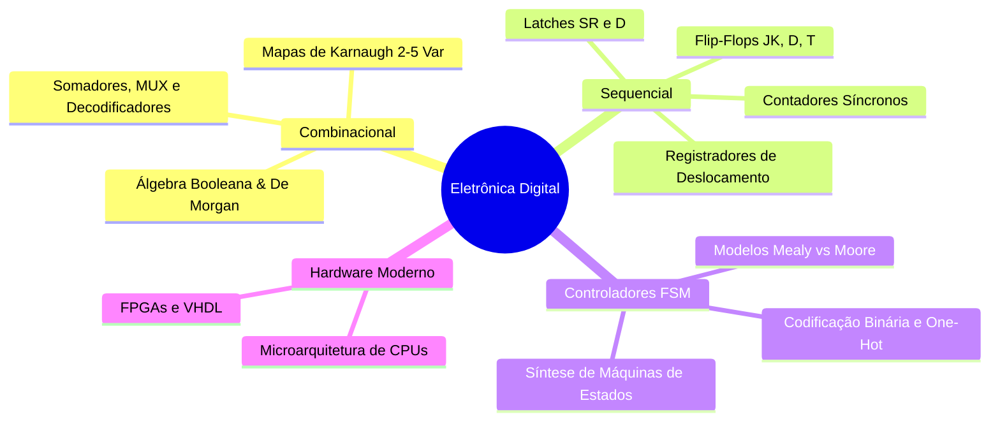

<div style="display: flex; justify-content: space-between; align-items: center; padding: 10px 16px; background: var(--light, #f8fafc); border: 1px solid var(--lightgray, #e2e8f0); border-radius: 10px; margin: 1.5rem 0;">
  <div>⬅️ <b><a href="/pt-br/resource/engenharia-de-computação/6-periodo/eletronica-digital/anotacoes/aula-15-avaliacao-pratica-p2-e-montagem-de-circuitos-sequenciais">Aula Anterior</a></b></div>
  <div>🏠 <b><a href="/pt-br/resource/engenharia-de-computação/6-periodo/eletronica-digital">Hub da Disciplina</a></b></div>
  <div>➡️ <span style="color: gray;">Última Aula</span></div>
</div>

> [!info] 📅 Informações da Aula
> - **Disciplina:** Eletrônica Digital (CSECBJI.46)
> - **Professor:** Rogério
> - **Data Realizada:** 14/12/2026
> - **Tópico Principal:** Prova Final de Eletrônica Digital e Encerramento
> - **Status:** Concluída e Revisada

> [!note] 📂 Material Complementar & Slides
> - 📄 **Slides Oficiais:** [[slide-16-eletronica-digital|Acessar Apresentação em PDF]]
> - 🎥 **Short Lecture / Gravação:** [[video-16-eletronica-digital|Assistir Síntese da Aula (Vídeo)]]

---

### 📑 Resumo das Seções
- [📌 1. Anotações do Quadro: Prova Final de Eletrônica Digital e Encerramento](#-anotações-do-quadro-prova-final-de-eletrônica-digital-e-encerramento)
- [🧮 2. Formulação & Exemplo Prático Resolvido](#-formulação--exemplo-prático-resolvido)
- [📊 3. Esquema Visual & Fluxograma (Mermaid)](#-esquema-visual--fluxograma-mermaid)
- [🧠 4. Resumo Pessoal & Macetes do Professor](#-resumo-pessoal--macetes-do-professor)
- [📝 5. Dúvidas & Exercícios Recomendados para Casa](#-dúvidas--exercícios-recomendados-para-casa)

---

## 📌 Anotações do Quadro: Prova Final de Eletrônica Digital e Encerramento

### 16.1 Síntese Holística da Eletrônica Digital
A disciplina de Eletrônica Digital constitui o elo fundamental da Engenharia de Computação, unindo a física dos semicondutores à arquitetura de computadores:
```text
Portas Lógicas ──▶ Circuitos Combinacionais ──▶ Latches e Flip-Flops ──▶ FSMs e Contadores ──▶ Processadores (ULAs, Registradores)
```

### 16.2 Tecnologias Modernas e Continuidade Curricular
- **Dispositivos Lógicos Programáveis (FPGAs & CPLDs):** Síntese digital moderna utilizando linguagens de descrição de hardware (VHDL / Verilog).
- **ASIC (*Application-Specific Integrated Circuit*):** Projeto de chips dedicados de silício.
- **Transição Curricular:** Esta base será aplicada diretamente nas disciplinas de **Sistemas Digitais (7ºP)**, **Organização de Computadores (7ºP)** e **Microcontroladores (8ºP)**.

---

## 🧮 Formulação & Exemplo Prático Resolvido

### ✏️ Fechamento das Médias e Próximos Passos

1. **Revisão das Notas:** Média Final $= (P1 + P2) / 2 \ge 6.0$.
2. **Consolidação Prática:** Domínio de mapas de Karnaugh, Flip-Flops e FSMs estabelece a base para projetar processadores RISC-V completos!

---

## 📊 Esquema Visual & Fluxograma (Mermaid)



---

## 🧠 Resumo Pessoal & Macetes do Professor

| Conceito-Chave | *Takeaway* do Professor | Dicas de Prova / Atenção |
| :--- | :--- | :--- |
| **Conhecimento Estrutural** | Todo processador, placa de vídeo ou chip de inteligência artificial é composto fundamentalmente por portas lógicas, somadores, multiplexadores e flip-flops organizados em pipelines sequenciais. | A teoria permanece idêntica da escala TTL aos 3 nanômetros. |
| **Encerramento do Semestre** | Parabéns pela dedicação e conclusão da disciplina de Eletrônica Digital! | Aplicação prática direta |

---

## 📝 Dúvidas & Exercícios Recomendados para Casa

1. Revisão geral dos compêndios teóricos para a Prova Final.
2. Consulte as referências clássicas recomendadas: Tocci, Widmer & Moss (Sistemas Digitais: Princípios e Aplicações) e Floyd (Sistemas Digitais).

---

<div style="display: flex; justify-content: space-between; align-items: center; padding: 10px 16px; background: var(--light, #f8fafc); border: 1px solid var(--lightgray, #e2e8f0); border-radius: 10px; margin: 1.5rem 0;">
  <div>⬅️ <b><a href="/pt-br/resource/engenharia-de-computação/6-periodo/eletronica-digital/anotacoes/aula-15-avaliacao-pratica-p2-e-montagem-de-circuitos-sequenciais">Aula Anterior</a></b></div>
  <div>🏠 <b><a href="/pt-br/resource/engenharia-de-computação/6-periodo/eletronica-digital">Hub da Disciplina</a></b></div>
  <div>➡️ <span style="color: gray;">Última Aula</span></div>
</div>
