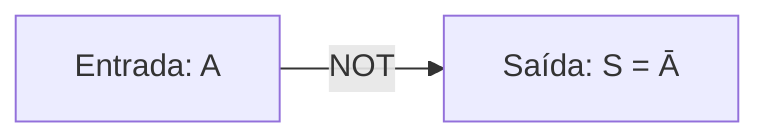
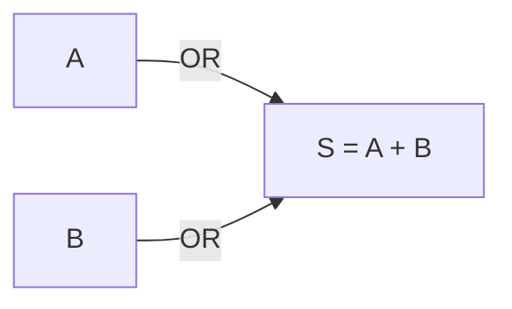
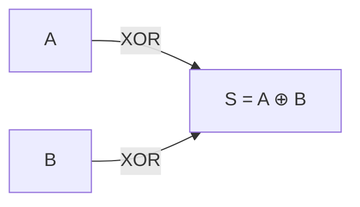
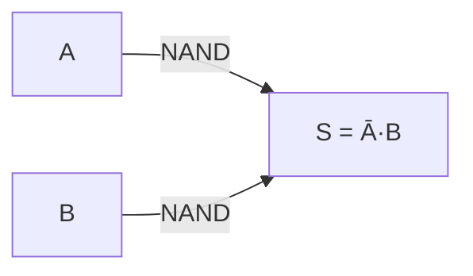
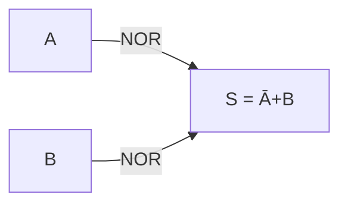
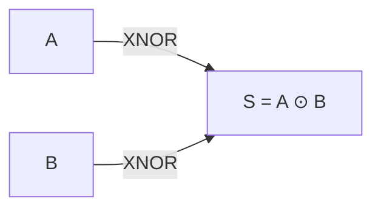

<div style="display: flex; justify-content: space-between; align-items: center; padding: 10px 16px; background: var(--light, #f8fafc); border: 1px solid var(--lightgray, #e2e8f0); border-radius: 10px; margin: 1.5rem 0;">
  <div>⬅️ <b><a href="#">Aula Anterior</a></b></div>
  <div>🏠 <b><a href="../">Hub da Disciplina</a></b></div>
  <div>➡️ <b><a href="#">Próxima Aula</a></b></div>
</div>

```dataviewjs
const currentPath = dv.current()?.file?.path || "";
const parts = currentPath.split("/");
const periodIndex = parts.findIndex(p => p.toLowerCase().includes("periodo") || p.toLowerCase().includes("período"));
const disciplineFolder = periodIndex !== -1 && parts.length > periodIndex + 1 ? parts[periodIndex + 1] : "";

const allPages = dv.pages();
const completedAulas = allPages.filter(p => {
    const path = (p.file?.path || "").toLowerCase();
    const name = (p.file?.name || "").toLowerCase();
    
    const isInDiscipline = disciplineFolder ? path.includes(disciplineFolder.toLowerCase()) : true;
    const isEsboco = path.includes("esboço") || path.includes("esboco") || path.includes("draft");
    const isAula = /^aula[\s_-]+\d+/i.test(name);
    
    return isInDiscipline && isAula && !isEsboco;
});

const totalAulas = 20;
const completedCount = completedAulas.length;
const percentage = Math.min(100, Math.round((completedCount / totalAulas) * 100));

dv.container.innerHTML = `
<div style="margin: 1.5rem 0; padding: 1.2rem; background: var(--background-secondary, #f4f4f5); border-radius: 8px; border: 1px solid var(--border-color, #e4e4e7); box-shadow: 0 1px 3px rgba(0,0,0,0.05);">
  <div style="display: flex; justify-content: space-between; align-items: center; margin-bottom: 0.6rem;">
    <span style="font-weight: 700; font-size: 0.95rem; color: var(--text-normal, #18181b); display: inline-flex; align-items: center; gap: 6px;">
      📖 Progresso da Disciplina
    </span>
    <span style="font-size: 0.85rem; font-weight: 700; color: var(--text-muted, #71717a);">
      ${completedCount} / ${totalAulas} Aulas (${percentage}%)
    </span>
  </div>
  <div style="width: 100%; height: 12px; background-color: var(--background-modifier-border, #e4e4e7); border-radius: 6px; overflow: hidden;">
    <div style="width: ${percentage}%; height: 100%; background: linear-gradient(90deg, #10b981, #059669); border-radius: 6px; transition: width 0.3s ease;"></div>
  </div>
</div>`;
```

> [!info] 📌 Informações da Aula & Contexto do Quadro
> - **Disciplina:** [[02 - Áreas/Acadêmico/IFF - Engenharia de Computação/6-periodo/eletronica-digital|Eletrônica Digital]]
> - **Docente Responsável:** Fabrício Barros Gonçalves
> - **Tópico Central:** Portas Lógicas & Álgebra Booleana
> - **Status das Anotações:** 🟢 Concluído

> [!note] 📦 Material Didático & Recursos da Aula
> - 📄 **[Lista de Exercícios em PDF](/assets/disciplinas/6-periodo/eletronica-digital/Lista_Eletronica_Digital_Notacao_Correta.pdf)**
> - 📖 **[Livro Texto de Apoio (Capuano & Idoeta)](/assets/disciplinas/6-periodo/eletronica-digital/ilide.info-elementos-de-eletronica-digital-capuano-francisco-gabriel-idoeta-ivan-valeije-pr_2b9feef9e166b55bcc121dacebf74415.pdf)**
> - 💻 **[Simulador LogiSim (Executável JAR)](/assets/disciplinas/6-periodo/eletronica-digital/logisim-generic-2.7.1.jar)**

## 📋 Sumário Interativo
- [📍 Anotações](#-anotações)
- [🧠 Resumo](#-resumo)
- [📝 Dúvida](#-dúvida)

---

## 📍 Anotações

### 📐 Revisão de Lógica para Computação & Fundamentação Teórica

Nesta aula de **Eletrônica Digital**, estudamos a transição da lógica matemática/proposicional para o ambiente de hardware por meio dos blocos lógicos fundamentais (portas lógicas).

---

### 1. NÃO (NOT - Inversor)

A porta **NOT** realiza a operação lógica de inversão ou complemento.



**Expressão Booleana:**
$$S = \bar{A}$$

**Tabela-Verdade:**

| A | S |
| :---: | :---: |
| 0 | 1 |
| 1 | 0 |

---

### 2. E (AND - Conjunção)

A porta **AND** gera saída alta ($1$) se e somente se todas as suas entradas forem altas ($1$).


**Expressão Booleana:**
$$S = A \cdot B$$

**Tabela-Verdade:**

| A | B | S |
| :---: | :---: | :---: |
| 0 | 0 | 0 |
| 0 | 1 | 0 |
| 1 | 0 | 0 |
| 1 | 1 | 1 |

---

### 3. OU (OR - Disjunção)

A porta **OR** gera saída alta ($1$) quando pelo menos uma das suas entradas for alta ($1$).



**Expressão Booleana:**
$$S = A + B$$

**Tabela-Verdade:**

| A | B | S |
| :---: | :---: | :---: |
| 0 | 0 | 0 |
| 0 | 1 | 1 |
| 1 | 0 | 1 |
| 1 | 1 | 1 |

---

### 4. OU EXCLUSIVO (XOR)

A porta **XOR** (Ou-Exclusivo) produz saída alta ($1$) se e somente se as entradas forem **diferentes**.



**Expressão Booleana:**
$$S = A \oplus B = \bar{A}B + A\bar{B}$$

**Tabela-Verdade:**

| A | B | S |
| :---: | :---: | :---: |
| 0 | 0 | 0 |
| 0 | 1 | 1 |
| 1 | 0 | 1 |
| 1 | 1 | 0 |

---

### 5. NÃO E (NAND - Porta Universal)

A porta **NAND** é a negação da saída da porta AND. É uma porta **universal**, pois qualquer circuito combinacional pode ser construído apenas com portas NAND.



**Expressão Booleana:**
$$S = \overline{A \cdot B}$$

**Tabela-Verdade:**

| A | B | S |
| :---: | :---: | :---: |
| 0 | 0 | 1 |
| 0 | 1 | 1 |
| 1 | 0 | 1 |
| 1 | 1 | 0 |

---

### 6. NÃO OU (NOR - Porta Universal)

A porta **NOR** é a negação da porta OR. Também possui caráter de **universalidade**.



**Expressão Booleana:**
$$S = \overline{A + B}$$

**Tabela-Verdade:**

| A | B | S |
| :---: | :---: | :---: |
| 0 | 0 | 1 |
| 0 | 1 | 0 |
| 1 | 0 | 0 |
| 1 | 1 | 0 |

---

### 7. NÃO OU EXCLUSIVO (XNOR - Coincidência)

A porta **XNOR** gera saída alta ($1$) quando as entradas forem **iguais** (coincidência).



**Expressão Booleana:**
$$S = \overline{A \oplus B} = A B + \bar{A}\bar{B}$$

**Tabela-Verdade:**

| A | B | S |
| :---: | :---: | :---: |
| 0 | 0 | 1 |
| 0 | 1 | 0 |
| 1 | 0 | 0 |
| 1 | 1 | 1 |

---

### 🧮 Mintermos e Maxtermos

1. **Mintermos (Soma de Produtos - SOP):**
   - Correspondem às combinações da tabela-verdade onde a saída do circuito é $1$.
   - Representados pela notação $\sum m$.
   - Na forma de mintermos, a variável direta vale $1$ e a variável complementada/barrada vale $0$.

2. **Maxtermos (Produto de Somas - POS):**
   - Correspondem às combinações da tabela-verdade onde a saída do circuito é $0$.
   - Representados pela notação $\prod M$.
   - Na forma de maxtermos, a variável direta vale $0$ e a variável complementada/barrada vale $1$.

---

### 📖 Exemplo do Quadro: Leitura e Análise de Expressão Booleana

Formulação resolvida em sala para mapeamento de circuito:

$$S = (A + B + C) \cdot \left\{ B \left[ (A + C) + \overline{B \cdot C} \right] \cdot (\bar{A} \cdot B \cdot \bar{C}) \right\}$$

```mermaid
flowchart TD
    subgraph Bloco 1
        OR1[A + B + C]
    end
    subgraph Bloco 2
        AND1[B]
        OR2[(A + C) + NOT(B·C)]
        AND2[Ā · B · C̄]
    end
    Bloco 1 & Bloco 2 --> AND_FINAL[Saída S]
```

---

## 🧠 Resumo

| Tópico | Princípio Central | Atenção Especial / Pegadinha |
| :--- | :--- | :--- |
| **Mintermos ($\sum m$)** | Agrupa as saídas $1$ da tabela | Variáveis sem barra correspondem a $1$ |
| **Maxtermos ($\prod M$)** | Agrupa as saídas $0$ da tabela | Variáveis sem barra correspondem a $0$ |
| **Universalidade NAND/NOR** | Implementa qualquer circuito lógico | Atenção às inversões duplas ao aplicar De Morgan |

> [!tip] 💡 Dica de Prova do Professor Fabrício
> Em avaliações e no laboratório, dê preferência a trabalhar com **mintermos ($\sum m$)**, pois simplifica a conversão para circuitos AND-OR e facilita a montagem dos diagramas no **LogiSim**!

---

## 📝 Dúvidas & Exercícios Recomendados

- [x] Testar os circuitos das 7 portas no simulador LogiSim (`logisim-generic-2.7.1.jar`).
- [ ] Resolver os exercícios da **Lista de Notação Correta** (disponível na pasta de materiais).
- [ ] Revisar a representação gráfica de mintermos e maxtermos para a próxima aula.

<div style="display: flex; justify-content: space-between; align-items: center; padding: 10px 16px; background: var(--light, #f8fafc); border: 1px solid var(--lightgray, #e2e8f0); border-radius: 10px; margin: 1.5rem 0;">
  <div>⬅️ <b><a href="#">Aula Anterior</a></b></div>
  <div>🏠 <b><a href="../">Hub da Disciplina</a></b></div>
  <div>➡️ <b><a href="#">Próxima Aula</a></b></div>
</div>
