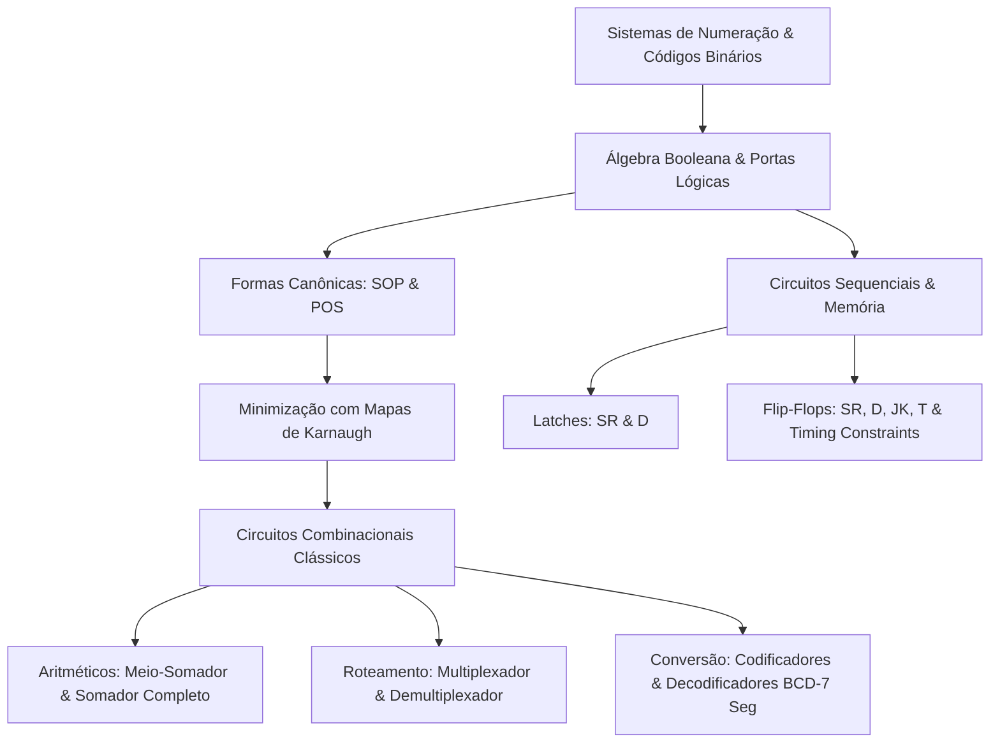
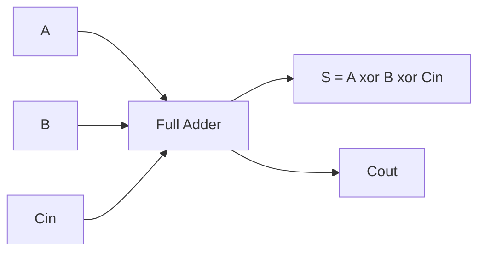
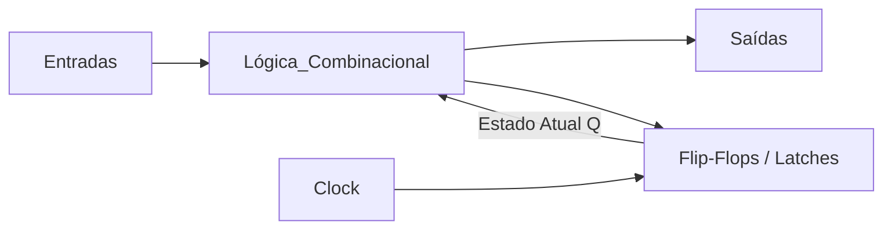

# ⚡ Short Lecture — Eletrônica Digital

> [!abstract] 📌 Visão Geral da Disciplina
> * **Código:** `CSECBJI.46` | **Carga Horária:** 60 h/a | **Período:** 6º Período
> * **Pré-requisitos:** [[02 - Áreas/Acadêmico/IFF - Engenharia de Computação/01 - Periodo/03 - Lógica para Computação/Ementa - Lógica para Computação|Lógica para Computação (CSECBJI.3)]], [[02 - Áreas/Acadêmico/IFF - Engenharia de Computação/05 - Periodo/37 - Eletrônica Analógica/Ementa - Eletrônica Analógica|Eletrônica Analógica (CSECBJI.37)]]
> * **Tranca:** [[02 - Áreas/Acadêmico/IFF - Engenharia de Computação/07 - Periodo/53 - Sistemas Digitais/Ementa - Sistemas Digitais|Sistemas Digitais (CSECBJI.53)]]
> * **Ementa Síntese:** Sistemas de numeração e códigos; Álgebra booleana e portas lógicas; Minimização lógica e Mapas de Karnaugh; Circuitos combinacionais clássicos (somadores, multiplexadores, decodificadores); Introdução aos circuitos sequenciais (latches e flip-flops).

---

## 🗺️ Mapa Conceitual da Disciplina



---

## 🔢 Módulo 1: Sistemas de Numeração e Códigos Digitais

### 1.1 Notação Posicional e Conversão de Bases
Qualquer número em uma base $b$ é expresso pela soma ponderada:
$$N = \sum_{i=-m}^{n-1} d_i \cdot b^i$$

- **Binário ($b=2$):** Dígitos $\{0, 1\}$.
- **Hexadecimal ($b=16$):** Dígitos $\{0..9, A..F\}$. Cada dígito hexadecimal mapeia diretamente para exatamente 4 bits (*nibble*): $(1101\,1010)_2 = (DA)_{16} = 218_{10}$.

### 1.2 Aritmética em Complemento de 2 (C2)
Para representar inteiros com sinal em $N$ bits:
1. O bit mais significativo ($MSB$) representa o sinal ($0 = \text{positivo}, 1 = \text{negativo}$).
2. O valor de um número negativo $-X$ em $N$ bits é obtido por:
   $$C2(X) = \overline{X} + 1$$
   *(Inverte todos os bits e soma 1).*
3. **Faixa de Representação ($N$ bits):** $[-2^{N-1}, \, 2^{N-1} - 1]$. Para 8 bits: $[-128, \, +127]$.
4. **Vantagem de C2:** A subtração $A - B$ é executada como uma soma simples: $A + C2(B)$, dispensando circuitos subtratores dedicados.

### 1.3 Códigos Digitais Clássicos
- **BCD (Binary Coded Decimal 8421):** Cada dígito decimal de 0 a 9 é codificado em 4 bits ($95_{10} = 1001\,0101_{BCD}$).
- **Código Gray:** Código não ponderado onde estados sucessivos diferem por **apenas 1 bit**, eliminando *glitches* em encoders ópticos rotativos.

---

## 🚪 Módulo 2: Álgebra Booleana e Portas Lógicas

### 2.1 Postulados e Teoremas Fundamentais
| Propriedade / Teorema | Operação AND ($\cdot$) | Operação OR ($+$) |
|---|---|---|
| **Elemento Neutro** | $A \cdot 1 = A$ | $A + 0 = A$ |
| **Elemento Nulo / Absorção** | $A \cdot 0 = 0$ | $A + 1 = 1$ |
| **Idempotência** | $A \cdot A = A$ | $A + A = A$ |
| **Complementaridade** | $A \cdot \overline{A} = 0$ | $A + \overline{A} = 1$ |
| **Involução** | $\overline{\overline{A}} = A$ | $\overline{\overline{A}} = A$ |
| **Teoremas de De Morgan** | $\overline{A \cdot B} = \overline{A} + \overline{B}$ | $\overline{A + B} = \overline{A} \cdot \overline{B}$ |

### 2.2 Universalidade das Portas NAND e NOR
Qualquer função lógica booleana pode ser construída utilizando **exclusivamente** portas NAND ou **exclusivamente** portas NOR:
- **Inversor NOT via NAND:** $\overline{A} = \overline{A \cdot A}$
- **Porta AND via NAND:** $A \cdot B = \overline{\overline{A \cdot B}}$
- **Porta OR via NAND:** $A + B = \overline{\overline{A} \cdot \overline{B}}$

---

## 🗺️ Módulo 3: Minimização Lógica e Mapas de Karnaugh

### 3.1 Formas Canônicas
- **Soma de Produtos (SOP - *Mintermos*):** $F(A,B,C) = \sum m(1, 3, 7) = \overline{A}\,\overline{B}C + \overline{A}BC + ABC$
- **Produto de Somas (POS - *Maxtermos*):** $F(A,B,C) = \prod M(0, 2, 4, 5, 6)$

### 3.2 Simplificação por Mapa de Karnaugh (K-Map 4 Variáveis)
A disposição das células utiliza o **Código Gray** para garantir que células adjacentes variem em apenas uma única variável:

```text
       CD
  AB   00   01   11   10
  00 [ m0 | m1 | m3 | m2 ]
  01 [ m4 | m5 | m7 | m6 ]
  11 [m12 |m13 |m15 |m14 ]
  10 [ m8 | m9 |m11 |m10 ]
```

> [!tip] Regras de Agrupamento
> 1. Formar grupos de tamanho potência de 2 ($1, 2, 4, 8, 16$).
> 2. Maximizar o tamanho dos laços e minimizar a quantidade total de laços.
> 3. O mapa é tórico (bordas opostas são adjacentes).
> 4. **Condições Irrelevantes (*Don't Care* / $X$):** Podem ser tratadas como $1$ para aumentar grupos ou como $0$ para não criar grupos desnecessários.

---

## 🎛️ Módulo 4: Circuitos Combinacionais Clássicos

### 4.1 Aritmética Digital: Half Adder & Full Adder
- **Meio-Somador (*Half Adder*):**
  $$S = A \oplus B, \quad C_{out} = A \cdot B$$
- **Somador Completo (*Full Adder*):** Soma $A, B$ e o transporte de entrada $C_{in}$:
  $$S = A \oplus B \oplus C_{in}$$
  $$C_{out} = A \cdot B + C_{in} \cdot (A \oplus B)$$



### 4.2 Roteamento de Dados: MUX e DEMUX
- **Multiplexador (MUX $2^n \rightarrow 1$):** Seleciona uma dentre $2^n$ entradas de dados e a encaminha para uma única saída com base em $n$ linhas de seleção:
  $$Y = \sum_{k=0}^{2^n-1} I_k \cdot m_k(S)$$
- **Demultiplexador (DEMUX $1 \rightarrow 2^n$):** Encaminha uma entrada para a saída selecionada.

### 4.3 Decodificadores e Encoders de Prioridade
- **Decodificador BCD para 7 Segmentos:** Converte o código binário de 4 bits para acionar os segmentos $a, b, c, d, e, f, g$ de um display.
- **Priority Encoder:** Em caso de múltiplas entradas ativas simultaneamente, codifica apenas a de maior peso binário.

---

## ⏱️ Módulo 5: Circuitos Sequenciais e Flip-Flops

### 5.1 Combinacional vs Sequencial
- **Circuito Combinacional:** As saídas dependem **exclusivamente** das entradas atuais ($Y = f(X)$). Não possui memória.
- **Circuito Sequencial:** As saídas dependem das entradas atuais e do **estado interno anterior** ($Y = f(X, Q)$), exigindo malha de realimentação (*feedback*) e sinal de clock.



### 5.2 Latches vs Flip-Flops
- **Latch:** Dispositivo sensível ao **nível** do sinal de habilitação (*level-sensitive* - transparente durante o nível ativo).
- **Flip-Flop:** Dispositivo disparado por **borda** de clock (*edge-triggered* - transição de subida ou descida).

### 5.3 Tabela Comparativa de Flip-Flops Clássicos

| Tipo | Entradas | Equação Característica ($Q_{next}$) | Comportamento Principal |
|---|---|---|---|
| **D (Data)** | $D$ | $Q_{next} = D$ | Armazena o bit presente em $D$ na borda do clock. |
| **T (Toggle)** | $T$ | $Q_{next} = T \oplus Q$ | Se $T=0$, mantém $Q$; se $T=1$, inverte $Q$ (divisor de frequência). |
| **JK** | $J, K$ | $Q_{next} = J\overline{Q} + \overline{K}Q$ | Resolve o estado proibido do SR: $J=K=1$ provoca alternância (*Toggle*). |
| **SR** | $S, R$ | $Q_{next} = S + \overline{R}Q \quad (S \cdot R = 0)$ | $S=1 \rightarrow Set$; $R=1 \rightarrow Reset$; $S=R=1$ Proibido/Inválido. |

### 5.4 Restrições Temporais (*Timing Constraints*)
Para garantir a operação confiável do Flip-Flop:
- **Setup Time ($t_{su}$):** Tempo mínimo que o sinal de dados $D$ deve permanecer estável **antes** da borda ativa do clock.
- **Hold Time ($t_h$):** Tempo mínimo que o sinal de dados $D$ deve permanecer estável **após** a borda ativa do clock.
- **Metaestabilidade:** Ocorre quando $t_{su}$ ou $t_h$ são violados, deixando a saída em um nível de tensão indeterminado oscilando antes de estabilizar.

---

## 🧪 Resumo Executivo / Cheat Sheet para Provas & Projetos

1. **Complemento de 2:** $C2(X) = \overline{X} + 1$. Permite fazer subtrações com circuitos somadores normais.
2. **De Morgan:** $\overline{A \cdot B} = \overline{A} + \overline{B}$ e $\overline{A + B} = \overline{A} \cdot \overline{B}$.
3. **Karnaugh:** Agrupar $1$s em potências de 2 ($1, 2, 4, 8, 16$) pelas bordas e cantos para eliminar o máximo de literais.
4. **Full Adder:** $S = A \oplus B \oplus C_{in}$ e $C_{out} = AB + C_{in}(A \oplus B)$.
5. **Flip-Flop JK:** $J=1, K=0 \rightarrow Set$; $J=0, K=1 \rightarrow Reset$; $J=K=1 \rightarrow Toggle$.
6. **Setup/Hold:** Dados devem estar fixos antes ($t_{su}$) e depois ($t_h$) do pulso de clock para evitar metaestabilidade.

---

## 🔗 Referências e Conexões no Cofre
* [[02 - Áreas/Acadêmico/IFF - Engenharia de Computação/06 - Periodo/46 - Eletrônica Digital/Ementa - Eletrônica Digital|📄 Ementa Oficial de Eletrônica Digital]]
* [[02 - Áreas/Acadêmico/IFF - Engenharia de Computação/01 - Periodo/03 - Lógica para Computação/Ementa - Lógica para Computação|Lógica para Computação (CSECBJI.3)]]
* [[02 - Áreas/Acadêmico/IFF - Engenharia de Computação/00 - Documentos/PPC_EngComp_Completo_Ementario|📜 PPC & Ementário Geral]]
* Livros Base:
  * TOKHEIM, Roger. *Fundamentos de Eletrônica Digital – Vol. 1: Sistemas Combinacionais*. Bookman, 2013.
  * IDOETA, I. V.; CAPUANO, F. G. *Elementos de Eletrônica Digital*. 42ª Edição. Érica, 2019.
  * PEDRONI, Volnei. *Eletrônica Digital Moderna e VHDL*. Elsevier, 2010.
