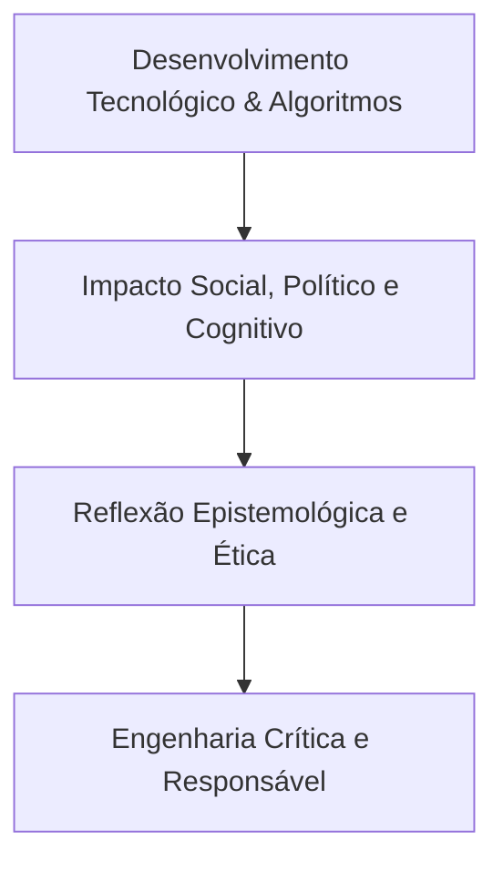

  
⬅️ Primeira Aula

  
🏠 <b><a href="/pt-br/resource/engenharia-de-computação/6-periodo/filosofia-da-ciencia-e-tecnologia">Hub da Disciplina</a></b>

  
➡️ <b><a href="/pt-br/resource/engenharia-de-computação/6-periodo/filosofia-da-ciencia-e-tecnologia/anotacoes/aula-01-epistemologia-e-teoria-do-conhecimento">Próxima Aula</a></b>

> [!info] 📅 Informações da Aula
> - **Disciplina:** Filosofia da Ciência e Tecnologia (CSECBJI.43)
> - **Professor:** Hugo
> - **Data Realizada:** 26/08/2026
> - **Tópico Principal:** Apresentação da Disciplina, Ementário e Critérios
> - **Status:** Concluída e Revisada

> [!note] 📂 Material Complementar & Slides
> - 📄 **Slides Oficiais:** [[slide-00-filosofia-da-ciencia-e-tecnologia|Acessar Apresentação em PDF]]
> - 🎥 **Short Lecture / Gravação:** [[video-00-filosofia-da-ciencia-e-tecnologia|Assistir Síntese da Aula (Vídeo)]]

---

### 📑 Resumo das Seções
- [📌 1. Anotações do Quadro: Apresentação da Disciplina, Ementário e Critérios](#-anotações-do-quadro-apresentação-da-disciplina,-ementário-e-critérios)
- [🧮 2. Formulação & Exemplo Prático Resolvido](#-formulação--exemplo-prático-resolvido)
- [📊 3. Esquema Visual & Fluxograma (Mermaid)](#-esquema-visual--fluxograma-mermaid)
- [🧠 4. Resumo Pessoal & Macetes do Professor](#-resumo-pessoal--macetes-do-professor)
- [📝 5. Dúvidas & Exercícios Recomendados para Casa](#-dúvidas--exercícios-recomendados-para-casa)

---

## 📌 Anotações do Quadro: Apresentação da Disciplina, Ementário e Critérios

### 1.1 A Necessidade da Filosofia na Formação do Engenheiro de Computação
A prática da engenharia contemporânea não se restringe a equações matemáticas e linhas de código: os sistemas computacionais, inteligências artificiais e algoritmos desenvolvidos por engenheiros reconfiguram as relações de trabalho, a cognição humana, a privacidade individual e as estruturas políticas da sociedade.

A reflexão epistemológica e filosófica fornece as ferramentas críticas indispensáveis para:
1. Questionar a pretensa "neutralidade" das tecnologias digitais.
2. Compreender a natureza, os limites e a validade do conhecimento científico.
3. Avaliar as consequências éticas, sociais e ambientais das inovações tecnológicas.

### 1.2 Estrutura da Disciplina e Dinâmica Pedagógica
- **Módulo I: Epistemologia e Filosofia da Ciência:** Da teoria do conhecimento clássica às revoluções científicas de Karl Popper e Thomas Kuhn.
- **Módulo II: Filosofia da Tecnologia e Sociologia do Conhecimento:** Heidegger, Álvaro Vieira Pinto, Bruno Latour e os estudos sociais da ciência (STS).
- **Módulo III: Ética, Humanismo e Tecnologia no Século XXI:** Inteligência Artificial, vigilância de dados, automação e responsabilidade profissional do engenheiro.

---

## 🧮 Formulação & Exemplo Prático Resolvido

### ✏️ Provocação Filosófica Inicial: O Mito da Neutralidade da Técnica

A afirmação popular de que *"a tecnologia é neutra; o ser humano é quem decide usá-la para o bem ou para o mal"* é profundamente contestada pela Filosofia da Tecnologia moderna:
- Toda tecnologia carrega embutida em seu design uma **visão de mundo, valores políticos e interesses econômicos**.
- Um algoritmo de recomendação de rede social não é neutro: ele foi projetado e otimizado para maximizar o tempo de retenção de tela através da polarização emocional de usuários.
- O engenheiro de computação é, portanto, um **agente moral e político** cujas decisões arquiteturais moldam a vida em sociedade.

---

## 📊 Esquema Visual & Fluxograma (Mermaid)

---

## 🧠 Resumo Pessoal & Macetes do Professor

| Conceito-Chave | *Takeaway* do Professor | Dicas de Prova / Atenção |
| :--- | :--- | :--- |
| **Epistemologia vs Ontologia** | Epistemologia estuda o **Conhecimento** (como sabemos o que sabemos?); Ontologia estuda o **Ser / Realidade** (o que é a realidade?). | Distinção terminológica essencial em filosofia. |
| **Postura nos Ensaios** | Em filosofia não basta emitir opiniões subjetivas; é fundamental estruturar argumentos lógicos rigorosos apoiados nos autores canônicos. | Aplicação prática direta |

---

## 📝 Dúvidas & Exercícios Recomendados para Casa

1. Analise criticamente a tese da neutralidade da tecnologia à luz de um exemplo concreto de algoritmo contemporâneo.
2. Explique a relevância da reflexão ética no currículo de Engenharia de Computação.

---

  
⬅️ Primeira Aula

  
🏠 <b><a href="/pt-br/resource/engenharia-de-computação/6-periodo/filosofia-da-ciencia-e-tecnologia">Hub da Disciplina</a></b>

  
➡️ <b><a href="/pt-br/resource/engenharia-de-computação/6-periodo/filosofia-da-ciencia-e-tecnologia/anotacoes/aula-01-epistemologia-e-teoria-do-conhecimento">Próxima Aula</a></b>

