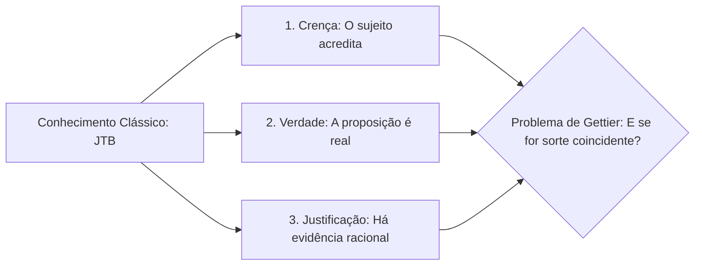

  
⬅️ <b><a href="/pt-br/resource/engenharia-de-computação/6-periodo/filosofia-da-ciencia-e-tecnologia/anotacoes/aula-00-apresentacao-da-disciplina-ementario-e-criterios">Aula Anterior</a></b>

  
🏠 <b><a href="/pt-br/resource/engenharia-de-computação/6-periodo/filosofia-da-ciencia-e-tecnologia">Hub da Disciplina</a></b>

  
➡️ <b><a href="/pt-br/resource/engenharia-de-computação/6-periodo/filosofia-da-ciencia-e-tecnologia/anotacoes/aula-02-arte-tecnica-ciencia-e-engenharia-definicoes">Próxima Aula</a></b>

> [!info] 📅 Informações da Aula
> - **Disciplina:** Filosofia da Ciência e Tecnologia (CSECBJI.43)
> - **Professor:** Hugo
> - **Data Realizada:** 02/09/2026
> - **Tópico Principal:** Epistemologia e Teoria do Conhecimento
> - **Status:** Concluída e Revisada

> [!note] 📂 Material Complementar & Slides
> - 📄 **Slides Oficiais:** [[slide-01-filosofia-da-ciencia-e-tecnologia|Acessar Apresentação em PDF]]
> - 🎥 **Short Lecture / Gravação:** [[video-01-filosofia-da-ciencia-e-tecnologia|Assistir Síntese da Aula (Vídeo)]]

---

### 📑 Resumo das Seções
- [📌 1. Anotações do Quadro: Epistemologia e Teoria do Conhecimento](#-anotações-do-quadro-epistemologia-e-teoria-do-conhecimento)
- [🧮 2. Formulação & Exemplo Prático Resolvido](#-formulação--exemplo-prático-resolvido)
- [📊 3. Esquema Visual & Fluxograma (Mermaid)](#-esquema-visual--fluxograma-mermaid)
- [🧠 4. Resumo Pessoal & Macetes do Professor](#-resumo-pessoal--macetes-do-professor)
- [📝 5. Dúvidas & Exercícios Recomendados para Casa](#-dúvidas--exercícios-recomendados-para-casa)

---

## 📌 Anotações do Quadro: Epistemologia e Teoria do Conhecimento

### 1.1 O que é o Conhecimento? A Definição Tripartite Clássica (Platão)
Desde o diálogo *Teeteto* de Platão, a tradição epistemológica ocidental definiu o conhecimento como **Crença Verdadeira Justificada (JTB - *Justified True Belief*)**:
$$S \text{ sabe que } P \iff (1)\; P \text{ é verdadeiro}; \; (2)\; S \text{ acredita que } P; \; (3)\; S \text{ possui justificação racional para crer em } P$$

### 1.2 O Problema de Gettier (1963)
Edmund Gettier provou que as três condições da JTB são insuficientes: podem ocorrer situações onde uma pessoa possui uma crença justificada e verdadeira que é verdadeira **apenas por pura coincidência / sorte epistêmica** (não constituindo conhecimento genuíno).

### 1.3 O Debate Clássico: Racionalismo vs Empirismo
- **Racionalismo (Descartes, Spinoza, Leibniz):** A razão e as ideias inatas (*a priori*) são a fonte primária e confiável de conhecimento indubitável (modelo axiomático da matemática: *"Penso, logo existo"*).
- **Empirismo (Locke, Berkeley, Hume):** A mente humana é uma tábula rasa (*tabula rasa*) e todo conhecimento provém estritamente da experiência sensorial (*a posteriori*).

### 1.4 A Síntese Kantiana (Immanuel Kant)
Kant unificou ambas as correntes na *Crítica da Razão Pura*: *"Pensamentos sem conteúdo são vazios; intuições sem conceitos são cegas"*. O sujeito cognoscente organiza ativamente os dados brutos da experiência através das estruturas *a priori* da sensibilidade (espaço e tempo) e categorias do entendimento.

---

## 🧮 Formulação & Exemplo Prático Resolvido

### ✏️ O Contraexemplo de Gettier na Engenharia de Computação

**Cenário:**
Um engenheiro consulta o monitor de status de um servidor web às 14:00 e vê o aviso *"Servidor Online (Verde)"*. O engenheiro cria a crença justificada de que o servidor está operando perfeitamente.
- O servidor realmente está online às 14:00 (Crença é **Verdadeira**).
- O engenheiro tem **Justificação** (o painel de monitoramento oficial).
- **Contudo:** O painel travou e parou de atualizar às 11:00 da manhã. Por pura coincidência, o servidor havia caído às 13:00 e reiniciado automaticamente sozinho às 13:59!

O engenheiro acertou por **sorte epistêmica**, provando o problema de Gettier: ter uma crença verdadeira justificada não garante que você realmente 'sabia' o estado do sistema!

---

## 📊 Esquema Visual & Fluxograma (Mermaid)

---

## 🧠 Resumo Pessoal & Macetes do Professor

| Conceito-Chave | *Takeaway* do Professor | Dicas de Prova / Atenção |
| :--- | :--- | :--- |
| **Conhecimento a Priori vs a Posteriori** | *A priori* é independente da experiência sensorial (ex: $2+2=4$); *A posteriori* depende da experiência empírica do mundo (ex: 'o cabo de rede está partido'). | Conceito kantiano frequentemente cobrado em avaliações. |
| **Ceticismo Pirrônico e Cartesiano** | Descartes utilizou a dúvida metódica radical (o gênio maligno) não para destruir o saber, mas para encontrar uma verdade absolutamente indubitável. | Aplicação prática direta |

---

## 📝 Dúvidas & Exercícios Recomendados para Casa

1. Explique detalhadamente como o Problema de Gettier refuta a definição clássica de conhecimento tripartite de Platão.
2. Compare a visão de John Locke sobre a mente como tábula rasa com a teoria das ideias inatas de René Descartes.

---

  
⬅️ <b><a href="/pt-br/resource/engenharia-de-computação/6-periodo/filosofia-da-ciencia-e-tecnologia/anotacoes/aula-00-apresentacao-da-disciplina-ementario-e-criterios">Aula Anterior</a></b>

  
🏠 <b><a href="/pt-br/resource/engenharia-de-computação/6-periodo/filosofia-da-ciencia-e-tecnologia">Hub da Disciplina</a></b>

  
➡️ <b><a href="/pt-br/resource/engenharia-de-computação/6-periodo/filosofia-da-ciencia-e-tecnologia/anotacoes/aula-02-arte-tecnica-ciencia-e-engenharia-definicoes">Próxima Aula</a></b>

