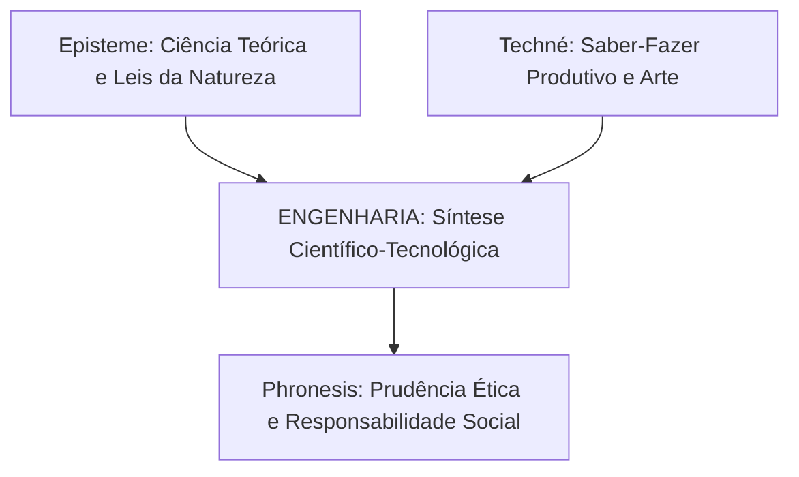

  
⬅️ <b><a href="/pt-br/resource/engenharia-de-computação/6-periodo/filosofia-da-ciencia-e-tecnologia/anotacoes/aula-01-epistemologia-e-teoria-do-conhecimento">Aula Anterior</a></b>

  
🏠 <b><a href="/pt-br/resource/engenharia-de-computação/6-periodo/filosofia-da-ciencia-e-tecnologia">Hub da Disciplina</a></b>

  
➡️ <b><a href="/pt-br/resource/engenharia-de-computação/6-periodo/filosofia-da-ciencia-e-tecnologia/anotacoes/aula-03-a-condicao-humana-e-a-emergencia-da-tecnica">Próxima Aula</a></b>

> [!info] 📅 Informações da Aula
> - **Disciplina:** Filosofia da Ciência e Tecnologia (CSECBJI.43)
> - **Professor:** Hugo
> - **Data Realizada:** 09/09/2026
> - **Tópico Principal:** Arte, Técnica, Ciência e Engenharia — Definições
> - **Status:** Concluída e Revisada

> [!note] 📂 Material Complementar & Slides
> - 📄 **Slides Oficiais:** [[slide-02-filosofia-da-ciencia-e-tecnologia|Acessar Apresentação em PDF]]
> - 🎥 **Short Lecture / Gravação:** [[video-02-filosofia-da-ciencia-e-tecnologia|Assistir Síntese da Aula (Vídeo)]]

---

### 📑 Resumo das Seções
- [📌 1. Anotações do Quadro: Arte, Técnica, Ciência e Engenharia — Definições](#-anotações-do-quadro-arte,-técnica,-ciência-e-engenharia--definições)
- [🧮 2. Formulação & Exemplo Prático Resolvido](#-formulação--exemplo-prático-resolvido)
- [📊 3. Esquema Visual & Fluxograma (Mermaid)](#-esquema-visual--fluxograma-mermaid)
- [🧠 4. Resumo Pessoal & Macetes do Professor](#-resumo-pessoal--macetes-do-professor)
- [📝 5. Dúvidas & Exercícios Recomendados para Casa](#-dúvidas--exercícios-recomendados-para-casa)

---

## 📌 Anotações do Quadro: Arte, Técnica, Ciência e Engenharia — Definições

### 2.1 A Tríade Aristotélica do Saber
Na Grécia Antiga, Aristóteles (*Ética a Nicômaco*) estabeleceu distinções ontológicas cruciais entre três formas de saber humano:
1. **Episteme ($\dot{\epsilon}\pi\iota\sigma\tau\acute{\eta}\mu\eta$):** O conhecimento teórico, demonstrativo, universal e contemplativo da verdade e das leis imutáveis da natureza (o que hoje chamamos de **Ciência**).
2. **Techné ($\tau\acute{\epsilon}\chi\nu\eta$):** O saber-fazer produtivo, criativo, prático e orientado a um fim (*telos*), que transforma a matéria para produzir artefatos inexistentes na natureza (a raiz de **Técnica** e **Arte**).
3. **Phronesis ($\phi\rho\acute{o}\nu\eta\sigma\iota\varsigma$):** A sabedoria prática, prudência ética e capacidade deliberativa para discernir o bem comum e agir corretamente na polis.

### 2.2 Da Técnica Artesanal à Tecnologia Industrial
- **Técnica Pré-Moderna (Artesanato):** Saber tácito, empírico, localizado e transmitido de mestre para aprendiz em corporações de ofício. A ferramenta prolonga a mão do artesão.
- **Tecnologia Moderna:** Fusão deliberada e sistemática entre **Ciência e Técnica**. A máquina não é uma simples ferramenta: ela opera sobre princípios científicos formais e impõe seu próprio ritmo de produção ao trabalhador.

### 2.3 A Engenharia como Síntese
A Engenharia moderna surge como a disciplina mediadora por excelência: ela mobiliza o rigor abstrato da *Episteme* (física, matemática, teoria da computação) para a realização pragmática da *Techné* (construção de sistemas, redes e circuitos).

---

## 🧮 Formulação & Exemplo Prático Resolvido

### ✏️ Matriz Comparativa dos Saberes na Engenharia de Computação

| Conceito | Domínio Epistêmico | Finalidade Principal | Exemplo em Computação |
| :--- | :--- | :--- | :--- |
| **Ciência (*Episteme*)** | Leis universais da física/matemática | Descobrir e provar a verdade | Teorema da Capacidade de Shannon, Teoria da Complexidade $P \text{ vs } NP$ |
| **Técnica / Engenharia (*Techné*)** | Construção de artefatos úteis | Criar soluções e resolver problemas práticos | Projeto de compiladores, desenvolvimento de sistemas operacionais |
| **Prudência (*Phronesis*)** | Deliberação ética e política | Garantir o bem humano e a justiça | Decisão ética sobre uso de reconhecimento facial em vigilância pública |

---

## 📊 Esquema Visual & Fluxograma (Mermaid)

---

## 🧠 Resumo Pessoal & Macetes do Professor

| Conceito-Chave | *Takeaway* do Professor | Dicas de Prova / Atenção |
| :--- | :--- | :--- |
| **A Origem da Palavra Tecnologia** | Deriva de $	aucute{\epsilon}\chi
u\eta$ (*techné* - técnica) + $\lambdacute{o}\gamma\omicronarsigma$ (*logos* - discurso racional/estudo). É a ciência da técnica. | Tecnologia não é sinônimo de aparelho eletrônico; é o método científico aplicado à transformação do mundo. |
| **Phronesis é Indispensável** | Sem Phronesis, a engenharia torna-se tecnocracia cega desprovida de humanismo. | Aplicação prática direta |

---

## 📝 Dúvidas & Exercícios Recomendados para Casa

1. Diferencie conceitualmente Episteme, Techné e Phronesis no contexto da construção de sistemas de software críticos.
2. Explique a transformação histórica da técnica tradicional em tecnologia científica moderna segundo Álvaro Vieira Pinto.

---

  
⬅️ <b><a href="/pt-br/resource/engenharia-de-computação/6-periodo/filosofia-da-ciencia-e-tecnologia/anotacoes/aula-01-epistemologia-e-teoria-do-conhecimento">Aula Anterior</a></b>

  
🏠 <b><a href="/pt-br/resource/engenharia-de-computação/6-periodo/filosofia-da-ciencia-e-tecnologia">Hub da Disciplina</a></b>

  
➡️ <b><a href="/pt-br/resource/engenharia-de-computação/6-periodo/filosofia-da-ciencia-e-tecnologia/anotacoes/aula-03-a-condicao-humana-e-a-emergencia-da-tecnica">Próxima Aula</a></b>

