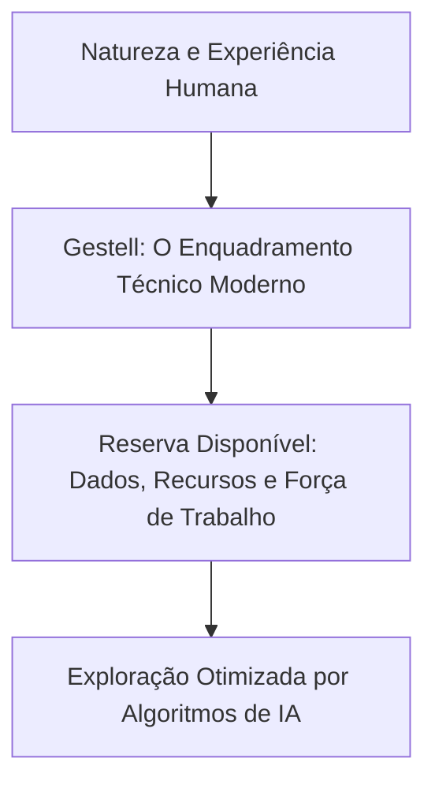

  
⬅️ <b><a href="/pt-br/resource/engenharia-de-computação/6-periodo/filosofia-da-ciencia-e-tecnologia/anotacoes/aula-02-arte-tecnica-ciencia-e-engenharia-definicoes">Aula Anterior</a></b>

  
🏠 <b><a href="/pt-br/resource/engenharia-de-computação/6-periodo/filosofia-da-ciencia-e-tecnologia">Hub da Disciplina</a></b>

  
➡️ <b><a href="/pt-br/resource/engenharia-de-computação/6-periodo/filosofia-da-ciencia-e-tecnologia/anotacoes/aula-04-o-metodo-cientifico-classico-e-o-indutivismo">Próxima Aula</a></b>

> [!info] 📅 Informações da Aula
> - **Disciplina:** Filosofia da Ciência e Tecnologia (CSECBJI.43)
> - **Professor:** Hugo
> - **Data Realizada:** 16/09/2026
> - **Tópico Principal:** A Condição Humana e a Emergência da Técnica
> - **Status:** Concluída e Revisada

> [!note] 📂 Material Complementar & Slides
> - 📄 **Slides Oficiais:** [[slide-03-filosofia-da-ciencia-e-tecnologia|Acessar Apresentação em PDF]]
> - 🎥 **Short Lecture / Gravação:** [[video-03-filosofia-da-ciencia-e-tecnologia|Assistir Síntese da Aula (Vídeo)]]

---

### 📑 Resumo das Seções
- [📌 1. Anotações do Quadro: A Condição Humana e a Emergência da Técnica](#-anotações-do-quadro-a-condição-humana-e-a-emergência-da-técnica)
- [🧮 2. Formulação & Exemplo Prático Resolvido](#-formulação--exemplo-prático-resolvido)
- [📊 3. Esquema Visual & Fluxograma (Mermaid)](#-esquema-visual--fluxograma-mermaid)
- [🧠 4. Resumo Pessoal & Macetes do Professor](#-resumo-pessoal--macetes-do-professor)
- [📝 5. Dúvidas & Exercícios Recomendados para Casa](#-dúvidas--exercícios-recomendados-para-casa)

---

## 📌 Anotações do Quadro: A Condição Humana e a Emergência da Técnica

### 3.1 A Técnica como Dimensão Ontológica Humana
O ser humano é constitutiva e ontologicamente um **ser técnico**:
- Ao contrário de animais que nascem com garras e peles adaptadas a nichos ecológicos específicos, o ser humano é biologicamente "incompleto" e vulnerável.
- A técnica é a prótese mediadora através da qual o ser humano constrói seu próprio mundo cultural e sobrevive (*Homo Faber* indissociável do *Homo Sapiens*).

### 3.2 Martin Heidegger e "A Questão da Técnica" (1953)
Para o filósofo alemão Martin Heidegger, a essência da técnica moderna **não é nada de técnico** (não se resume a máquinas ou engrenagens):
- **Desocultamento (*Aletheia*):** A técnica antiga era uma forma poética de trazer algo à luz (*poiesis*), como o moinho de vento que respeita a força natural do vento.
- **Armação / Enquadramento (*Gestell*):** A essência da técnica moderna é uma postura ontológica que desafia a natureza, enquadrando todo o real como **Reserva Disponível (*Bestand*)** a ser calculada, estocada e explorada (a floresta vira estoque de celulose, o rio vira potencial hidroelétrico e o ser humano vira "recurso humano").

### 3.3 A Visão Crítica de Álvaro Vieira Pinto em "O Conceito de Tecnologia"
O filósofo brasileiro Álvaro Vieira Pinto enfatiza que a técnica não pode ser alienada: ela é expressão da soberania e do trabalho humano para a emancipação nacional e superação do subdesenvolvimento.

---

## 🧮 Formulação & Exemplo Prático Resolvido

### ✏️ O Fenômeno do *Gestell* na Era dos Algoritmos e Big Data

Na era da computação em nuvem e inteligência artificial, o conceito heideggeriano de *Gestell* manifesta-se de forma radical:
- A experiência humana, emoções, cliques, rotinas e conversas são convertidos em **reserva de dados (*Data Exhaust*)** a ser minerada, monetizada e utilizada para alimentar modelos preditivos de comportamento.
- O ser humano deixa de ser o sujeito da técnica e passa a ser enquadrado como o principal insumo da máquina algorítmica!

---

## 📊 Esquema Visual & Fluxograma (Mermaid)

---

## 🧠 Resumo Pessoal & Macetes do Professor

| Conceito-Chave | *Takeaway* do Professor | Dicas de Prova / Atenção |
| :--- | :--- | :--- |
| **A Essência da Técnica segundo Heidegger** | A técnica moderna não é um mero instrumento neutro que usamos, mas um **modo de desocultamento do mundo** que nos impõe uma relação instrumentalizante com a realidade. | Citação clássica indispensável em ensaios. |
| **Homo Faber** | Termo consagrado por Henri Bergson e Hannah Arendt para caracterizar o ser humano como fabricante de ferramentas e transformador do ambiente. | Aplicação prática direta |

---

## 📝 Dúvidas & Exercícios Recomendados para Casa

1. Explique o conceito de Gestell (Armação/Enquadramento) de Martin Heidegger e exemplifique com a coleta massiva de dados por plataformas digitais.
2. Sintetize a tese de Álvaro Vieira Pinto sobre a relação entre tecnologia e emancipação social.

---

  
⬅️ <b><a href="/pt-br/resource/engenharia-de-computação/6-periodo/filosofia-da-ciencia-e-tecnologia/anotacoes/aula-02-arte-tecnica-ciencia-e-engenharia-definicoes">Aula Anterior</a></b>

  
🏠 <b><a href="/pt-br/resource/engenharia-de-computação/6-periodo/filosofia-da-ciencia-e-tecnologia">Hub da Disciplina</a></b>

  
➡️ <b><a href="/pt-br/resource/engenharia-de-computação/6-periodo/filosofia-da-ciencia-e-tecnologia/anotacoes/aula-04-o-metodo-cientifico-classico-e-o-indutivismo">Próxima Aula</a></b>

